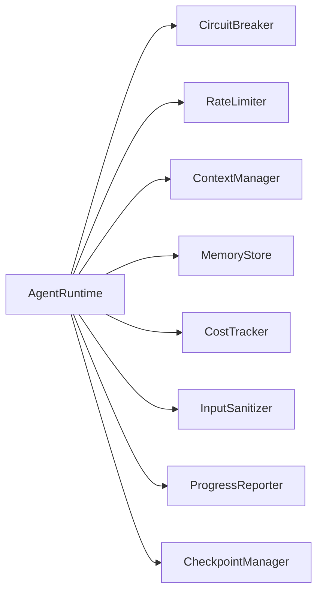
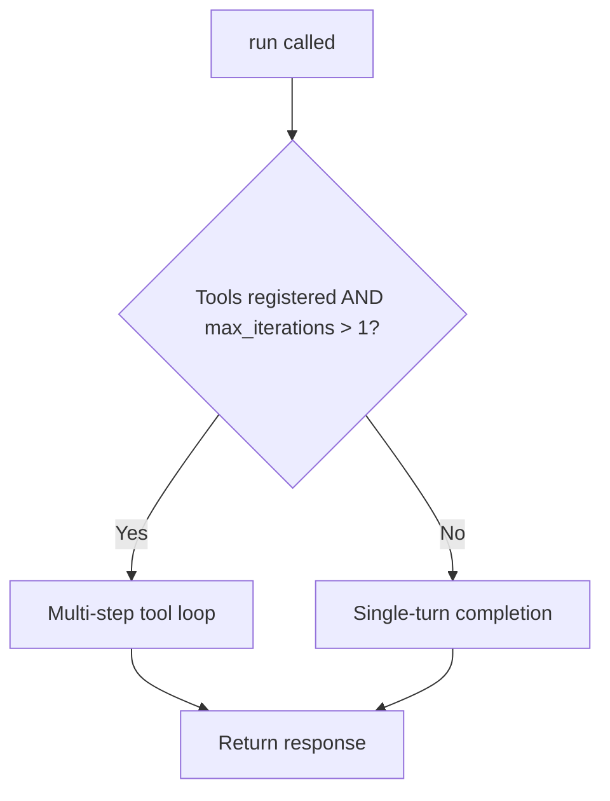
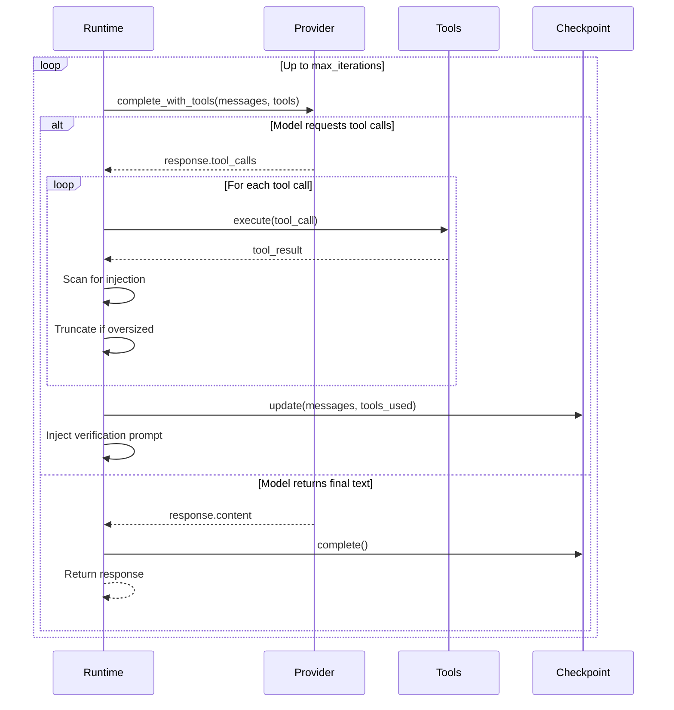

# Agent Runtime

The `AgentRuntime` class (`missy/agent/runtime.py`) is the top-level orchestrator. It binds a provider, session, tool registry, and all supporting subsystems into a single execution loop.

## Initialization

```python
from missy.agent.runtime import AgentRuntime, AgentConfig

agent = AgentRuntime(AgentConfig(
    provider="anthropic",
    max_iterations=10,
    temperature=0.7,
    capability_mode="full",
    max_spend_usd=5.0,
))
```

### AgentConfig Fields

| Field | Type | Default | Description |
|---|---|---|---|
| `provider` | `str` | `"anthropic"` | Registry key of the provider |
| `model` | `str\|None` | `None` | Model override (provider default if None) |
| `system_prompt` | `str` | *(built-in)* | System instructions prepended to every conversation |
| `max_iterations` | `int` | `10` | Max provider calls per `run()` invocation |
| `temperature` | `float` | `0.7` | Sampling temperature |
| `capability_mode` | `str` | `"full"` | `"full"`, `"safe-chat"`, `"discord"`, or `"no-tools"` |
| `max_spend_usd` | `float` | `0.0` | Per-session cost cap (0 = unlimited) |

### Lazy-Loaded Subsystems

The runtime initializes these subsystems lazily and fails gracefully if any are unavailable:



This design means the core agent loop always works, even if optional subsystems (memory, cost tracking, checkpoints) fail to initialize.

## Session Management

Each `run()` call operates within a session:

- If `session_id` is provided and a session with that ID exists, it is **reused**.
- If `session_id` is provided but no session exists, a **new session** is created with that ID stored in metadata.
- If `session_id` is omitted, a **new session** is created.

Sessions are managed by a `SessionManager` instance owned by the runtime. Session history is loaded from the `SQLiteMemoryStore` at the start of each run and persisted after completion.

## Provider Resolution

The runtime resolves the provider through the `ProviderRegistry`:

1. Look up the provider named in `AgentConfig.provider`.
2. If unavailable (disabled, missing API key), fall back to the first available provider.
3. If no provider is available, raise `ProviderError`.

The runtime can switch providers at any time via `switch_provider(name)`, which validates availability and rebuilds the circuit breaker.

## Single-Turn vs. Multi-Step

The runtime supports two execution modes, determined automatically:



### Single-Turn Mode

When no tools are registered or `max_iterations` is 1:

1. Build messages via `ContextManager`.
2. Call `provider.complete()` through the circuit breaker.
3. Return the response text.

### Multi-Step Tool Loop

When tools are available and `max_iterations > 1`:



Each iteration:

1. Call `provider.complete_with_tools()` via the circuit breaker.
2. If the model requests tool calls, execute them through the `ToolRegistry`.
3. Scan tool output for prompt injection (`InputSanitizer`).
4. Truncate oversized tool results (> 200K chars hard limit, > 50K stored separately).
5. Track tool failures and inject strategy rotation prompts after 3 consecutive failures to the same tool.
6. Save a checkpoint after each round of tool results.
7. Inject a verification prompt (`DoneCriteria`) so the model can assess outcomes.
8. If the model returns a final text response (`finish_reason: "stop"`), exit the loop.

## Checkpoint and Recovery

The `CheckpointManager` provides crash recovery for the tool loop:

### During Execution

- **Create** -- A checkpoint is created at the start of each tool loop with the session ID, task ID, and user input.
- **Update** -- After each round of tool results, the checkpoint is updated with the current message list, tools used, and iteration count.
- **Complete** -- When the loop finishes normally, the checkpoint is marked complete.
- **Fail** -- On unhandled exceptions, the checkpoint is marked failed.

### On Startup

When the runtime initializes, it scans for incomplete checkpoints from previous runs:

```python
agent = AgentRuntime(config)
for recovery in agent.pending_recovery:
    print(f"Session {recovery.session_id}: {recovery.strategy}")
    # strategy is "resume" or "abandon"
```

Manage recovery via the CLI:

```bash
missy recover                    # list incomplete checkpoints
missy recover --abandon-all      # discard all incomplete checkpoints
```

## Cost Tracking

When `max_spend_usd > 0`, the runtime tracks cumulative cost across provider calls within a session. After each completion, the cost is recorded and checked against the budget. If the budget is exceeded, subsequent calls are blocked.

```yaml
# In config.yaml
max_spend_usd: 5.0
```

Or per-runtime:

```python
AgentConfig(max_spend_usd=5.0)
```

Check cost status:

```bash
missy cost                       # show budget and usage
missy cost --session SESSION_ID  # per-session breakdown
```

## Streaming

The `run_stream()` method provides token-by-token output for real-time CLI display:

- **Single-turn**: Yields text deltas from `provider.stream()`.
- **Multi-step with tools**: Falls back to `run()` and yields the complete response as a single chunk (streaming during tool calls is not practical since tool results must be processed first).

## Audit Events

The runtime emits structured audit events at each stage:

| Event | Stage |
|---|---|
| `agent.run.start` | Run begins, input length recorded |
| `agent.run.error` | Provider resolution or completion failure |
| `agent.run.complete` | Run finishes, provider and tools used recorded |
| `agent.tool.strategy_rotation` | Tool failure threshold hit, strategy prompt injected |

## Integrated Intelligence Subsystems

The runtime integrates four intelligence subsystems that enhance the agent loop beyond basic tool execution:

### Attention System

At the **start of each iteration**, the runtime runs `AttentionSystem.process()` on the user input:

- **Urgency detection** flags high-priority requests for immediate tool dispatch.
- **Topic extraction** identifies what the user is focused on.
- **Focus continuity** tracks whether the user has been on the same topic across turns.
- **Tool prioritization** suggests which tools to favor based on urgency and topics.
- **Context filtering** provides topic words to the memory synthesizer for selective retrieval.

See [Attention System](attention.md) for the full five-subsystem breakdown.

### Memory Consolidation (Sleep Mode)

Before context assembly, the runtime checks whether the token window is approaching capacity. If usage reaches **80% of max_tokens**, the `MemoryConsolidator` compresses older messages:

1. Keep the last 4 messages intact.
2. Extract key facts (tool results, decisions, short instructions) from older messages.
3. Replace older messages with a single summary.

This allows long-running sessions to continue without hitting token limits. See [Sleep Mode](sleep-mode.md).

### AI Playbook

The playbook operates at two points in the loop:

- **Before execution**: `Playbook.get_relevant()` retrieves proven patterns for the current task type, which the [Memory Synthesizer](memory-synthesizer.md) injects into context.
- **After execution**: When a tool-augmented run succeeds, `Playbook.record()` captures the task type, tool sequence, and a prompt hint for future replay.

Patterns with 3+ successes are flagged for promotion to full skills. See [AI Playbook](playbook.md).

### Memory Synthesizer

During context assembly, the `MemorySynthesizer` replaces the previous approach of injecting learnings and playbook entries separately. It:

1. Collects fragments from all memory sources (learnings at 0.7, playbook at 0.6, conversation at 0.5, summaries at 0.4).
2. Scores each fragment against the current query using keyword overlap.
3. Deduplicates near-identical fragments.
4. Produces a single relevance-ranked block within a 4500-token budget.

See [Memory Synthesizer](memory-synthesizer.md).

### Message Bus Integration

The runtime publishes lifecycle events via the [Message Bus](message-bus.md):

| Event | Topic | When |
|---|---|---|
| Run start | `agent.run.start` | `run()` is called |
| Run complete | `agent.run.complete` | Run finishes successfully |
| Run error | `agent.run.error` | Run fails with an error |
| Tool request | `tool.request` | Before executing a tool call |
| Tool result | `tool.result` | After a tool call completes |

Other subsystems (audit logger, attention system, custom handlers) subscribe to these events for decoupled observation.

## Capability Modes

The `capability_mode` field controls which tools and system prompt are available:

| Mode | Tools | System Prompt | Use Case |
|---|---|---|---|
| `full` | All tools | Full (desktop, browser, shell, etc.) | CLI interactive |
| `safe-chat` | Limited set | Restricted | Edge nodes with limited trust |
| `discord` | Discord-safe set | No desktop/GUI references | Discord bot |
| `no-tools` | None | Conversational only | Pure chat |
