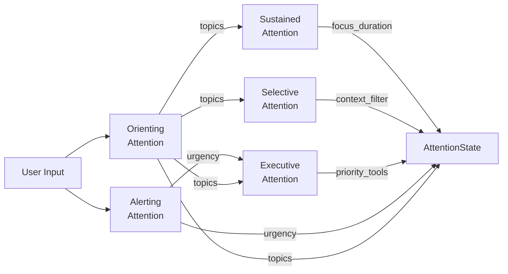
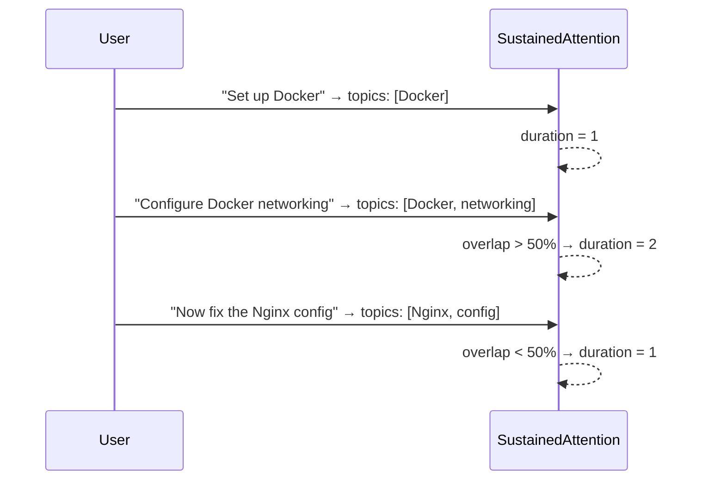

# Attention System

The `AttentionSystem` class (`missy/agent/attention.py`) is a brain-inspired five-subsystem pipeline that tracks focus, detects urgency, and guides how the agent prioritizes tool calls and context retrieval.

## Overview



## AttentionState

The pipeline produces an `AttentionState` dataclass that downstream systems consume:

| Field | Type | Description |
|---|---|---|
| `urgency` | `float` | Urgency score in [0.0, 1.0] |
| `topics` | `list[str]` | Extracted focus topics / entities |
| `focus_duration` | `int` | Consecutive turns on the same topic (starts at 1) |
| `priority_tools` | `list[str]` | Tools to prioritize given current attention state |
| `context_filter` | `list[str]` | Topic words for filtering memory retrieval |

## The Five Subsystems

### 1. Alerting Attention

**Purpose:** Detect urgent signals that require immediate action.

Scans the input for urgency keywords and returns a score from 0.0 to 1.0:

```python
_URGENCY_KEYWORDS = {
    "error", "critical", "urgent", "broken", "down",
    "failed", "security", "immediately", "asap", "emergency",
}
```

The score is the fraction of input words matching urgency keywords, capped at 1.0.

!!! example
    Input: `"The server is down! Fix it immediately!"`
    Urgency: ~0.25 (2 matches out of 8 words)

### 2. Orienting Attention

**Purpose:** Identify what the user is focused on.

Extracts topics using two heuristics:

- **Capitalized words** not at the start of a sentence (likely proper nouns or entities)
- **Words following topic prepositions** (`about`, `with`, `for`, `the`)

Results are deduplicated while preserving order.

!!! example
    Input: `"Tell me about the Docker configuration for Nginx"`
    Topics: `["Docker", "configuration", "Nginx"]`

### 3. Sustained Attention

**Purpose:** Track topic continuity across conversation turns.

Maintains state between calls. If more than 50% of the previous turn's topics overlap with the current topics, the `focus_duration` counter increments. Otherwise, it resets to 1.

This allows the system to recognize when a user has been working on the same topic for multiple turns, enabling deeper context retrieval.



### 4. Selective Attention

**Purpose:** Filter memory fragments to only the relevant subset.

Given a list of text fragments (e.g., from the memory store) and the current topics, returns only fragments where at least one topic word appears in the content. If no topics are available, all fragments pass through.

```python
SelectiveAttention.filter(
    fragments=["Docker port mapping guide", "Python venv setup", "Docker compose networking"],
    topics=["Docker", "networking"],
)
# Returns: ["Docker port mapping guide", "Docker compose networking"]
```

### 5. Executive Attention

**Purpose:** Decide which tools should be prioritized based on urgency and topic signals.

| Condition | Priority Tools |
|---|---|
| Urgency > 0.5 | `shell_exec`, `file_read` |
| Topics contain file-related words | `file_read`, `file_write` |
| Neither condition met | No priority override (empty list) |

File-related topic words: `file`, `files`, `directory`, `folder`, `path`, `read`, `write`, `edit`, `config`, `log`, `logs`.

## Usage

```python
from missy.agent.attention import AttentionSystem

attn = AttentionSystem()

# Process user input
state = attn.process("The server is down! Fix it immediately!")

print(state.urgency)         # 0.25
print(state.topics)          # ["server"]
print(state.priority_tools)  # [] (urgency below 0.5)
print(state.focus_duration)  # 1 (first turn)

# Next turn, same topic
state = attn.process("Check the server error logs")

print(state.topics)          # ["server", "error", "logs"]
print(state.focus_duration)  # 2 (topic continuity detected)
print(state.priority_tools)  # ["file_read", "file_write"] (log-related)
print(state.context_filter)  # ["server", "error", "logs"]
```

## Integration with the Runtime

The attention system runs at the **start of each agent iteration**:

1. **Input processing** -- `AttentionSystem.process()` analyzes the user message.
2. **Memory filtering** -- `context_filter` topics are passed to the [Memory Synthesizer](memory-synthesizer.md) and [Selective Attention](#4-selective-attention) to retrieve only relevant fragments.
3. **Tool prioritization** -- `priority_tools` hints are provided to the tool selection logic.
4. **Focus tracking** -- `focus_duration` can inform context depth decisions (longer focus = more history for this topic).

## Related

- [Agent Runtime](agent-runtime.md) -- invokes the attention system each iteration
- [Memory Synthesizer](memory-synthesizer.md) -- uses attention topics for relevance scoring
- [Context Management](context-management.md) -- attention state influences context assembly
