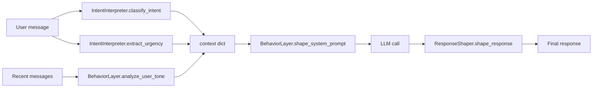

---
tags:
  - architecture
---

# Behavior Layer

`missy/agent/behavior.py` is Missy's "humanistic behavior layer" — the code that keeps agent responses from reading like generic AI-assistant boilerplate. It has no CLI surface of its own; it works entirely inside the prompt-shaping and response-post-processing path of the [Agent Runtime](agent-runtime.md). Three cooperating classes each own a distinct concern:

- **`BehaviorLayer`** — augments system prompts with persona + contextual guidelines.
- **`IntentInterpreter`** — classifies user intent and urgency with keyword/regex heuristics (no ML).
- **`ResponseShaper`** — strips robotic filler phrases out of raw LLM output, without touching code.



## The Shared Context Dict

All three classes read from / write into a single context dict shape, defined in the module docstring:

```python
{
    "user_tone":        str,   # from BehaviorLayer.analyze_user_tone()
    "topic":             str,   # current conversation topic
    "turn_count":        int,   # turns elapsed in this session
    "has_tool_results":  bool,  # whether tool results are present
    "intent":            str,   # from IntentInterpreter.classify_intent()
    "urgency":           str,   # from IntentInterpreter.extract_urgency()
}
```

## Tone Analysis

`BehaviorLayer.analyze_user_tone(messages)` inspects the **last 5 user messages** and returns one of six labels: `"casual"`, `"formal"`, `"frustrated"`, `"technical"`, `"brief"`, or `"verbose"`.

- **Frustration takes priority** — if any word matches `_FRUSTRATED_SIGNALS` (e.g. `"wrong"`, `"broken"`, `"useless"`, `"ugh"`, `"wtf"`) or `_FRUSTRATION_PATTERNS` matches (e.g. `"still not"`, `"doesn't work"`, `"same error"`), the tone is immediately `"frustrated"` regardless of anything else.
- Otherwise, casual/formal/technical are scored by counting keyword-set intersections (`_CASUAL_SIGNALS` like `"hey"`, `"lol"`, `"gonna"`; `_FORMAL_SIGNALS` like `"kindly"`, `"furthermore"`, `"pursuant"`; `_TECHNICAL_SIGNALS` — a large set of ~45 dev/ops terms like `"endpoint"`, `"docker"`, `"async"`, `"kubernetes"`).
- **Length overrides keyword scoring**: if the average word count across the sampled messages is below 8, the tone is `"brief"`; above 40, it's `"verbose"` — checked *before* falling back to the keyword-score winner.
- If no keyword signals fire and length is in the normal range, the default is `"casual"`.

## Intent Classification

`IntentInterpreter.classify_intent(user_input)` runs a fixed, ordered cascade of ten regex patterns and returns the first match:

`greeting` → `farewell` → `confirmation` → `frustration` → `troubleshooting` → `clarification` → `feedback` → `exploration` → `command` → `question` (default fallback).

Examples of what each pattern looks for: `greeting` matches leading `hey/hi/hello/good morning`; `troubleshooting` matches `error`, `traceback`, `segfault`, `connection refused`, `permission denied`; `command` matches leading imperative verbs (`run`, `restart`, `delete`, `deploy`, `install`...); `confirmation` matches short acknowledgement-only replies (`ok`, `sounds good`, `go ahead`, `approved`). Because the cascade is ordered and short-circuits on first match, e.g. a message starting with a greeting is always classified `"greeting"` even if it also contains a question mark later.

`IntentInterpreter.extract_urgency(user_input)` is a simpler two-tier check: `_HIGH_URGENCY_PATTERNS` (`asap`, `production down`, `outage`, `crash`, `broken`) wins over `_MEDIUM_URGENCY_PATTERNS` (`soon`, `today`, `deadline`, `must`), defaulting to `"low"` if neither matches.

## Shaping the System Prompt

`BehaviorLayer.shape_system_prompt(base_prompt, context)` never removes or rewrites the base prompt — it appends clearly delimited sections:

1. The unmodified `base_prompt`.
2. A `## Persona` block (`_build_persona_block()`) — name, `identity_description`, tone, personality traits, and boundaries, sourced from the `PersonaConfig` passed to the constructor. See [Persona](persona.md) for the underlying config.
3. A `## Response guidelines` block from `get_response_guidelines(context)`.

`get_response_guidelines()` assembles a bulleted list of directive sentences, conditionally, from several independent signals in the context dict:

| Signal | Condition | Guidance added |
|---|---|---|
| Tone | any recognized `user_tone` | `get_tone_adaptation()` directive (see below) |
| Length | `should_be_concise(context)` is `True` | "keep your answer concise..." |
| Tool results | `has_tool_results` | "weave them into your reply naturally rather than dumping raw output" |
| Urgency | `"high"` | "lead with the answer, then detail; skip preamble" |
| Urgency | `"medium"` | "keep the response focused and actionable" |
| Intent | `frustration` / `exploration` / `greeting` / `farewell` / `troubleshooting` / `confirmation` / `clarification` / `command` | one tailored instruction per intent (e.g. troubleshooting → "likely cause → diagnostic steps → fix") |
| `vision_mode` | `"painting"` | warm, encouraging art-coaching guidance |
| `vision_mode` | `"puzzle"` | patient, specific placement-suggestion guidance |
| `vision_mode` | any other truthy value | generic "reference specific visual details" guidance |
| `topic` | contains code/script/function/class/api | "include concrete examples or code snippets" |
| Persona | always, if a persona is set | every `behavioral_tendencies` and `response_style_rules` entry is appended verbatim |

`should_be_concise(context)` returns `True` when `turn_count >= 10`, `user_tone == "brief"`, or `urgency == "high"` — i.e. long conversations, terse users, and time-pressured requests all independently trigger brevity.

`get_tone_adaptation(user_tone)` maps each of the six tone labels to a one- or two-sentence directive via `_TONE_ADAPTATION_MAP` — e.g. `"frustrated"` maps to "Acknowledge the difficulty directly before diving into solutions... avoid lengthy preamble," `"technical"` maps to "Use accurate technical vocabulary freely... code examples are welcome."

## Cleaning the Response

`ResponseShaper.shape_response(response, persona, context)` post-processes raw LLM output in four steps, always preserving code:

1. **Stash code blocks** — fenced (`` ``` ``) and inline (`` ` `` `) code spans are matched by `_CODE_BLOCK_RE` and replaced with `\x00CODE_BLOCK_N\x00` placeholders before any text manipulation happens.
2. **Strip robotic phrases** — a list of ~14 compiled regex patterns removes filler like `"As an AI language model,"`, `"Certainly! I'll help you..."`, `"I don't have feelings or emotions..."`, `"Great question!"`, `"I'd be happy to help you..."`.
3. **Collapse blank lines** — three or more consecutive newlines collapse to a single blank line.
4. **Restore code blocks** — the stashed placeholders are substituted back with the original, untouched code text.

`detect_robotic_patterns(text)` runs the same phrase list in read-only mode (no substitution) and returns the list of matches, for auditing or tests. The `persona`/`context` parameters to `shape_response()` are currently accepted but unused — reserved for future adaptive rules.

## Usage

```python
from missy.agent.behavior import BehaviorLayer, IntentInterpreter, ResponseShaper
from missy.agent.persona import PersonaConfig

persona = PersonaConfig(name="Missy")
layer = BehaviorLayer(persona)
interp = IntentInterpreter()
shaper = ResponseShaper()

messages = [{"role": "user", "content": "hey, quick q — how do i restart nginx?"}]
tone = layer.analyze_user_tone(messages)          # "casual" or "brief" depending on length
intent = interp.classify_intent(messages[-1]["content"])   # "greeting" (leading "hey")
urgency = interp.extract_urgency(messages[-1]["content"])  # "low"

ctx = {
    "user_tone": tone, "topic": "nginx", "turn_count": 1,
    "has_tool_results": False, "intent": intent, "urgency": urgency,
}

system = layer.shape_system_prompt("You are a helpful assistant.", ctx)
raw_response = "As an AI language model, I can help you restart nginx by..."
clean = shaper.shape_response(raw_response, persona, ctx)
# "I can help you restart nginx by..."
```

## Integration with the Runtime

`BehaviorLayer` has no persistence layer of its own — it's a pure function of the `PersonaConfig` it's constructed with and the context dict passed to each call. The [Agent Runtime](agent-runtime.md) builds the context dict each turn (tone via `analyze_user_tone()` on recent history, intent/urgency via `IntentInterpreter`, plus turn count and tool-result state), calls `shape_system_prompt()` before the provider call, and runs the raw completion through `ResponseShaper.shape_response()` before it reaches the user or channel.

## Related

- [Persona](persona.md) — the `PersonaConfig` that `BehaviorLayer` renders into prompt text
- [Agent Runtime](agent-runtime.md) — builds the context dict and calls into this module each turn
- [Attention System](attention.md) — another per-turn context-shaping subsystem that runs alongside behavior shaping
