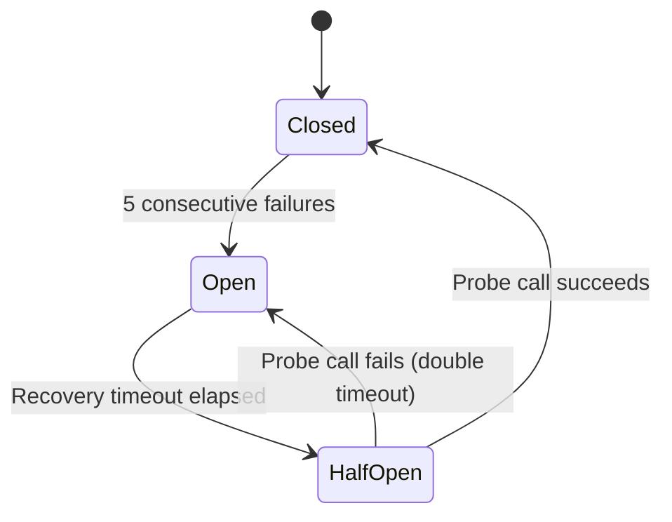

# Circuit Breaker

The `CircuitBreaker` (`missy/agent/circuit_breaker.py`) implements the classic Closed/Open/HalfOpen state machine to isolate provider failures and prevent cascading errors.

## State Machine



### States

| State | Behavior |
|---|---|
| **Closed** | Normal operation. All calls are forwarded to the provider. Failures are counted. |
| **Open** | All calls are **rejected immediately** with a `MissyError`. No requests reach the provider. |
| **HalfOpen** | A single "probe" call is allowed through. If it succeeds, the circuit closes. If it fails, the circuit reopens with a longer timeout. |

## Parameters

```python
CircuitBreaker(
    name="anthropic",      # identifier for logging
    threshold=5,           # consecutive failures before opening
    base_timeout=60.0,     # initial recovery timeout (seconds)
    max_timeout=300.0,     # maximum recovery timeout (seconds)
)
```

| Parameter | Default | Description |
|---|---|---|
| `name` | *required* | Identifier (typically the provider name) |
| `threshold` | `5` | Consecutive failures before the circuit opens |
| `base_timeout` | `60.0` | Initial recovery wait time in seconds |
| `max_timeout` | `300.0` | Maximum recovery wait time in seconds |

## Exponential Backoff

When a probe call fails in the HalfOpen state, the recovery timeout **doubles** (up to `max_timeout`):

```
Failure 5  → OPEN, wait 60s
             → HALF_OPEN, probe fails
             → OPEN, wait 120s
             → HALF_OPEN, probe fails
             → OPEN, wait 240s
             → HALF_OPEN, probe fails
             → OPEN, wait 300s (max)
             → HALF_OPEN, probe succeeds
             → CLOSED (timeout resets to 60s)
```



```mermaid
gantt
    title Circuit Breaker Recovery Timeline
    dateFormat X
    axisFormat %s

    section State
    CLOSED (normal)          :done, 0, 50
    5 failures               :crit, 50, 51
    OPEN (wait 60s)          :active, 51, 111
    HALF_OPEN (probe fails)  :crit, 111, 112
    OPEN (wait 120s)         :active, 112, 232
    HALF_OPEN (probe fails)  :crit, 232, 233
    OPEN (wait 240s)         :active, 233, 473
    HALF_OPEN (probe OK)     :done, 473, 474
    CLOSED (reset)           :done, 474, 524
```

## Usage

The circuit breaker wraps any callable:

```python
breaker = CircuitBreaker("anthropic", threshold=5, base_timeout=60.0)

# Normal call — forwarded to provider
result = breaker.call(provider.complete_with_tools, messages, tools, system)

# When circuit is OPEN:
# raises MissyError("Circuit breaker 'anthropic' is OPEN; skipping call")
```

### In the Agent Runtime

The `AgentRuntime` creates one circuit breaker per runtime instance, keyed to the provider name. Every provider call in the tool loop goes through it:

```python
response = self._circuit_breaker.call(
    provider.complete_with_tools,
    provider_messages,
    tools,
    system_prompt,
)
```

When the circuit opens, the runtime receives a `MissyError` and can fall back to an alternative provider or report the failure to the user.

## Success Handling

Any successful call (no exception raised) immediately:

1. Resets the failure count to 0.
2. Resets the recovery timeout to `base_timeout`.
3. Transitions to the **Closed** state (regardless of current state).

This means a single successful probe in HalfOpen fully restores normal operation.

## Thread Safety

The circuit breaker is thread-safe. All state transitions are protected by a `threading.Lock`. The `state` property performs an automatic OPEN to HALF_OPEN transition if the recovery timeout has elapsed, so callers do not need to poll.

## Failure Scenarios

| Scenario | Circuit Behavior |
|---|---|
| Transient API error (1-4 failures) | Stays CLOSED, failures counted |
| Provider down (5+ consecutive failures) | Opens, blocks all calls for 60s |
| Provider recovers after outage | Probe succeeds in HALF_OPEN, closes |
| Provider partially recovers (intermittent) | Probe may fail, doubles timeout |
| Provider permanently down | Timeout grows to 300s max, probes every 300s |

!!! tip "Combine with provider fallback"
    When the circuit breaker opens for one provider, the `ProviderRegistry` can fall back to another. Configure multiple providers for resilience:

    ```yaml
    providers:
      anthropic:
        model: "claude-sonnet-4-6"
        enabled: true
      openai:
        model: "gpt-4o"
        enabled: true
    ```
