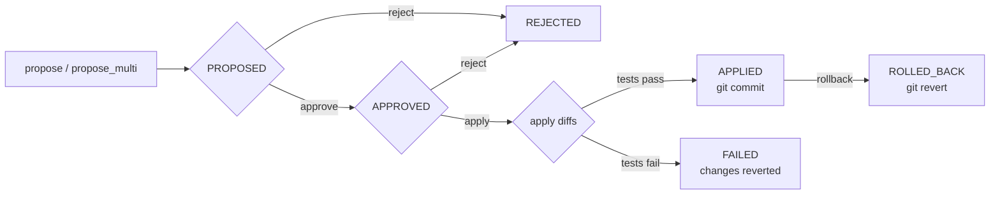

---
tags:
  - architecture
---

# Code Evolution

The `CodeEvolutionManager` class (`missy/agent/code_evolution.py`) lets Missy propose, review, and apply changes to its own source code. Every modification is a first-class `EvolutionProposal` that moves through an explicit approval lifecycle before it ever touches a file, and every applied change is wrapped in a git commit so rollback is always a single `git revert`. The CLI surface for this subsystem is documented at [Evolve Commands](../cli/evolve.md); this page covers the underlying design.

## Lifecycle



`EvolutionStatus` (a `StrEnum`) defines six states: `PROPOSED`, `APPROVED`, `APPLIED`, `REJECTED`, `ROLLED_BACK`, `FAILED`. A proposal can only be applied from `APPROVED`, and can only be rolled back from `APPLIED`.

## EvolutionProposal

Each proposal is an `EvolutionProposal` dataclass containing one or more `FileDiff` entries:

| Field | Type | Description |
|---|---|---|
| `id` | `str` | 8-character UUID prefix |
| `title` | `str` | One-line summary |
| `description` | `str` | Detailed rationale |
| `diffs` | `list[FileDiff]` | File-level changes (`file_path`, `original_code`, `proposed_code`, `description`) |
| `trigger` | `EvolutionTrigger` | `repeated_error`, `user_request`, `learning`, `performance`, or `security` |
| `trigger_detail` | `str` | Extra context (error text, learning ID, etc.) |
| `status` | `EvolutionStatus` | Current lifecycle state |
| `confidence` | `float` | Agent's confidence the change is correct (0.0–1.0) |
| `error_pattern` | `str` | Recurring error text, if triggered by an error |
| `git_commit_sha` | `str` | SHA of the commit created on apply |
| `test_output` | `str` | Captured pytest output (capped to the last 2000 characters) |
| `created_at` / `resolved_at` | `str` | ISO-8601 UTC timestamps |

A diff replaces `original_code` with `proposed_code` using a single `str.replace(..., 1)` — the original text must be an exact, unique match against the current file contents, both when the proposal is created and again immediately before it is applied.

## Security Model

- **Path confinement** — `_validate_path()` resolves every `file_path` and rejects it unless it falls under the repo's `missy/` package directory (or the installed package root). `apply()` additionally re-checks that the resolved path is relative to the repo root before writing, blocking path traversal.
- **Exact-match validation** — `_validate_diffs()` requires `original_code` to be present verbatim in the target file, both at proposal time and at apply time, so a proposal cannot silently apply against source that has since changed underneath it.
- **Mandatory test gate** — `apply()` always runs the configured `test_command` (default: `python3 -m pytest tests/ -x -q --tb=short`) after patching files and before committing. A non-zero return code reverts the patched files via `git checkout --` and marks the proposal `FAILED`.
- **Sanitized test environment** — tests run with a scrubbed environment (an explicit allowlist of vars like `PATH`, `HOME`, `LANG`, `DISPLAY`) so provider API keys and other secrets in the parent process's environment cannot leak into or influence the test run.
- **Git safety net** — before touching files, `_stash_if_dirty()` stashes any uncommitted work in the repo (`git stash push`) and restores it in a `finally` block, so an in-flight evolution can never clobber unrelated local changes.
- **Store capacity** — `MAX_PROPOSALS = 50`; `propose_multi()` raises once the store is full, forcing old proposals to be resolved first.
- **Audit trail** — every lifecycle transition (`proposed`, `approved`, `rejected`, `applied`, `test_failed`, `rolled_back`) is published as an `AuditEvent` on the core event bus, category `"plugin"`.

## Usage

```python
from missy.agent.code_evolution import CodeEvolutionManager

mgr = CodeEvolutionManager()

prop = mgr.propose(
    title="Fix timeout handling in circuit breaker",
    description="Increase base timeout and add jitter",
    file_path="missy/agent/circuit_breaker.py",
    original_code="base_timeout=60",
    proposed_code="base_timeout=90",
    trigger="repeated_error",
)

mgr.approve(prop.id)
result = mgr.apply(prop.id)
# {"success": True, "message": "Evolution applied and committed: a1b2c3d4",
#  "commit_sha": "...", "test_output": "..."}

# Later, if the change turns out to be wrong:
mgr.rollback(prop.id)
```

### Multi-file proposals

`propose_multi()` accepts a list of `FileDiff` objects when a change spans more than one file — the diffs are validated and applied together, and the resulting commit lists every changed file.

### Auto-proposal from repeated errors

`analyze_error_for_evolution()` inspects a traceback for frames inside `missy/` after a tool has failed at least 3 times (`failure_count >= 3`). If it finds a Missy source file in the trace, it returns a **skeleton proposal** — trigger `REPEATED_ERROR`, `confidence=0.0`, and an empty `diffs` list — that the agent is expected to fill in with an actual `original_code`/`proposed_code` fix before calling `propose_multi()`. This method never invents a fix itself; it only identifies *where* to look.

## Persistence

Proposals are stored as JSON at `~/.missy/evolutions.json` (directory created with mode `0o700`). The full list is serialized on every mutation via `_serialize_proposal()`/`_deserialize_proposal()`, which round-trip the nested `FileDiff` list and the `EvolutionTrigger`/`EvolutionStatus` enums. Access to the in-memory list is guarded by a `threading.Lock`.

Applied changes are additionally recorded in git history as commits prefixed `[missy-evolve]`, containing the proposal ID, trigger, confidence, and file list in the commit body — this is what makes `rollback()` possible via `git revert --no-edit <sha>`.

## Restarting after an evolution

`restart_process()` (module-level function) replaces the running process with a fresh invocation of the same command via `os.execv`, preserving the PID and terminal session — used to pick up a self-modification without a manual restart. If `execv` fails it falls back to `sys.exit(75)` (`EX_TEMPFAIL`) with a message asking for a manual restart.

## Integration with the Runtime

`CodeEvolutionManager` is instantiated by the `AgentRuntime` (see [Agent Runtime](agent-runtime.md)) alongside the other lazy-loaded subsystems. Proposals can originate from the agent itself (e.g. via a `code_evolve` tool after `analyze_error_for_evolution()` flags a recurring failure) or from an operator via `missy evolve`. Approval and application remain deliberately manual steps — nothing in this module auto-approves or auto-applies a proposal.

## Related

- [Evolve Commands](../cli/evolve.md) — the `missy evolve list/show/approve/reject/apply/rollback` CLI reference
- [Agent Runtime](agent-runtime.md) — orchestrates subsystem lifecycles including `CodeEvolutionManager`
- [Circuit Breaker](circuit-breaker.md) — one of the subsystems whose failures can trigger an evolution proposal
