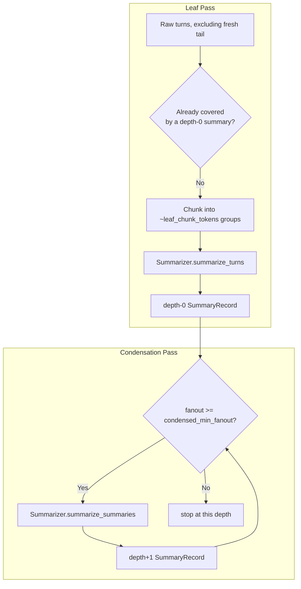

---
tags:
  - architecture
---

# Compaction Manager

`missy/agent/compaction.py` is the orchestration layer that decides *when* and *how much* of a session's conversation history to summarize. It has no class of its own — it's a small set of module-level functions (`compact_session`, `should_compact`, `compact_if_needed`) that drive the [Summarizer](summarizer.md) and read/write `SummaryRecord`s in the `SQLiteMemoryStore`. Where the [Condenser Pipeline](condenser-pipeline.md) defines *what* compression looks like (observation masking → amortized forgetting → summarizing → windowing), `CompactionManager` is the piece that walks a session's turn history and summary DAG, decides which chunks are due for compaction, and calls the summarizer to do the actual work — the two systems describe the same overall process from different angles (see [Relationship to Condenser Pipeline](#relationship-to-condenser-pipeline) below).

## Two Kinds of Passes



### Leaf pass

Turns fetched via `memory_store.get_session_turns()` are compared against the last `fresh_tail_count` turns (default 16), which are always protected from compaction. Of the remaining "evictable" turns, any not already covered by an existing depth-0 `SummaryRecord` (tracked via `source_turn_ids`) are grouped into chunks of roughly `leaf_chunk_tokens` (default 20,000) using `_chunk_turns()`, and each chunk is summarized with `Summarizer.summarize_turns()`. The most recent existing depth-0 summary, if any, is passed as `prior_summary` for continuity across chunks. Each result is written as a new `SummaryRecord` with `depth=0` and `source_turn_ids` set to the summarized turns' IDs.

### Condensation pass

After the leaf pass, `compact_session` walks depths starting at 0: at each depth it fetches `get_uncompacted_summaries(session_id, depth)`, and if there are at least `condensed_min_fanout` (default 4) of them, it condenses them into a single parent `SummaryRecord` at `depth + 1` via `Summarizer.summarize_summaries()`, then calls `memory_store.mark_summary_compacted()` to mark the children as consumed. This repeats depth by depth (bounded by `max_condense_depth`, default unlimited) until a depth doesn't have enough summaries to condense further — i.e. the DAG only grows a new level when there's sufficient fanout at the level below.

Both passes return/accumulate into a single `stats` dict: `leaf_summaries_created`, `condensed_summaries_created`, `turns_compacted`, and `tiers_used` (the list of summarizer tiers — `normal`/`aggressive`/`fallback` — used across all calls in the run).

## Deciding When to Compact

`should_compact(session_id, memory_store, token_budget, threshold=0.75)` compares the session's current token count (`memory_store.get_session_token_count()`) against `token_budget * threshold` and returns a plain boolean — it does no summarization itself.

`compact_if_needed(session_id, memory_store, summarizer, budget)` is the usual entry point: it reads `context_threshold`, `fresh_tail_count`, `leaf_chunk_tokens`, and `condensed_min_fanout` off the given `TokenBudget` (falling back to the module defaults via `getattr` if the budget object doesn't define them), checks `should_compact()`, and only calls `compact_session()` if the threshold is exceeded. It returns `None` when no compaction ran, or the stats dict when it did.

## Defaults

| Constant | Value | Meaning |
|---|---|---|
| `_DEFAULT_LEAF_CHUNK_TOKENS` | 20,000 | Max source tokens per leaf summary chunk |
| `_DEFAULT_CONDENSED_MIN_FANOUT` | 4 | Minimum sibling summaries before condensing to the next depth |
| `_DEFAULT_CONTEXT_THRESHOLD` | 0.75 | Fraction of token budget that triggers compaction |
| `_DEFAULT_FRESH_TAIL` | 16 | Recent turns always protected from compaction |

## Usage

```python
from missy.agent.compaction import compact_session, compact_if_needed, should_compact

# Unconditional full pass
stats = compact_session(
    "sess-1", memory_store, summarizer,
    fresh_tail_count=16, leaf_chunk_tokens=20_000, condensed_min_fanout=4,
)
# {"leaf_summaries_created": 2, "condensed_summaries_created": 0,
#  "turns_compacted": 40, "tiers_used": ["normal", "normal"]}

# Conditional pass, driven by the session's live token budget
if should_compact("sess-1", memory_store, budget.total):
    stats = compact_if_needed("sess-1", memory_store, summarizer, budget)
```

Important guarantee: **the original turns are never deleted.** Compaction only adds `SummaryRecord`s and marks summaries as compacted (folded into a parent); the full turn history remains queryable in the `SQLiteMemoryStore`. Only what is injected into the active context window shrinks.

## Relationship to Condenser Pipeline

| Concern | CompactionManager (this page) | Condenser Pipeline |
|---|---|---|
| Role | Orchestrates *when* to compact and walks the leaf/condensation DAG | Defines the conceptual 4-stage compression process |
| Unit of work | `SummaryRecord` DAG over a session's turns | Observation masking → amortized forgetting → summarizing → windowing |
| Calls | `Summarizer.summarize_turns()` / `summarize_summaries()` | Implemented across masking, forgetting, summarizing, and windowing logic |
| Trigger | `should_compact()` / `compact_if_needed()`, driven by `TokenBudget` | Triggered by context threshold, sleep mode, or manual scheduling (per [Condenser Pipeline](condenser-pipeline.md)) |

In short: `CompactionManager` is the scheduler and DAG-builder; the "Summarizing" stage described on the [Condenser Pipeline](condenser-pipeline.md) page is what actually happens inside each `compact_session()` call via the [Summarizer](summarizer.md). See that page for the other three stages (observation masking, amortized forgetting, windowing), which are not re-explained here.

## Integration with the Runtime

`compact_if_needed()` is called with the active session's `TokenBudget` (see [Context Management](context-management.md)) as part of normal turn processing, and again from [Sleeptime](sleeptime.md) background processing and [Sleep Mode](sleep-mode.md) consolidation. The resulting `SummaryRecord`s feed into the [Memory Synthesizer](memory-synthesizer.md), which ranks and merges them alongside learnings and playbook entries for context injection.

## Related

- [Condenser Pipeline](condenser-pipeline.md) — the 4-stage compression model this manager orchestrates
- [Summarizer](summarizer.md) — the LLM-backed engine that performs each leaf/condensation call
- [Context Management](context-management.md) — the `TokenBudget` that drives compaction thresholds
- [Sleep Mode](sleep-mode.md) — another path that triggers compaction at 80% context capacity
