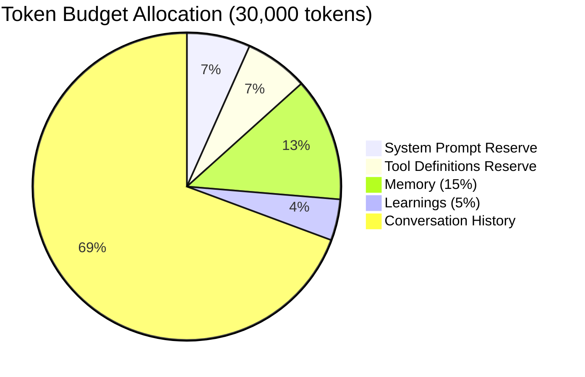
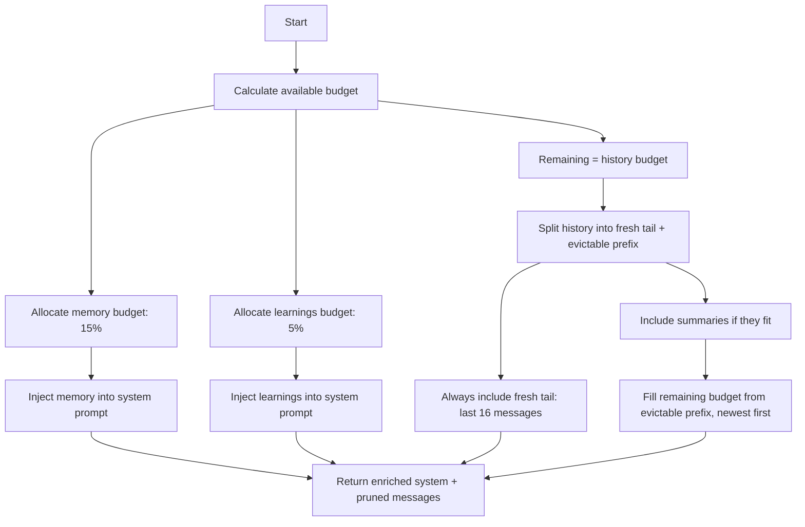

# Context Management

The `ContextManager` (`missy/agent/context.py`) assembles conversation context within configurable token budget limits. It enriches the system prompt with retrieved memory and learnings, and prunes conversation history when the budget is exceeded.

## Token Budget

The budget is defined by the `TokenBudget` dataclass:

```python
@dataclass
class TokenBudget:
    total: int = 30_000
    system_reserve: int = 2_000
    tool_definitions_reserve: int = 2_000
    memory_fraction: float = 0.15
    learnings_fraction: float = 0.05
    fresh_tail_count: int = 16
```

### Budget Allocation



The available budget after reserves is `total - system_reserve - tool_definitions_reserve = 26,000`. From this:

| Allocation | Fraction | Tokens (default) |
|---|---|---|
| Memory snippets | 15% of available | ~3,900 |
| Learnings | 5% of available | ~1,300 |
| Conversation history | Remainder | ~20,800 |

## Token Estimation

Token counts are approximated using a **4-characters-per-token** heuristic:

```python
def _approx_tokens(text: str) -> int:
    return max(1, len(text) // 4)
```

This is a fast approximation that avoids the overhead of a full tokenizer. It slightly overestimates for English text and underestimates for code-heavy content, but provides a safe budget boundary.

## Context Assembly

The `build_messages()` method assembles the final context in this order:



### System Prompt Enrichment

The base system prompt is enriched with two optional sections:

**Memory snippets** -- Relevant past context retrieved via FTS5 search from the memory store:

```
## Relevant Memory
User previously asked about deploying to Kubernetes.
Last session covered Python asyncio patterns.
```

**Learnings** -- Lessons extracted from previous tool-augmented runs (up to 5):

```
## Past Learnings
- When editing Python files, always run ruff check after changes
- User prefers YAML configs over JSON
- The workspace uses pytest with coverage threshold 85%
```

Learnings are only injected if they fit within the learnings budget.

## Pruning Strategy

When conversation history exceeds the budget, the `ContextManager` uses a two-tier pruning strategy:

### Fresh Tail (Protected)

The most recent 16 messages (`fresh_tail_count`) are **always included** regardless of budget. This ensures the model has immediate conversational context.

### Evictable Prefix

All messages older than the fresh tail are candidates for eviction. They are evaluated **newest first** -- the most recent evictable messages are kept, and the oldest are dropped:

```
Messages:  [1] [2] [3] [4] [5] [6] [7] [8] ... [20] [21] [22] [23] [24]
                                                  |    |--- fresh tail ---|
           |--- evictable prefix --------------|  |
           dropped first ←                        → kept if budget allows
```

!!! note "Newest-first fill, not oldest-first drop"
    The evictable prefix is filled from newest to oldest. Once a message would exceed the remaining budget, all older messages are dropped. This preserves the most relevant recent context.

### Conversation Summaries

If conversation summaries are available (from the summarization subsystem), they are inserted **before** evictable messages as compressed history. This gives the model a high-level understanding of earlier conversation even when those messages have been pruned.

```
[Summary: depth 2, 45 messages, covers 2024-01-15 to 2024-01-16]
The user worked on setting up a Kubernetes deployment...

[Evictable message 15]
[Evictable message 16]
[Fresh tail message 17]
...
[Fresh tail message 24]
[New user message]
```

## Configuration

The token budget is not directly configurable via `config.yaml` -- it uses built-in defaults. To customize, pass a `TokenBudget` when constructing the `ContextManager`:

```python
from missy.agent.context import ContextManager, TokenBudget

mgr = ContextManager(TokenBudget(
    total=50_000,           # larger budget for premium models
    memory_fraction=0.20,   # more memory context
    learnings_fraction=0.10,
    fresh_tail_count=24,    # protect more recent messages
))
```

## Example

Given a 30,000 token budget with 40 messages in history:

1. **Reserves**: 2,000 (system) + 2,000 (tools) = 4,000 reserved.
2. **Available**: 26,000 tokens.
3. **Memory**: 15% of 26,000 = 3,900 tokens for memory snippets.
4. **Learnings**: 5% of 26,000 = 1,300 tokens for learnings.
5. **History budget**: 26,000 - 3,900 - 1,300 = 20,800 tokens.
6. **Fresh tail**: Messages 25-40 (16 messages) -- always included.
7. **Evictable**: Messages 1-24. Fill from message 24 backward until budget is exhausted. Perhaps messages 12-24 fit, so messages 1-11 are dropped.

Result: The model sees the enriched system prompt, messages 12-40, and the new user message.
