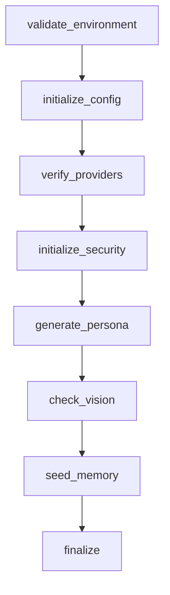

---
tags:
  - architecture
---

# Hatching

The `HatchingManager` class (`missy/agent/hatching.py`) implements "hatching" — Missy's first-run bootstrap experience, where the agent establishes identity, validates its environment, configures behavior, initializes memory, and becomes usable. It's an idempotent, resumable state machine: each of its 8 steps is tracked individually, so an interrupted or failed hatching can pick up exactly where it left off on the next run. The `missy hatch` CLI command (documented at [Core Commands](../cli/core.md)) is the operator-facing entry point; this page covers the underlying design.

## The 8 Steps



1. **`validate_environment`** — Checks the running Python is 3.11+ (hard failure otherwise), ensures `~/.missy/` can be created and is writable, and checks available disk space against a 50 MiB minimum (`_MIN_FREE_BYTES`). Low disk space is a *non-fatal* warning, not a hard failure.
2. **`initialize_config`** — Writes a default `~/.missy/config.yaml` if none exists (network preset `anthropic`, shell/plugins disabled, `workspace_path: ~/workspace`). Does nothing if a config already exists.
3. **`verify_providers`** — Looks for `ANTHROPIC_API_KEY` or `OPENAI_API_KEY` in the environment, then falls back to scanning `config.yaml`'s `providers` section for a non-empty `api_key`/`api_keys`. If nothing is found, this raises a non-fatal warning (hatching still proceeds; credentials can be added later).
4. **`initialize_security`** — Creates `~/.missy/secrets/` with mode `0o700`. Does *not* generate the Ed25519 identity keypair itself — that's created lazily by `AgentIdentity` on first use — but logs whether `~/.missy/identity.pem` is already present.
5. **`generate_persona`** — If `~/.missy/persona.yaml` doesn't already exist, constructs a `PersonaManager` and calls `save()` to write the default persona. See [Persona](persona.md) for the full schema.
6. **`check_vision`** — Non-fatal readiness check for the optional vision subsystem: verifies `opencv-python-headless` and `numpy` are importable, calls `discover_cameras(force=True)`, and checks for screenshot tooling via `VisionDoctor.check_screenshot_tools()`. Any missing piece is collected into an `issues` list and raised as a single non-fatal warning — vision is optional and never blocks hatching.
7. **`seed_memory`** — Opens the `SQLiteMemoryStore` at `~/.missy/memory.db` and writes a single welcome `ConversationTurn` (`session_id="hatching"`, `role="system"`, content `"Missy hatching completed. Ready to assist."`). Failure here is also non-fatal.
8. **`finalize`** — Sets `status = HATCHED`, stamps `completed_at`, clears any prior `error`, and persists the final state.

## State Machine

`HatchingStatus` is a plain `Enum` with four values: `UNHATCHED`, `IN_PROGRESS`, `HATCHED`, `FAILED`. `run_hatching()`:

- Short-circuits immediately if already `HATCHED`.
- If resuming from `FAILED`, clears `state.error` and proceeds.
- Sets status to `IN_PROGRESS`, stamps `started_at` (only if not already set, so a resumed run keeps its original start time).
- Iterates the 8 steps in order, **skipping any step whose name is already in `state.steps_completed`** — this is what makes hatching resumable.
- On success, appends the step name to `steps_completed` and saves state after *every* step (not just at the end).
- On a caught `_HatchingStepWarning`, logs it as `"warn"`, still marks the step completed, and continues — this is the mechanism steps 1, 3, 6, and 7 use to signal "non-fatal, keep going."
- On any other `Exception`, logs `"error"`, sets `status = FAILED` with a descriptive `error` message, saves, and **returns immediately** — remaining steps do not run until the next `run_hatching()` call.

```python
from missy.agent.hatching import HatchingManager

manager = HatchingManager()
if manager.needs_hatching():
    state = manager.run_hatching(interactive=False)
    if state.status.name == "HATCHED":
        print("Missy is ready.")
    else:
        print(f"Hatching incomplete: {state.error}")
```

`needs_hatching()` returns `True` when no state file exists, or when the persisted status is `UNHATCHED` or `FAILED`. `is_hatched()` is a convenience check for `status is HatchingStatus.HATCHED`. `reset()` deletes the state file (forcing a full re-hatch) but deliberately **preserves the hatching log**, so the history of all attempts survives a reset.

## HatchingState Fields

| Field | Type | Description |
|---|---|---|
| `status` | `HatchingStatus` | Current lifecycle phase |
| `started_at` / `completed_at` | `str \| None` | ISO-8601 UTC timestamps |
| `steps_completed` | `list[str]` | Names of steps that have succeeded (drives resumability) |
| `persona_generated` | `bool` | Set by step 5 |
| `environment_validated` | `bool` | Set by step 1 |
| `provider_verified` | `bool` | Set by step 3 |
| `security_initialized` | `bool` | Set by step 4 |
| `memory_seeded` | `bool` | Set by step 7 |
| `error` | `str \| None` | Description of the last failure, if any |

## Persistence

State is written atomically to `~/.missy/hatching.yaml`: `HatchingManager._save_state()` writes to a `.yaml.tmp` sibling file (created with mode `0o600` via `os.open`) and then `Path.replace()`s it into place, so a crash mid-write can't corrupt the state file. It's saved after **every** step transition, not just at the end.

A separate structured `HatchingLog` (`missy/agent/hatching.py`) appends one JSON object per line to `~/.missy/hatching_log.jsonl` (also mode `0o600`) for every step attempt, with `timestamp`, `step`, `status` (`"ok"`/`"warn"`/`"error"`/`"info"`), `message`, and optional `details`. This log is intentionally append-only and survives resets, giving a full audit trail of every hatching attempt across the agent's lifetime. `get_hatching_log()` returns all entries in chronological order.

## Integration with the Runtime

Hatching runs before the [Agent Runtime](agent-runtime.md) is fully operational — it's the bootstrap that ensures the config file, persona file, security directories, and memory store the runtime depends on all exist. The `generate_persona` step directly constructs a [PersonaManager](persona.md) to seed `~/.missy/persona.yaml`, and `seed_memory` writes directly into the same `SQLiteMemoryStore` the runtime uses at steady state.

## Related

- [Core CLI Commands](../cli/core.md) — the `missy hatch` command reference
- [Persona](persona.md) — the persona system seeded by the `generate_persona` step
- [Agent Runtime](agent-runtime.md) — the subsystem hatching prepares the ground for
