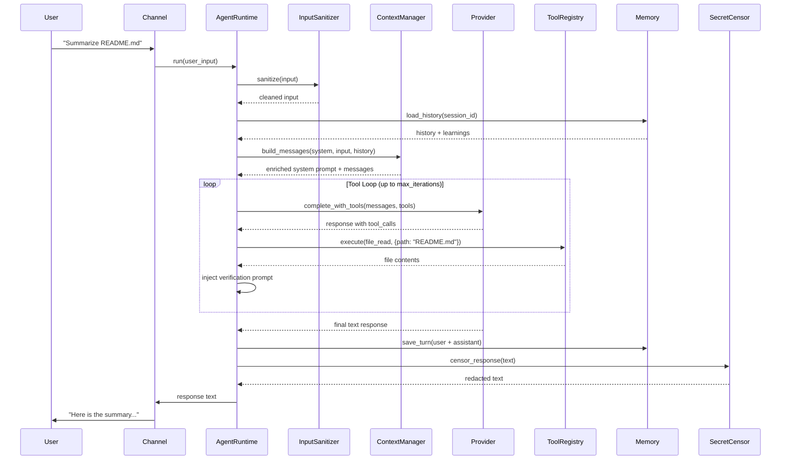

# Architecture Overview

Missy is a security-first, self-hosted agentic AI assistant for Linux. This page describes the system architecture: how components fit together and how a request flows from input to response.

## System Diagram

```mermaid
graph TB
    subgraph Channels
        CLI[CLIChannel]
        Discord[DiscordChannel]
        Webhook[WebhookChannel]
        Voice[VoiceChannel]
    end

    subgraph Core["Agent Core"]
        Runtime[AgentRuntime]
        Context[ContextManager]
        CB[CircuitBreaker]
        Progress[ProgressReporter]
    end

    subgraph Security
        Sanitizer[InputSanitizer]
        Secrets[SecretsDetector]
        Censor[SecretCensor]
        Policy[PolicyEngine]
        RestPolicy[RestPolicy L7]
        Drift[PromptDriftDetector]
        Identity[AgentIdentity]
        Trust[TrustScorer]
        Container[ContainerSandbox]
        IApproval[InteractiveApproval]
    end

    subgraph Providers
        Registry[ProviderRegistry]
        Router[ModelRouter]
        RL[RateLimiter]
        Anthropic[AnthropicProvider]
        OpenAI[OpenAIProvider]
        Ollama[OllamaProvider]
    end

    subgraph Tools
        ToolReg[ToolRegistry]
        MCP[McpManager]
        BuiltIn[Built-in Tools]
    end

    subgraph Intelligence["Intelligence"]
        Playbook[Playbook]
        Consolidator[MemoryConsolidator]
        Attention[AttentionSystem]
        Synthesizer[MemorySynthesizer]
        Bus[MessageBus]
    end

    subgraph Persistence
        Memory[SQLiteMemoryStore]
        VectorMem[VectorMemoryStore FAISS]
        Audit[AuditLogger]
        Learnings[Learnings]
        Checkpoint[CheckpointManager]
    end

    CLI --> Runtime
    Discord --> Runtime
    Webhook --> Runtime
    Voice --> Runtime

    Runtime --> Sanitizer
    Runtime --> Context
    Runtime --> CB
    Runtime --> Progress

    Sanitizer --> Policy
    Policy --> RestPolicy
    Runtime --> Identity
    Runtime --> Trust
    Runtime --> Drift
    Runtime --> Container
    Runtime --> IApproval
    Runtime --> Registry
    Registry --> Router
    Router --> RL
    RL --> Anthropic
    RL --> OpenAI
    RL --> Ollama

    Runtime --> ToolReg
    ToolReg --> BuiltIn
    ToolReg --> MCP

    Policy -.->|enforces| Registry
    Policy -.->|enforces| ToolReg

    Runtime --> Playbook
    Runtime --> Consolidator
    Runtime --> Attention
    Runtime --> Synthesizer
    Synthesizer --> Learnings
    Synthesizer --> Playbook
    Synthesizer --> Memory
    Runtime --> Bus
    Bus -.->|events| Audit
    Bus -.->|events| Attention

    Runtime --> Memory
    Runtime --> VectorMem
    Runtime --> Audit
    Runtime --> Learnings
    Runtime --> Checkpoint
```

## Key Subsystems

### Channels

Channels are the communication interfaces through which users interact with Missy. Each channel adapts its input/output format but delegates all processing to the same `AgentRuntime`.

| Channel | Transport | Use Case |
|---|---|---|
| `CLIChannel` | stdin/stdout | Interactive terminal, scripting |
| `DiscordChannel` | WebSocket + REST | Chat bot with slash commands |
| `WebhookChannel` | HTTP POST | External integrations, automation |
| `VoiceChannel` | WebSocket + PCM audio | Edge node voice assistants |

### Agent Runtime

The `AgentRuntime` is the central orchestrator. It binds a provider, session, tool registry, and all supporting subsystems into a single execution loop. See [Agent Runtime](agent-runtime.md) for details.

### Policy Engine

The `PolicyEngine` is a three-layer enforcement facade that gates all external interactions:

- **NetworkPolicyEngine** -- Controls outbound HTTP (CIDR blocks, domain matching, per-category hosts).
- **FilesystemPolicyEngine** -- Controls file read/write access (path allowlists, symlink resolution).
- **ShellPolicyEngine** -- Controls command execution (enabled flag, command whitelist).

Every check emits an audit event regardless of outcome.

### Provider System

The `ProviderRegistry` manages multiple AI providers with fallback resolution. The `ModelRouter` selects the appropriate model tier (fast, default, premium) based on task complexity. A `RateLimiter` throttles API calls per provider.

Supported providers: Anthropic, OpenAI, Ollama (and any OpenAI-compatible endpoint via `base_url` override).

### Tool System

The `ToolRegistry` manages built-in tools and MCP server connections. Tools are invoked during the agentic loop when the model requests them. Built-in tools include file operations, shell execution, web fetch, calculator, browser automation, and more.

MCP (Model Context Protocol) servers extend the tool set dynamically. Tools from MCP servers are namespaced as `server__tool`.

### Security Layer

All inputs pass through the `InputSanitizer` (prompt injection detection) before reaching the LLM. All outputs pass through the `SecretCensor` (credential redaction) before reaching the user. The `SecretsDetector` identifies 9+ credential patterns (API keys, JWTs, private keys, etc.).

Additional security subsystems:

- **PromptDriftDetector** -- Registers system prompt hashes at session start and verifies them before each provider call, detecting runtime prompt tampering.
- **AgentIdentity** -- Ed25519 keypair that signs audit events for non-repudiation and tamper detection.
- **TrustScorer** -- Tracks reliability of providers, MCP servers, and tools on a 0--1000 scale. Untrusted entities trigger warnings or require approval.
- **ContainerSandbox** -- Docker-based per-session isolation for tool execution, with network disabled, capabilities dropped, and resource limits enforced.
- **InteractiveApproval** -- TUI that surfaces policy-denied operations for real-time operator approval with session-scoped "allow always" memory.
- **RestPolicy** -- L7 per-host HTTP method and path rules evaluated after host-level network policy.

### Persistence

- **SQLiteMemoryStore** -- Conversation history with FTS5 full-text search (`~/.missy/memory.db`).
- **VectorMemoryStore** -- Optional FAISS-backed semantic search over text entries (`~/.missy/memory.faiss`). Uses TF-IDF hashing vectors for approximate nearest-neighbor retrieval without requiring an external embedding model.
- **AuditLogger** -- Structured JSONL audit trail (`~/.missy/audit.jsonl`), optionally signed with the agent's Ed25519 identity.
- **Learnings** -- Task outcomes extracted from tool-augmented runs, persisted in SQLite.
- **CheckpointManager** -- Saves tool loop state for crash recovery.

### Intelligence

- **[Playbook](playbook.md)** -- Auto-captures successful tool-use patterns. Matches by task type + tool sequence hash. Promotes patterns to skill proposals after 3+ successes. JSON persistence at `~/.missy/playbook.json`.
- **[MemoryConsolidator](sleep-mode.md)** -- Sleep mode that compresses conversation history when the context window reaches 80% capacity. Keeps the last 4 messages intact, extracts key facts from older messages, and replaces them with a summary.
- **[AttentionSystem](attention.md)** -- Five-subsystem pipeline: alerting (urgency detection), orienting (topic extraction), sustained (focus continuity), selective (memory filtering), executive (tool prioritization).
- **[MemorySynthesizer](memory-synthesizer.md)** -- Merges learnings, summaries, playbook entries, and conversation fragments into a single relevance-ranked context block within a 4500-token budget. Replaces separate memory injection.
- **[MessageBus](message-bus.md)** -- Async event bus with `fnmatch` topic wildcards, priority queue, correlation IDs, and both sync and async dispatch. Singleton pattern shared across all subsystems.

## Request Flow

Here is how a single user request flows through the system:

### Step-by-Step

1. **Input** -- User sends a message through any channel.
2. **Sanitization** -- `InputSanitizer` checks for prompt injection patterns and truncates oversized payloads.
3. **Session resolution** -- A session is created or resumed from the session ID.
4. **History loading** -- Previous conversation turns and relevant memory snippets are retrieved from SQLite.
5. **Context assembly** -- `ContextManager` builds the message list within the token budget, enriching the system prompt with memory and learnings.
6. **Provider resolution** -- `ProviderRegistry` resolves the configured provider (with fallback).
7. **Tool loop** -- If tools are available and `max_iterations > 1`, the runtime enters the agentic loop:
    - Call the provider with tool schemas.
    - Execute any requested tool calls (gated by the policy engine).
    - Inject verification prompts.
    - Repeat until the model produces a final response or the iteration limit is reached.
8. **Persistence** -- User and assistant turns are saved to the memory store. Learnings are extracted from tool-augmented runs.
9. **Censorship** -- `SecretCensor` redacts any detected credentials from the response.
10. **Output** -- The final response is returned to the user through the channel.

## Design Principles

- **Secure by default** -- Every capability is disabled until explicitly enabled in config.
- **Policy enforcement at the edge** -- All external interactions (network, filesystem, shell) pass through the policy engine before execution.
- **Graceful degradation** -- Subsystems (memory, learnings, checkpoints, cost tracking) are loaded lazily and fail silently, so the core agent loop is always functional.
- **Full auditability** -- Every policy check, tool call, and provider interaction emits a structured audit event.
- **Provider agnostic** -- The same agent loop works with any provider that implements the `BaseProvider` interface.

## Further Reading

- [Agent Runtime](agent-runtime.md) -- session management, tool loop, checkpoint/recovery
- [Context Management](context-management.md) -- token budget, memory injection, pruning
- [Circuit Breaker](circuit-breaker.md) -- failure isolation with exponential backoff
- [Progress Reporting](progress-reporting.md) -- structured progress protocol
- [AI Playbook](playbook.md) -- auto-capture and replay of successful tool patterns
- [Sleep Mode](sleep-mode.md) -- memory consolidation when context fills up
- [Memory Synthesizer](memory-synthesizer.md) -- unified relevance-ranked memory block
- [Attention System](attention.md) -- five-subsystem focus and priority pipeline
- [Message Bus](message-bus.md) -- async event routing with topic wildcards
