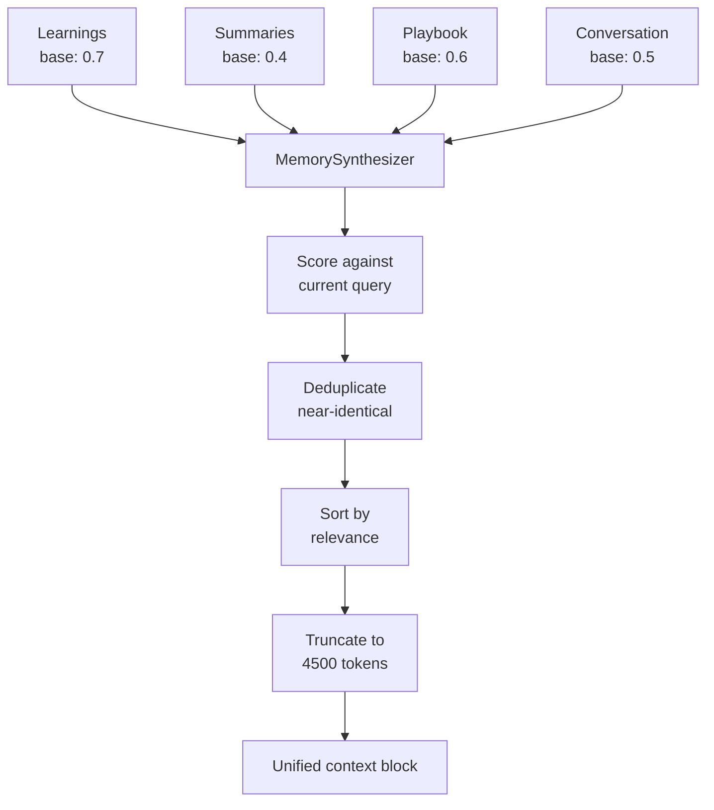

# Memory Synthesizer

The `MemorySynthesizer` class (`missy/memory/synthesizer.py`) merges all of Missy's memory subsystems into a single, deduplicated, relevance-ranked context block. Instead of injecting learnings, summaries, and playbook entries separately (each consuming its own token allocation), the synthesizer produces one unified block that fits within a shared budget.

## Why Unified Memory?

Previously, the `ContextManager` injected memory from multiple sources independently:

- Learnings (15% of token budget)
- Conversation summaries
- Playbook entries (5% of token budget)

This led to duplication (the same fact appearing in both learnings and a summary) and poor prioritization (a highly relevant playbook entry might be crowded out by stale learnings). The synthesizer solves both problems.

## Architecture



## Memory Sources and Base Relevance

Each source is assigned a **base relevance** score reflecting its general usefulness:

| Source | Base Relevance | Rationale |
|---|---|---|
| **Learnings** | 0.7 | Proven task outcomes -- highest baseline value |
| **Playbook** | 0.6 | Successful patterns -- high but not yet proven across contexts |
| **Conversation** | 0.5 | General context -- neutral baseline |
| **Summaries** | 0.4 | Compressed older context -- useful but lower fidelity |

## Relevance Scoring

Each fragment is scored against the current user query using a **keyword overlap** formula:

```
final_score = base_relevance * 0.5 + keyword_overlap * 0.5
```

Where `keyword_overlap` is the fraction of query words that appear in the fragment:

```python
query_words = set(query.lower().split())
content_words = set(fragment.content.lower().split())
overlap = len(query_words & content_words) / len(query_words)
```

This means a learning with base relevance 0.7 that shares many words with the current query will score near 0.85, while a summary with base 0.4 and no keyword overlap will score 0.2.

## Deduplication

Before ranking, near-duplicate fragments are removed. Two fragments are considered duplicates when their **word-level Jaccard overlap** exceeds 80%:

```
overlap = |words_A ∩ words_B| / |words_A ∪ words_B|
```

When duplicates are found, the fragment with the **higher relevance score** is kept and the other is discarded. This prevents the same fact from appearing multiple times in the output even when it exists in both learnings and a conversation summary.

## Token Budget

The synthesizer enforces a **4500 token** budget (configurable via `max_tokens`). Fragments are added in relevance order until the budget is exhausted. Token estimation uses the standard 4-characters-per-token heuristic.

## Output Format

The synthesized block is a newline-separated string with source labels:

```
[learnings] Always check disk space before large file operations
[playbook] Use rsync with --checksum for reliable deployments
[conversation] User prefers YAML over JSON for config files
[summaries] Previous session covered Docker networking setup
```

This block is injected directly into the system prompt by the `ContextManager`.

## Usage

```python
from missy.memory.synthesizer import MemorySynthesizer

synth = MemorySynthesizer(max_tokens=4500)

# Add fragments from each subsystem
synth.add_fragments("learnings",
    ["always check ports first", "use --verbose for debugging"],
    base_relevance=0.7)

synth.add_fragments("playbook",
    ["rsync deploy: shell_exec then file_write"],
    base_relevance=0.6)

synth.add_fragments("summaries",
    ["discussed Docker networking and port mapping"],
    base_relevance=0.4)

# Synthesize against the current query
block = synth.synthesize("How do I fix Docker networking?")
print(block)
```

## MemoryFragment Dataclass

Each fragment is internally represented as:

| Field | Type | Description |
|---|---|---|
| `source` | `str` | Origin subsystem name |
| `content` | `str` | The actual text content |
| `relevance` | `float` | Relevance score in [0, 1] |
| `timestamp` | `str` | ISO timestamp (informational, not used for ranking) |

## Related

- [AI Playbook](playbook.md) -- one of the sources merged by the synthesizer
- [Sleep Mode](sleep-mode.md) -- produces summaries that feed into the synthesizer
- [Context Management](context-management.md) -- consumes the synthesized block
- [Agent Runtime](agent-runtime.md) -- orchestrates memory loading and synthesis
