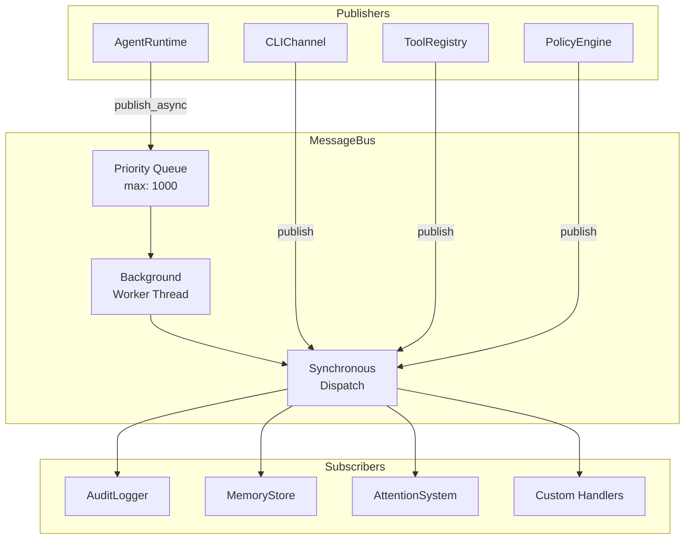
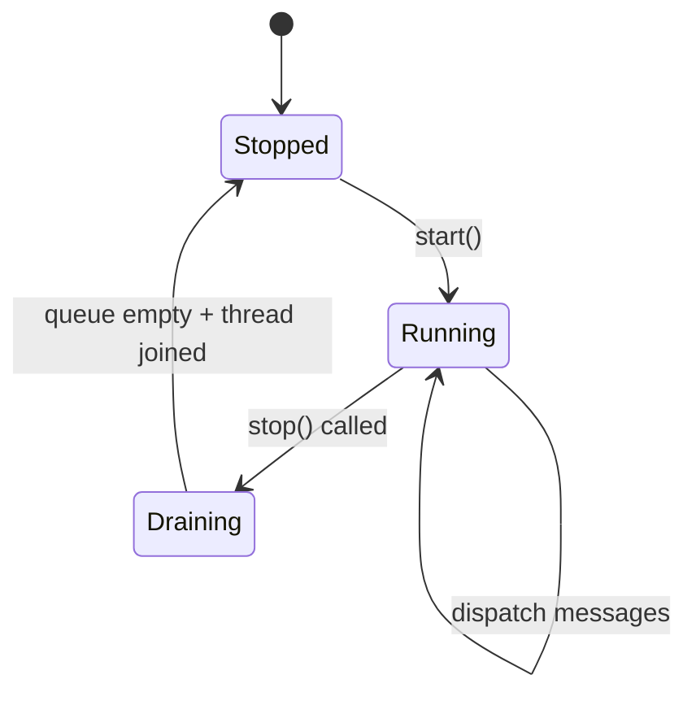

# Message Bus

The `MessageBus` class (`missy/core/message_bus.py`) is an event-driven publish/subscribe system that decouples channels, the agent runtime, and tools via typed message routing. It supports wildcard topic matching, priority queuing, and both synchronous and asynchronous dispatch.

## Architecture



## BusMessage

Every message flowing through the bus is a `BusMessage` dataclass:

| Field | Type | Default | Description |
|---|---|---|---|
| `topic` | `str` | *(required)* | Dotted topic string (e.g. `"agent.run.start"`) |
| `payload` | `dict` | *(required)* | Arbitrary message-specific data |
| `source` | `str` | *(required)* | Originator identifier (e.g. `"cli"`, `"agent"`) |
| `target` | `str \| None` | `None` | Optional specific recipient identifier |
| `message_id` | `str` | *(auto UUID)* | Unique message identifier |
| `correlation_id` | `str \| None` | `None` | Links request/response pairs together |
| `timestamp` | `str` | *(auto ISO-8601)* | Creation time in UTC |
| `priority` | `int` | `0` | Dispatch priority: 0=normal, 1=high, 2=urgent |

## Topic System

Topics use a dotted naming convention: `<subsystem>.<action>[.<detail>]`

### Wildcard Matching

Subscribers register with `fnmatch`-style patterns:

```python
bus.subscribe("agent.*", handler)      # matches agent.run.start, agent.run.complete
bus.subscribe("*.error", handler)       # matches agent.run.error, tool.error
bus.subscribe("security.*.*", handler)  # matches security.approval.needed
bus.subscribe("*", handler)             # matches everything
```

### Standard Topics

These constants are defined in `missy/core/bus_topics.py`:

=== "Channel"

    | Constant | Topic String | Description |
    |---|---|---|
    | `CHANNEL_INBOUND` | `channel.inbound` | User message received |
    | `CHANNEL_OUTBOUND` | `channel.outbound` | Response ready to send |

=== "Agent"

    | Constant | Topic String | Description |
    |---|---|---|
    | `AGENT_RUN_START` | `agent.run.start` | Agent run has started |
    | `AGENT_RUN_COMPLETE` | `agent.run.complete` | Agent run completed successfully |
    | `AGENT_RUN_ERROR` | `agent.run.error` | Agent run failed with an error |

=== "Tool"

    | Constant | Topic String | Description |
    |---|---|---|
    | `TOOL_REQUEST` | `tool.request` | Tool call about to execute |
    | `TOOL_RESULT` | `tool.result` | Tool call completed |

=== "System"

    | Constant | Topic String | Description |
    |---|---|---|
    | `SYSTEM_STARTUP` | `system.startup` | System is starting up |
    | `SYSTEM_SHUTDOWN` | `system.shutdown` | System is shutting down |

=== "Security"

    | Constant | Topic String | Description |
    |---|---|---|
    | `SECURITY_VIOLATION` | `security.violation` | Policy violation detected |
    | `SECURITY_APPROVAL_NEEDED` | `security.approval.needed` | Human approval required |
    | `SECURITY_APPROVAL_RESPONSE` | `security.approval.response` | Approval response received |

## Dispatch Modes

### Synchronous

`publish()` calls all matching handlers immediately in the calling thread, in registration order. Exceptions in handlers are caught and logged -- they never propagate to the publisher.

```python
bus.publish(BusMessage(
    topic="agent.run.start",
    payload={"user_input_length": 42},
    source="agent",
))
```

### Asynchronous

`publish_async()` enqueues the message for dispatch by a background worker thread. Messages are dispatched in **priority order** (higher priority first), with FIFO ordering within the same priority level.

```python
bus.publish_async(BusMessage(
    topic="tool.result",
    payload={"tool": "shell_exec", "exit_code": 0},
    source="tools",
    priority=1,  # high priority
))
```

!!! info "Priority Queue"
    The queue uses a min-heap with negated priorities, so priority 2 (urgent) is dispatched before priority 1 (high), which is dispatched before priority 0 (normal). Maximum queue size defaults to 1000 messages.

## Singleton Pattern

The message bus uses a module-level singleton to ensure all subsystems share the same bus instance:

```python
from missy.core.message_bus import init_message_bus, get_message_bus

# At startup (once)
bus = init_message_bus(max_queue_size=1000)
bus.start()  # start background worker

# Anywhere else
bus = get_message_bus()
bus.subscribe("agent.*", my_handler)

# At shutdown
bus.stop(timeout=5.0)
```

| Function | Description |
|---|---|
| `init_message_bus()` | Create or return the singleton instance |
| `get_message_bus()` | Return the singleton (raises `RuntimeError` if not initialized) |
| `reset_message_bus()` | Stop and reset to `None` (testing only) |

## Correlation IDs

The `correlation_id` field links related messages across the system. For example, a channel can set a correlation ID on an inbound message, and all downstream events (tool calls, provider requests, the final response) carry the same ID for end-to-end tracing:

```python
import uuid

correlation = str(uuid.uuid4())

# Channel publishes inbound message
bus.publish(BusMessage(
    topic="channel.inbound",
    payload={"text": "list files"},
    source="cli",
    correlation_id=correlation,
))

# Later, tool result carries the same correlation
bus.publish(BusMessage(
    topic="tool.result",
    payload={"tool": "shell_exec", "output": "..."},
    source="tools",
    correlation_id=correlation,
))
```

## Worker Lifecycle



- `start()` -- Launches a daemon thread that polls the priority queue and dispatches messages via `publish()`.
- `stop(timeout)` -- Sets the stop event, drains remaining messages synchronously, and joins the worker thread.
- `drain()` -- Processes all queued messages synchronously (useful for testing and shutdown).

## Usage Example

```python
from missy.core.message_bus import init_message_bus, BusMessage
from missy.core.bus_topics import AGENT_RUN_START, AGENT_RUN_COMPLETE

bus = init_message_bus()

# Subscribe to all agent events
def on_agent_event(msg: BusMessage):
    print(f"[{msg.topic}] {msg.payload}")

bus.subscribe("agent.*", on_agent_event)
bus.start()

# Publish events
bus.publish(BusMessage(
    topic=AGENT_RUN_START,
    payload={"session_id": "abc123", "input_length": 42},
    source="agent",
))
```

## Related

- [Agent Runtime](agent-runtime.md) -- primary publisher of agent lifecycle events
- [Attention System](attention.md) -- can subscribe to events for focus tracking
