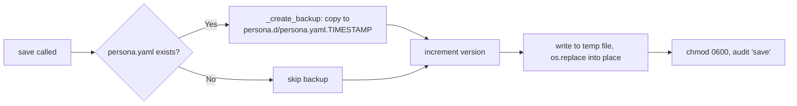

---
tags:
  - architecture
---

# Persona

The `PersonaManager` class (`missy/agent/persona.py`) owns Missy's identity, tone, personality traits, and response-style rules, backed by a YAML file at `~/.missy/persona.yaml`. It handles loading, saving, versioning, timestamped backup/rollback, and audit logging, and it builds the persona section that gets injected into every system prompt. The `missy persona show/edit/reset/backups/diff/rollback/log` CLI commands are documented at [Persona Commands](../cli/persona.md); this page covers the schema and mechanics underneath them.

## PersonaConfig Schema

`PersonaConfig` is a dataclass with these fields (with abbreviated defaults):

| Field | Type | Default | Purpose |
|---|---|---|---|
| `name` | `str` | `"Missy"` | Display name |
| `tone` | `list[str]` | `["helpful", "direct", "technical"]` | Communication-style adjectives |
| `personality_traits` | `list[str]` | `["curious", "thorough", "security-conscious", "pragmatic"]` | Core character traits |
| `behavioral_tendencies` | `list[str]` | e.g. `"prefers action over narration"`, `"adapts formality to context"` | Habitual behavioral patterns |
| `response_style_rules` | `list[str]` | e.g. `"Be concise unless detail is requested"` | Explicit response-formulation rules |
| `boundaries` | `list[str]` | e.g. `"Never execute destructive operations without confirmation"` | Hard constraints the agent must never violate |
| `identity_description` | `str` | A paragraph describing Missy as a security-first Linux assistant, including tone guidance for painting-coaching and puzzle-helping contexts | Narrative identity block |
| `version` | `int` | `1` | Monotonically incremented on every `save()` |

Unknown keys encountered when loading a persona YAML file are silently ignored (`_persona_from_dict()` filters to known dataclass fields), so older installs can read a file written by a newer schema version without crashing.

## System Prompt Injection

`get_system_prompt_prefix()` renders the persona into a multi-line, section-headed text block intended for direct injection into a system prompt:

```
# Identity
<identity_description>

# Tone
Your communication style is <tone items joined by ", ">.

# Personality
Your core character traits are: <personality_traits joined>.

# Behavioural Tendencies
- <tendency>
...

# Response Style
- <rule>
...

# Boundaries
- <boundary>
...
```

Each section is only emitted if the corresponding list/string is non-empty. This is the standalone rendering; the [Behavior Layer](behavior.md) builds a related but distinct persona block (`BehaviorLayer._build_persona_block()`) as part of shaping the *runtime* system prompt with per-turn context — see that page for how tone, traits, and boundaries are woven in alongside intent/urgency guidance.

## Backup, Rollback, and Diff

Every call to `save()` first backs up the *existing* file (if any) before writing the new version, then increments `version` and writes atomically: data goes to a `tempfile.mkstemp()`-created temp file in the same directory, which is `os.replace()`d into place, and the final file is `chmod`'d to `0o600` since persona content is treated as sensitive identity info.



- **Backups** live in `~/.missy/persona.d/`, named `persona.yaml.<%Y%m%d_%H%M%S>`. `_MAX_BACKUPS = 5`; `_prune_backups()` deletes the oldest backups beyond that cap after every new backup is created.
- **`rollback()`** restores the most recent backup: it reads the latest backup's content, backs up the *current* file first (without bumping version, since this isn't a normal save), overwrites `persona.yaml` with the backup content, reloads `self._persona` from disk, and writes a `"rollback"` audit entry. Returns `None` if no backups exist.
- **`diff()`** returns a unified diff (`difflib.unified_diff`) between the latest backup and the current file — useful for previewing what a rollback would undo, or what changed since the last save.
- **`reset()`** restores `PersonaConfig` defaults, preserves (rather than resets) the version counter — incrementing it via the normal `save()` path — and writes a `"reset"` audit entry.

## Audit Log

Every `save()`, `reset()`, and `rollback()` appends a JSON line to `~/.missy/persona_audit.jsonl` (created with mode `0o700` directory / entries appended via `os.open(..., 0o600)`), containing `timestamp`, `action`, `version`, `name`, and an optional `details` dict (e.g. `rollback` records which backup file was restored). `get_audit_log()` returns all entries in chronological order.

## Usage

```python
from missy.agent.persona import PersonaManager

pm = PersonaManager()  # defaults to ~/.missy/persona.yaml

prefix = pm.get_system_prompt_prefix()
print(prefix)

pm.update(name="Missy v2", tone=["playful", "technical"])
pm.save()  # backs up old file, bumps version, writes atomically

print(pm.version)          # 2
print(pm.list_backups())   # [PosixPath(".../persona.d/persona.yaml.20260709_...")]
print(pm.diff())           # unified diff vs. the last backup

pm.rollback()               # restore the previous version
```

`update(**kwargs)` only accepts field names that exist on `PersonaConfig` (excluding `version`, which is never settable directly) — an unknown field raises `ValueError` listing the valid field names, to catch typos early rather than silently no-op'ing.

## Integration with the Runtime

`PersonaManager` is constructed once during hatching (see [Hatching](hatching.md), step 5 `generate_persona`) to write the initial default file, and is read by the [Behavior Layer](behavior.md) at runtime — `BehaviorLayer` takes a `PersonaConfig` and folds its `identity_description`, `tone`, `personality_traits`, `boundaries`, `behavioral_tendencies`, and `response_style_rules` into both the shaped system prompt and the per-turn response guidelines. Persona is therefore the durable identity data; `BehaviorLayer` is what turns it into live prompt text every turn.

## Related

- [Persona Commands](../cli/persona.md) — the `missy persona show/edit/reset/backups/diff/rollback/log` CLI reference
- [Behavior Layer](behavior.md) — consumes `PersonaConfig` to shape system prompts and per-turn guidelines
- [Hatching](hatching.md) — creates the default persona file on first run
