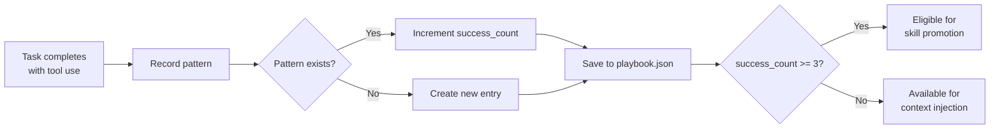

# AI Playbook

The `Playbook` class (`missy/agent/playbook.py`) automatically captures successful tool-use patterns and replays them on future tasks. Patterns that prove reliable are promoted to skill proposals.

## How It Works



## Pattern Matching

Each pattern is identified by a **deterministic hash** of the task type and sorted tool sequence:

```python
# Pattern ID = SHA-256(task_type + sorted tool names)[:16]
key = f"{task_type}:{','.join(sorted(tool_sequence))}"
pattern_id = hashlib.sha256(key.encode()).hexdigest()[:16]
```

This means the same combination of task type and tools always maps to the same pattern, regardless of the order tools were called.

## PlaybookEntry

Each recorded pattern contains:

| Field | Type | Description |
|---|---|---|
| `pattern_id` | `str` | Deterministic hash of task_type + tool_sequence |
| `task_type` | `str` | Coarse category (e.g. `"shell"`, `"file"`) |
| `description` | `str` | Human-readable description of what the pattern does |
| `tool_sequence` | `list[str]` | Ordered list of tool names used |
| `prompt_template` | `str` | Hint or prompt snippet for reproducing the approach |
| `success_count` | `int` | Number of times this pattern has succeeded |
| `created_at` | `str` | ISO-8601 UTC timestamp of first recording |
| `promoted` | `bool` | Whether this entry has been promoted to a skill |

## Usage

### Recording a Pattern

After a successful tool-augmented run, the runtime records the pattern:

```python
from missy.agent.playbook import Playbook

pb = Playbook()  # defaults to ~/.missy/playbook.json
pb.record(
    task_type="shell",
    description="deploy app via rsync",
    tool_sequence=["shell_exec", "file_write"],
    prompt_hint="use rsync to sync files, then write deployment log",
)
```

If the same `task_type` + `tool_sequence` combination is recorded again, the existing entry's `success_count` is incremented and its description and hint are updated to the latest successful run.

### Retrieving Relevant Patterns

Before an agent run, the runtime queries for patterns matching the current task:

```python
entries = pb.get_relevant("shell", top_k=3)
for entry in entries:
    print(f"{entry.description} (succeeded {entry.success_count}x)")
```

Results are sorted by `success_count` descending, so the most proven patterns come first.

### Skill Promotion

Patterns with 3 or more successes are eligible for promotion to full skills:

```python
promotable = pb.get_promotable(threshold=3)
for entry in promotable:
    print(f"Promote: {entry.description}")
    pb.mark_promoted(entry.pattern_id)
```

!!! info "Promotion Threshold"
    The default threshold of 3 successes balances discovery speed with reliability. A pattern that has worked 3 times across different contexts is likely a generalizable approach.

## Persistence

Patterns are stored as JSON at `~/.missy/playbook.json`:

```json
[
  {
    "pattern_id": "a1b2c3d4e5f67890",
    "task_type": "shell",
    "description": "deploy app via rsync",
    "tool_sequence": ["file_write", "shell_exec"],
    "prompt_template": "use rsync to sync files, then write deployment log",
    "success_count": 5,
    "created_at": "2026-03-15T10:30:00+00:00",
    "promoted": true
  }
]
```

Writes use **atomic file replacement** (write to temp file, then `os.replace`) to prevent corruption from crashes. The playbook is thread-safe, protected by a threading lock.

## Integration with the Runtime

The playbook integrates into the agent loop at two points:

1. **Before execution** -- `get_relevant()` retrieves proven patterns for the current task type. These are injected into the context via the [Memory Synthesizer](memory-synthesizer.md) as playbook fragments with a base relevance of 0.6.

2. **After execution** -- When a tool-augmented run succeeds, `record()` captures the pattern for future use.

## Related

- [Memory Synthesizer](memory-synthesizer.md) -- merges playbook entries with other memory sources
- [Agent Runtime](agent-runtime.md) -- orchestrates playbook recording and injection
- [Context Management](context-management.md) -- token budget that playbook entries consume
