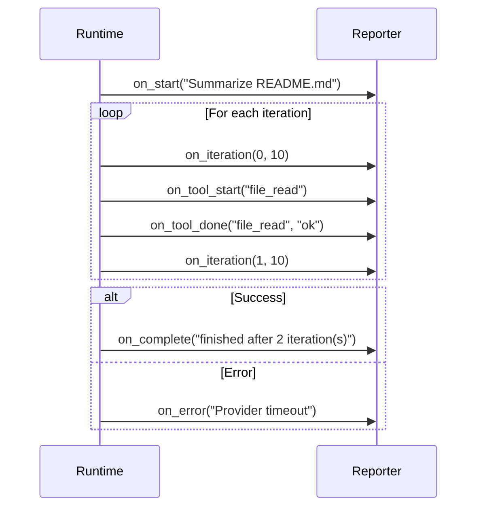

# Progress Reporting

The `ProgressReporter` protocol (`missy/agent/progress.py`) provides structured progress updates during the agent tool loop. It enables UIs, audit systems, and custom integrations to track what the agent is doing in real time.

## Protocol

The `ProgressReporter` is a Python `Protocol` (structural typing) with seven methods:

```python
@runtime_checkable
class ProgressReporter(Protocol):
    def on_start(self, task: str) -> None: ...
    def on_progress(self, pct: float, label: str) -> None: ...
    def on_tool_start(self, name: str) -> None: ...
    def on_tool_done(self, name: str, summary: str) -> None: ...
    def on_iteration(self, i: int, max_iterations: int) -> None: ...
    def on_complete(self, summary: str) -> None: ...
    def on_error(self, error: str) -> None: ...
```

### Method Reference

| Method | Called When | Arguments |
|---|---|---|
| `on_start(task)` | Tool loop begins | `task`: user input or description |
| `on_progress(pct, label)` | Progress percentage update | `pct`: 0.0-100.0, `label`: description |
| `on_tool_start(name)` | A tool is about to execute | `name`: tool name (e.g., `"file_read"`) |
| `on_tool_done(name, summary)` | A tool has finished | `name`: tool name, `summary`: `"ok"` or `"error"` |
| `on_iteration(i, max_iterations)` | A new loop iteration starts | `i`: zero-based index, `max_iterations`: limit |
| `on_complete(summary)` | Tool loop finished successfully | `summary`: e.g., `"finished after 3 iteration(s)"` |
| `on_error(error)` | Tool loop encountered an error | `error`: error message string |

## Built-in Reporters

### NullReporter

The default reporter. All methods are silent no-ops. Used when no reporter is configured, ensuring the agent loop incurs no overhead from progress tracking.

```python
class NullReporter:
    def on_start(self, task: str) -> None:
        pass
    # ... all methods are pass
```

### AuditReporter

Emits progress events to Missy's audit event bus. Each method publishes an `AuditEvent` with a structured `detail` dict:

```python
reporter = AuditReporter(session_id="abc-123", task_id="task-456")
```

| Method | Event Type | Detail Fields |
|---|---|---|
| `on_start` | `agent.progress.start` | `{"task": "..."}` |
| `on_progress` | `agent.progress.update` | `{"pct": 50.0, "label": "..."}` |
| `on_tool_start` | `agent.progress.tool_start` | `{"tool": "file_read"}` |
| `on_tool_done` | `agent.progress.tool_done` | `{"tool": "file_read", "summary": "ok"}` |
| `on_iteration` | `agent.progress.iteration` | `{"iteration": 2, "max": 10}` |
| `on_complete` | `agent.progress.complete` | `{"summary": "..."}` |
| `on_error` | `agent.progress.error` | `{"error": "..."}` |

All events are emitted with `category="agent"` and `result="allow"`. Failures within the `AuditReporter` itself are silently suppressed to avoid disrupting the agent loop.

### CLIReporter

Prints human-readable status lines to stderr, suitable for terminal output:

```python
reporter = CLIReporter()
```

Output example:

```
  [progress] Starting: Summarize the README file
  [progress] Iteration 1/10
  [progress] Tool: file_read...
  [progress] Tool: file_read done — ok
  [progress] Iteration 2/10
  [progress] Complete: finished after 2 iteration(s)
```

## Wiring a Reporter to the Runtime

Pass a reporter to the `AgentRuntime` constructor:

```python
from missy.agent.runtime import AgentRuntime, AgentConfig
from missy.agent.progress import CLIReporter, AuditReporter

# CLI progress output
agent = AgentRuntime(
    AgentConfig(provider="anthropic"),
    progress_reporter=CLIReporter(),
)

# Audit event tracking
agent = AgentRuntime(
    AgentConfig(provider="anthropic"),
    progress_reporter=AuditReporter(session_id="s1", task_id="t1"),
)

# No progress tracking (default)
agent = AgentRuntime(AgentConfig(provider="anthropic"))
# Equivalent to passing NullReporter()
```

## Implementing a Custom Reporter

Any object that implements the seven methods satisfies the `ProgressReporter` protocol. No base class or registration is required -- Python structural typing handles it:

```python
import json
import sys

class JSONReporter:
    """Emits progress as JSON lines to stdout."""

    def _emit(self, event: str, **data):
        print(json.dumps({"event": event, **data}), file=sys.stdout, flush=True)

    def on_start(self, task: str) -> None:
        self._emit("start", task=task)

    def on_progress(self, pct: float, label: str) -> None:
        self._emit("progress", pct=pct, label=label)

    def on_tool_start(self, name: str) -> None:
        self._emit("tool_start", tool=name)

    def on_tool_done(self, name: str, summary: str) -> None:
        self._emit("tool_done", tool=name, summary=summary)

    def on_iteration(self, i: int, max_iterations: int) -> None:
        self._emit("iteration", current=i, max=max_iterations)

    def on_complete(self, summary: str) -> None:
        self._emit("complete", summary=summary)

    def on_error(self, error: str) -> None:
        self._emit("error", error=error)
```

!!! tip "Runtime checkability"
    The protocol is decorated with `@runtime_checkable`, so you can verify compliance:

    ```python
    from missy.agent.progress import ProgressReporter

    assert isinstance(JSONReporter(), ProgressReporter)
    ```

## Event Flow During a Tool Loop



## Graceful Degradation

The runtime resolves the reporter defensively. If `progress_reporter` is `None` (e.g., in tests that bypass `__init__`), a `NullReporter` is substituted automatically:

```python
_progress = getattr(self, "_progress", None)
if _progress is None:
    from missy.agent.progress import NullReporter
    _progress = NullReporter()
```

This ensures the tool loop never fails due to a missing reporter.
