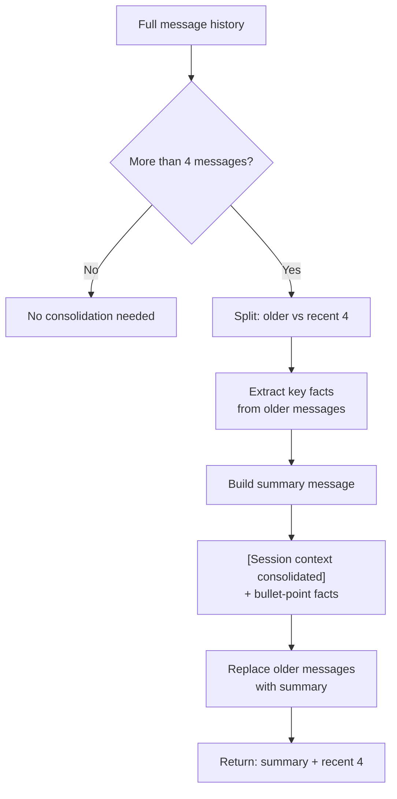
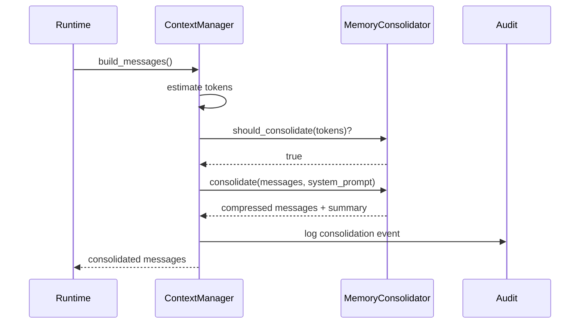

# Sleep Mode / Memory Consolidation

The `MemoryConsolidator` class (`missy/agent/consolidation.py`) compresses conversation history when the context window approaches capacity. This prevents token budget exhaustion during long-running sessions by summarizing older messages while preserving recent context and key facts.

## When Does It Trigger?

Consolidation activates when token usage reaches **80%** of the maximum budget:

```python
from missy.agent.consolidation import MemoryConsolidator

mc = MemoryConsolidator(threshold_pct=0.8, max_tokens=30000)

# Check before each agent iteration
if mc.should_consolidate(current_tokens=25000):
    messages, summary = mc.consolidate(messages, system_prompt)
```

!!! warning "Threshold Configuration"
    The 80% default leaves a 20% buffer for the current exchange (user message + assistant response + tool calls). Setting this too high risks hitting the hard token limit mid-response.

## Consolidation Strategy



The strategy preserves the **last 4 messages** intact (ensuring the model has immediate conversational context) and replaces everything older with a single summary message.

## Key Fact Extraction

The consolidator uses heuristics to identify important information in older messages:

### Fact Keywords

Lines containing these keywords are preserved as key facts:

- `result:`, `decided:`, `found:`, `error:`
- `success:`, `created:`, `updated:`, `deleted:`
- `confirmed:`, `output:`

### Extraction Rules

| Message Type | Rule |
|---|---|
| **Tool results** | Always kept (truncated to 200 chars), prefixed with tool name |
| **Lines with fact keywords** | Extracted verbatim |
| **Short user messages** | Messages under 120 chars are kept (often instructions or decisions) |
| **Long assistant prose** | Skipped (verbose explanations are not key facts) |

All extracted facts are **deduplicated** -- identical strings are only included once.

### Example Output

A consolidated message might look like:

```
[Session context consolidated]

- [shell_exec] Exit code 0. Deployed 47 files to /opt/app
- decided: use blue-green deployment strategy
- created: backup at /tmp/app-backup-20260317.tar.gz
- Check the nginx config before restarting
- [file_read] server { listen 80; server_name app.example.com; ...
```

## Token Estimation

The consolidator includes a simple token estimator:

```python
estimated = MemoryConsolidator.estimate_tokens(messages)
# Formula: total characters across all messages / 4
```

This 4-chars-per-token heuristic is deliberately conservative. It slightly overestimates token usage, which is safer than underestimating (better to consolidate slightly early than to hit the hard limit).

## Integration with the Runtime

The consolidator runs as part of the agent loop's context assembly phase:

1. The `ContextManager` estimates current token usage.
2. If usage exceeds the threshold, `MemoryConsolidator.consolidate()` is called.
3. The compressed message list replaces the full history for the remainder of the session.
4. An audit event is emitted recording the consolidation (number of messages removed, summary length).



## Configuration

| Parameter | Default | Description |
|---|---|---|
| `threshold_pct` | `0.8` | Fraction of max_tokens that triggers consolidation |
| `max_tokens` | `30000` | Total token budget for the context window |

These are set via the `ContextManager` configuration in `~/.missy/config.yaml`:

```yaml
# The context manager's token budget controls consolidation
# Consolidation triggers at 80% of this value
# (not directly configurable yet -- hardcoded default)
```

## Related

- [Context Management](context-management.md) -- token budget that drives consolidation decisions
- [Memory Synthesizer](memory-synthesizer.md) -- uses consolidated summaries as a memory source
- [Agent Runtime](agent-runtime.md) -- orchestrates the consolidation check each iteration
