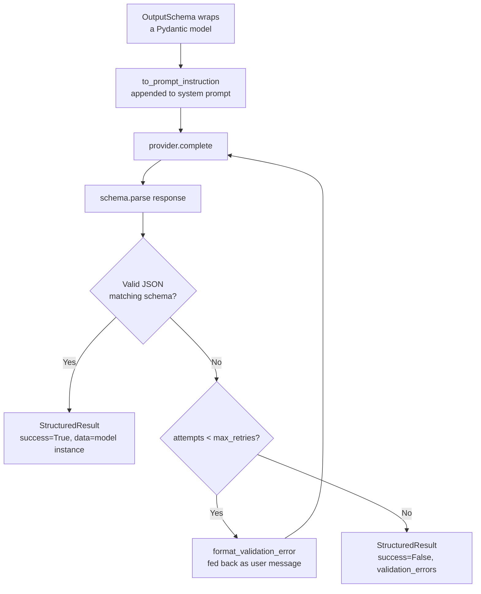

---
tags:
  - architecture
---

# Structured Output

The `StructuredOutputRunner` and `OutputSchema` classes (`missy/agent/structured_output.py`) enforce a Pydantic model schema on an LLM's response, retrying with error feedback when the response fails validation. This lets any code path in Missy request a typed, validated result — a task classification, an error analysis, a conversation summary — instead of parsing free-form text.

## How It Works



## OutputSchema

`OutputSchema[T]` wraps a Pydantic `BaseModel` subclass and generates both the prompt instruction and the parsing/validation logic.

| Parameter | Default | Description |
|---|---|---|
| `model_class` | *required* | The Pydantic model responses must conform to |
| `description` | model docstring | Human-readable description injected into the prompt |
| `max_retries` | `2` | Additional provider calls made after the first attempt if validation fails |
| `strict` | `False` | Passed to `model_validate(..., strict=...)`; when `True`, extra/mistyped fields are rejected rather than coerced |

`to_prompt_instruction()` renders the model's JSON Schema (via `model_class.model_json_schema()`) into an instruction block: *"You MUST respond with valid JSON matching this schema: ```json ... ``` Do not include any text before or after the JSON."* This is appended to whatever system prompt the caller supplies.

`parse(content)` extracts a JSON candidate from the raw response text — handling three shapes in order: raw JSON starting with `{`/`[`, a fenced ` ```json ... ``` ` code block, or JSON embedded in surrounding prose (found by locating the outermost matching brace/bracket pair) — then validates it against the model with `model_validate()`. A parse or validation failure returns a `StructuredResult` with `success=False` and human-readable `validation_errors`; it never raises.

## StructuredResult

| Field | Type | Description |
|---|---|---|
| `success` | `bool` | `True` if the final attempt parsed and validated cleanly |
| `data` | `T \| None` | The validated Pydantic instance, or `None` on failure |
| `raw_content` | `str` | The original LLM response string from the final attempt |
| `validation_errors` | `list[str]` | Formatted error lines from the final failed attempt (empty on success) |
| `attempts` | `int` | Total number of provider calls made (1 + retries actually used) |

## Usage

```python
from missy.agent.structured_output import OutputSchema, StructuredOutputRunner
from pydantic import BaseModel

class Answer(BaseModel):
    value: int
    reasoning: str

schema = OutputSchema(Answer)
runner = StructuredOutputRunner(provider)
result = runner.complete_structured(messages, schema, system="You are helpful.")

if result.success:
    print(result.data.value, result.data.reasoning)
else:
    print(f"Failed after {result.attempts} attempts: {result.validation_errors}")
```

`complete_structured()` runs up to `schema.max_retries + 1` provider calls. On each failed attempt, it appends the model's own (invalid) response as an `assistant` message and `format_validation_error()`'s output as a `user` message — e.g. `Your response had validation errors:\n- field "value": Field required\n\nPlease fix these errors and respond again with valid JSON.` — before calling the provider again, so the model sees exactly what it got wrong. If every attempt fails, the last `StructuredResult` (with `success=False`) is returned rather than raising, leaving the retry-exhaustion decision to the caller.

An `acomplete_structured()` coroutine mirrors this logic for async callers; it uses the provider's native `acomplete()` when available, or falls back to running the sync `complete()` in a thread executor.

### Provider-native structured output

If the provider implements `structured_output_kwargs(schema)` (`BaseProvider`, overridden by `OpenAIProvider`), `StructuredOutputRunner` forwards the returned kwargs into every `provider.complete()` call — letting a provider with native JSON-schema/function-calling support (e.g. OpenAI's `response_format`) enforce the schema itself in addition to the prompt-instruction + parse/retry loop. Providers without an override return an empty dict and rely solely on the prompt instruction and client-side retry.

## Built-in Schemas

Three ready-made Pydantic models ship in the same module for common agent self-analysis tasks:

| Model | Fields |
|---|---|
| `TaskAnalysis` | `task_type` (`question`/`code`/`research`/`file_operation`/`system_admin`), `complexity` (`simple`/`moderate`/`complex`), `tools_needed: list[str]`, `approach: str` |
| `ErrorAnalysis` | `error_type` (`syntax`/`runtime`/`logic`/`permission`/`network`/`unknown`), `root_cause: str`, `suggested_fix: str`, `can_retry: bool` |
| `ConversationSummary` | `key_topics: list[str]`, `decisions_made: list[str]`, `action_items: list[str]`, `entities_mentioned: list[str]`, `overall_summary: str` |

These give other subsystems (e.g. self-correction after a tool failure, or a future planning step) a stable, typed contract without each caller having to define its own schema.

## Integration with the Runtime

`StructuredOutputRunner` wraps a `BaseProvider` (see [Providers](../providers/index.md)) directly and is provider-agnostic — it works with any provider implementing `complete()`/`acomplete()`. It is a standalone utility for any code path that needs a typed response rather than a component `AgentRuntime` wires up automatically on every turn; the agent's main conversational loop uses free-form text plus tool calls. Call sites construct a `StructuredOutputRunner(provider)` directly when they need a guaranteed-shape result — for example, classifying a task before dispatch, or extracting a structured summary at a checkpoint.

## Related

- [Agent Runtime](agent-runtime.md) — the tool loop that `StructuredOutputRunner` complements with typed, validated outputs
- [Providers](../providers/index.md) — the `BaseProvider` interface `StructuredOutputRunner` wraps, including the optional `structured_output_kwargs()` hook
- [Context Management](context-management.md) — token budget considerations when injecting a JSON Schema instruction into the system prompt
