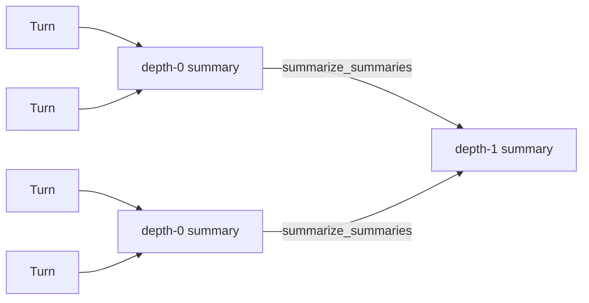
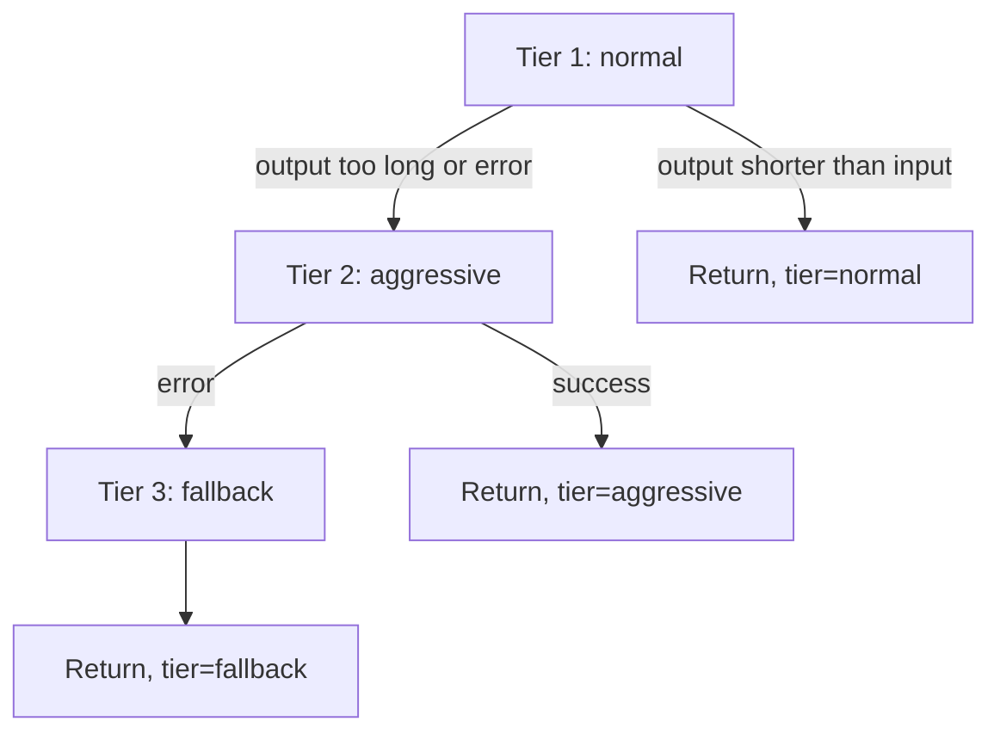

---
tags:
  - architecture
---

# Summarizer

The `Summarizer` class (`missy/agent/summarizer.py`) is the LLM-backed engine that turns raw conversation turns into hierarchical summaries. It is invoked by the [Compaction Manager](compaction.md) during leaf and condensation passes, and underpins the "Summarizing" stage of the [Condenser Pipeline](condenser-pipeline.md). On its own, `Summarizer` doesn't know about sessions, token budgets, or when to run — it just takes text in and, via a three-tier escalation strategy, guarantees compressed text out.

## Two Entry Points, One DAG

Conversation history is summarized as a DAG of `SummaryRecord`s: raw turns are the leaves (depth 0), and repeated condensation passes merge sibling summaries into higher-depth parent summaries. `Summarizer` exposes one method per DAG operation:



- `summarize_turns(turns, prior_summary="", target_tokens=1_200)` — formats a list of `ConversationTurn` objects into a timestamped transcript and produces a depth-0 leaf summary. `prior_summary`, if given, is injected into the prompt as continuity context so consecutive leaf chunks read coherently.
- `summarize_summaries(summaries, target_tokens=2_000)` — condenses a list of `SummaryRecord` objects (which may themselves be prior condensations) into a single higher-depth summary. Each input summary is rendered with its `depth` and time range so the model can see the hierarchy it's collapsing.

Both methods return a `(summary_text, tier_used)` tuple — the DAG structure itself (which turns/summaries roll up into which parent) is tracked by the caller (`CompactionManager`), not by `Summarizer`.

## Escalation Tiers

Every summarization call runs through `_escalate()`, which tries up to three tiers in order and always returns *something* — summarization is never allowed to fail outright:



1. **Normal** — sends the leaf/condensed prompt to the provider at `temperature=0.2`. The result is only accepted if it is non-empty *and* shorter (in approximate tokens) than the input — otherwise the call is considered to have not actually compressed anything, and the code escalates to Tier 2.
2. **Aggressive** — wraps the original prompt in `_AGGRESSIVE_PROMPT`, explicitly instructing the model to compress into fewer than `target_tokens` tokens, at a lower `temperature=0.1`. Any non-empty result is accepted.
3. **Fallback (deterministic truncation)** — used only if both LLM tiers raise exceptions. The original prompt text is hard-truncated to `target_tokens * 4` characters (the module's `~4 chars/token` approximation) and suffixed with `"\n[TRUNCATED — summarization failed]"`. This tier never calls the LLM and therefore cannot fail.

`Summarizer.tier_counts` is a running dict (`{"normal": int, "aggressive": int, "fallback": int}`) incremented on every call, giving an at-a-glance signal of how often summarization is degrading to a lower tier.

## Prompt Templates

Three module-level prompt templates drive the tiers:

- `_LEAF_PROMPT` — instructs the model to preserve key decisions, action items, code references/paths/commands, error messages and resolutions, and important facts/names/numbers from a raw transcript excerpt.
- `_CONDENSED_PROMPT` — instructs the model to condense multiple summaries into one, preserving cross-summary themes and removing redundancy.
- `_AGGRESSIVE_PROMPT` — the Tier 2 escalation prompt; takes a `target_tokens` cap and the full previous prompt as `{text}`.

## Usage

```python
from missy.agent.summarizer import Summarizer

s = Summarizer(provider=my_provider, timeout=120)

# Leaf pass: turns -> depth-0 summary
text, tier = s.summarize_turns(turns, prior_summary="")

# Condensation pass: N depth-0 summaries -> one depth-1 summary
text, tier = s.summarize_summaries(depth0_summaries, target_tokens=2_000)

print(s.tier_counts)  # {"normal": 4, "aggressive": 1, "fallback": 0}
```

`_call_llm()` sends a single `Message(role="user", content=prompt)` to the provider's `chat()` method with `max_tokens=4096` and logs elapsed time in milliseconds.

## Integration with the Runtime

`Summarizer` has no persistence of its own and does not decide *when* to run — it is a pure text-in/text-out compression engine. The [Compaction Manager](compaction.md) is the caller: it decides which turns and summaries are eligible for compaction, invokes `summarize_turns()`/`summarize_summaries()`, and writes the resulting `SummaryRecord`s to the `SQLiteMemoryStore`. The [Condenser Pipeline](condenser-pipeline.md)'s "Summarizing" stage is conceptually backed by this class.

## Related

- [Compaction Manager](compaction.md) — orchestrates when and how `Summarizer` is called
- [Condenser Pipeline](condenser-pipeline.md) — the 4-stage compression pipeline that includes summarization as one stage
- [Sleep Mode](sleep-mode.md) — another trigger path that leads to summarization work
