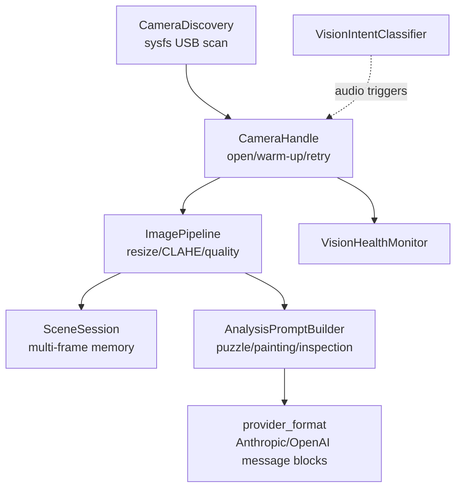

---
tags:
  - architecture
---

# Vision Subsystem

The vision subsystem (`missy/vision/`) gives Missy on-demand visual capability: discovering USB webcams, capturing and preprocessing frames, building domain-specific analysis prompts, and tracking multi-frame context for tasks like puzzle solving or painting feedback. It is deliberately **on-demand, not always-on** — capture only happens when a tool is invoked or a high-confidence audio intent triggers it, and every activation decision is logged. CLI usage is documented separately at [Vision Commands](../cli/vision.md); this page covers the underlying architecture.

## Component Overview



## Camera Discovery

`CameraDiscovery` (`missy/vision/discovery.py`) finds USB webcams by walking `/sys/class/video4linux/` rather than trusting `/dev/videoN` ordering, which can change across reboots or reconnects.

- Reads `idVendor`/`idProduct` from sysfs (walking up to 10 parent directories to find them) to build a stable `vendor_id:product_id` identity per device.
- Filters out non-capture nodes (metadata-only V4L2 device nodes) via the `index` and `uevent` sysfs attributes.
- Caches scan results with a configurable TTL (`cache_ttl_seconds`, default 10s); pass `force=True` to bypass the cache.
- `find_preferred()` picks a Logitech C922x/C922 first, then falls back to any device in the `KNOWN_CAMERAS` table, then the first discovered device.
- `rediscover_device(vendor_id, product_id, ...)` polls for a specific USB device to reappear after a disconnect (default 5 attempts, 1s apart) — the replacement device may get a new `/dev/videoN` path, so this matches by USB identity instead.
- `validate_device()` re-checks that a previously discovered `CameraDevice` still exists at its path and that its USB IDs haven't changed (guards against `/dev/videoN` number reuse by a different physical device).

```python
from missy.vision.discovery import CameraDiscovery, find_preferred_camera

disc = CameraDiscovery()
cameras = disc.discover()          # cached for 10s unless force=True
cam = disc.find_by_usb_id("046d", "085c")   # Logitech C922x
cam = find_preferred_camera()      # module-level convenience wrapper
```

## Capture (CameraHandle)

`CameraHandle` (`missy/vision/capture.py`) wraps an OpenCV `VideoCapture` with lifecycle management. OpenCV (via `CAP_V4L2`) is used instead of raw V4L2 for cross-platform format negotiation.

**Warm-up.** On `open()`, `_warmup()` discards `config.warmup_frames` frames (default 5) to let auto-exposure and white-balance settle, tracking brightness across the discarded frames to log whether exposure stabilized (spread of the last 3 samples `< 5.0`). Warm-up is capped at half the capture timeout (minimum 3s) so a frozen camera can't block `open()` indefinitely.

**Retry.** `capture()` retries up to `config.max_retries` (default 3) times, sleeping `retry_delay` (default 0.5s) between attempts, and enforces an overall `timeout_seconds` (default 10s) deadline across all attempts. Failures are classified into a `FailureType` enum: `TRANSIENT`, `PERMISSION`, `DEVICE_GONE`, `UNSUPPORTED`, `UNKNOWN`.

**Blank-frame detection.** `AdaptiveBlankDetector` learns ambient light levels from a rolling window (default 20) of successful-frame mean pixel intensities, and derives the blank-frame threshold as a fraction (`adaptation_factor=0.25`) of the minimum observed intensity, floored at `min_threshold=2.0` and capped at `base_threshold=5.0`. This avoids false "blank frame" positives in dim rooms while still catching genuinely black/covered-lens frames.

```python
from missy.vision.capture import CameraHandle, CaptureConfig

config = CaptureConfig(width=1920, height=1080, warmup_frames=5, max_retries=3)
with CameraHandle("/dev/video0", config) as cam:
    result = cam.capture()
    if result.success:
        print(result.width, result.height, result.attempt_count)

    # Burst + best-frame selection (60% sharpness, 20% brightness, 20% contrast)
    best = cam.capture_best(burst_count=3)
```

`capture_burst(count, interval)` captures up to 20 frames in sequence; `capture_best()` scores each frame with a weighted composite of Laplacian-variance sharpness, brightness centered at 128, and grayscale standard deviation, returning the highest-scoring frame — useful for auto-selecting a sharp frame from a shaky handheld capture.

## Image Pipeline

`ImagePipeline` (`missy/vision/pipeline.py`) preprocesses raw frames before they reach the LLM or local analysis. `process()` runs, in order: resize → (optional) CLAHE exposure normalization → (optional) denoise → (optional) sharpen.

- **Resize** — scales so the largest dimension is at most `target_dimension` (default 1280), preserving aspect ratio via `cv2.INTER_AREA`.
- **CLAHE** (`normalize_exposure`) — Contrast Limited Adaptive Histogram Equalization applied to the L channel in LAB color space (`clipLimit=2.0`, `tileGridSize=(8,8)`), handling grayscale, single-channel, BGR, and BGRA inputs.
- **`assess_quality(image)`** returns brightness, contrast, sharpness (Laplacian variance), saturation, and a noise estimate (median absolute deviation of the Laplacian), then classifies overall `quality` as `"good"`, `"fair"`, or `"poor"` based on accumulated `issues` (e.g. `"very dark"`, `"blurry"`, `"low contrast"`, `"oversaturated"`).

```python
from missy.vision.pipeline import ImagePipeline

pipeline = ImagePipeline()
processed = pipeline.process(raw_frame)
quality = pipeline.assess_quality(raw_frame)
# {"width": 1920, "height": 1080, "brightness": 142.3, "quality": "good", "issues": []}
```

## Scene Memory

`SceneSession` (`missy/vision/scene_memory.py`) is task-scoped, **in-process-only** multi-frame memory — it is not persisted to disk, by design, for privacy. A `SceneManager` singleton (`get_scene_manager()`) tracks up to `max_sessions` (default 5) concurrent sessions, evicting the oldest inactive (or oldest overall) session when full.

- Frames are keyed by `TaskType`: `PUZZLE`, `PAINTING`, `GENERAL`, `INSPECTION`.
- Each `SceneFrame` computes a 64-bit perceptual hash (`compute_phash`, an 8x8-downsampled average hash) on construction, used for near-duplicate detection: `add_frame(..., deduplicate=True, dedup_threshold=5)` skips storing a frame whose Hamming distance from the previous frame is `<= 5`.
- `max_frames` (default 20) bounds memory per session; the oldest frame is evicted (and its numpy array explicitly released) once the limit is exceeded.
- `detect_change(frame_a, frame_b)` blends normalized pixel difference (40% weight) with perceptual-hash Hamming distance (60% weight) into a single 0–1 `change_score`, bucketed into `"no change"` / `"minor change"` / `"moderate change"` / `"major change"` at thresholds 0.05 / 0.15 / 0.3.
- `visualize_change()` produces a red-highlighted diff overlay image for the two most recent frames.

```python
from missy.vision.scene_memory import get_scene_manager, TaskType

mgr = get_scene_manager()
session = mgr.create_session("puzzle-1", TaskType.PUZZLE, max_frames=20)
session.add_frame(frame_image, source="webcam:/dev/video0")
session.add_observation("Border is 80% complete")
session.update_state(completion_pct=35)

change = session.detect_latest_change()   # SceneChange with change_score + description
session.close()   # releases all frame numpy arrays, marks session inactive
```

## Domain-Specific Analysis

`AnalysisPromptBuilder` (`missy/vision/analysis.py`) builds the text prompt sent alongside an image to a vision-capable LLM, selected by `AnalysisMode`: `GENERAL`, `PUZZLE`, `PAINTING`, `INSPECTION`.

- **Puzzle mode** asks for board-state completion estimate, piece identification (edge/corner/interior, tab/blank pattern), rotation hints, color/texture grouping suggestions, and 2–3 actionable next steps. A `PUZZLE_FOLLOWUP_PROMPT` variant compares against `previous_observations`/`previous_state` from scene memory when `is_followup=True`.
- **Painting mode** is deliberately styled as a warm, encouraging art coach — the prompt explicitly forbids words like "wrong", "bad", "weak", "poor", "fail" and frames every suggestion as a possibility rather than a correction.
- **Inspection mode** asks for a structured condition report: overview, condition assessment, details/observations, measurements, concerns/anomalies, recommendations.
- User-supplied `context` is sanitized via `_sanitize_context()` — truncated to `MAX_CONTEXT_LENGTH` (2000 chars) and wrapped in a clearly delimited `[User-provided context]:` block to mitigate prompt injection (the LLM can still choose to follow injected instructions, but the delimiter signals the text's provenance).

`PuzzlePreprocessor` provides local (non-LLM) preprocessing: Canny edge overlay (`enhance_edges`), k-means dominant-color extraction with human-readable naming (`extract_color_regions`, `_describe_color`), and contour-based edge/corner counting (`detect_edges_and_corners`).

## Vision Intent Classification

`VisionIntentClassifier` (`missy/vision/intent.py`) classifies user utterances (typically from voice transcripts) to decide whether vision should activate — see the design rule in the module docstring: *"Vision activation is SCOPED to the active task — never becomes always-on."*

Regex pattern groups score confidence per category: explicit look/check phrases (`"look at"`, `"take a photo"`, `"screenshot"` → 0.90–0.95), puzzle phrases (`"puzzle piece"`, `"where does this go"` → up to 0.95), painting phrases (`"what do you think of this"`, `"critique"` → 0.55–0.90), and inspection/reading phrases (`"what does this say"`, `"zoom in"` → 0.65–0.85). Combining an explicit look/check match with a puzzle or painting match boosts confidence by +0.10.

```python
from missy.vision.intent import VisionIntentClassifier, ActivationDecision

classifier = VisionIntentClassifier(auto_threshold=0.80, ask_threshold=0.50)
result = classifier.classify("does this piece go in the sky section?")
# IntentResult(intent=PUZZLE, decision=ACTIVATE, confidence=0.95, suggested_mode="puzzle")

if result.decision == ActivationDecision.ACTIVATE:
    ...  # auto-capture and analyze
elif result.decision == ActivationDecision.ASK:
    ...  # prompt the user before activating the camera
```

Confidence at or above `auto_threshold` yields `ACTIVATE`; between `ask_threshold` and `auto_threshold` yields `ASK` (ambiguous — confirm with the user); below `ask_threshold` yields `SKIP`. The `auto_threshold` default (0.80) corresponds to the `vision.auto_activate_threshold` config key. Every classification is appended to an in-memory `activation_log` (capped at 500 entries) for audit purposes.

## Health Monitoring

`VisionHealthMonitor` (`missy/vision/health_monitor.py`) records every capture attempt (`record_capture(success, device, quality_score, error, latency_ms)`) and aggregates per-device `DeviceStats` (success rate, average quality, average latency, consecutive-failure count).

Device status is classified into `HealthStatus`: `HEALTHY`, `DEGRADED`, `UNHEALTHY`, `UNKNOWN`, using thresholds `_DEGRADED_THRESHOLD=0.8` and `_UNHEALTHY_THRESHOLD=0.5` success rate, or `_CONSECUTIVE_FAILURE_LIMIT=5` consecutive failures. `get_health_report()` rolls per-device status up into an `overall_status` — the worst status across all known devices.

The monitor supports optional SQLite persistence (`persist_path` constructor arg, or explicit `save()`/`load()`) so health history survives process restarts, auto-saving every `auto_save_interval` captures (default 50). This backs the `missy vision health` and `missy vision doctor` CLI commands.

## Provider Image Formatting

`missy/vision/provider_format.py` converts a base64-encoded JPEG into the message content block each provider expects:

| Provider | Format |
|---|---|
| Anthropic | `{"type": "image", "source": {"type": "base64", "media_type": ..., "data": ...}}` |
| OpenAI | `{"type": "image_url", "image_url": {"url": "data:<media_type>;base64,...", "detail": ...}}` |
| Ollama | Same shape as OpenAI |

`build_vision_message(provider_name, image_base64, prompt)` assembles a full `{"role": "user", "content": [image_block, text_block]}` message ready to send to a provider's `complete`/`complete_with_tools` call.

## Agent Tools

Five built-in tools in `missy/tools/builtin/vision_tools.py` expose the subsystem to the agent's tool loop:

| Tool | Purpose |
|---|---|
| `vision_capture` | Capture a single frame from webcam/screenshot/file, preprocess it, and save to `~/.missy/captures/` (images are always saved to disk rather than returned as base64 — inline base64 tool results are large enough to cause Discord 400 errors) |
| `vision_burst` | Capture a burst of frames (1–20); optionally return only the sharpest via `best_only` |
| `vision_analyze` | Build a domain-specific analysis prompt (general/puzzle/painting/inspection); pulls prior observations from scene memory when `is_followup=true` |
| `vision_devices` | Enumerate cameras via `CameraDiscovery`, forcing a fresh scan |
| `vision_scene` | Manage scene sessions: `create`, `add_observation`, `update_state`, `summarize`, `close` |

Note that `vision_analyze` only *builds the prompt string* — the caller (the agent runtime) is responsible for pairing that prompt with the actual captured image bytes when calling the provider's vision-capable completion endpoint.

## Configuration

Vision behavior is controlled by the `vision:` section of `~/.missy/config.yaml`, parsed into `VisionConfig` (`missy/config/settings.py`):

```yaml
vision:
  enabled: true
  preferred_device: ""               # auto-detect if empty
  capture_width: 1920
  capture_height: 1080
  warmup_frames: 5
  max_retries: 3
  auto_activate_threshold: 0.80      # confidence to auto-activate from audio intent
  scene_memory_max_frames: 20
  scene_memory_max_sessions: 5
```

| Key | Default | Description |
|---|---|---|
| `enabled` | `true` | Master switch for vision capabilities |
| `preferred_device` | `""` | Preferred camera device path; auto-detected via `CameraDiscovery.find_preferred()` when empty |
| `capture_width` / `capture_height` | `1920` / `1080` | Requested capture resolution (`CaptureConfig.width/height`) |
| `warmup_frames` | `5` | Frames discarded on camera open for auto-exposure stabilization |
| `max_retries` | `3` | Capture retry attempts before failing |
| `auto_activate_threshold` | `0.80` | Confidence required for `VisionIntentClassifier` to auto-activate vision from audio |
| `scene_memory_max_frames` | `20` | Max frames retained per `SceneSession` |
| `scene_memory_max_sessions` | `5` | Max concurrent `SceneSession`s in the `SceneManager` |

Requires the optional `vision` extra: `pip install -e ".[vision]"` (installs `opencv-python-headless` and `numpy`). OpenCV, `numpy`, and `cv2`-dependent submodules are imported lazily so the rest of Missy runs without the extra installed.

## Integration with the Runtime

Vision is consumed by the [Agent Runtime](agent-runtime.md) through the tool loop like any other built-in tool set — `vision_capture`, `vision_burst`, `vision_analyze`, `vision_devices`, and `vision_scene` are registered in the `ToolRegistry` and invoked by the model when it decides visual input is needed. On the voice channel, `VisionIntentClassifier` additionally allows audio-triggered activation: a transcribed utterance above `auto_activate_threshold` confidence can trigger a capture without an explicit tool call, subject to the config's `vision.enabled` switch and full audit logging of the activation decision (`missy/vision/audit.py`).

## Related

- [Agent Runtime](agent-runtime.md) — orchestrates tool invocation, including the vision tools
- [Reliability & Autonomy](reliability.md) — `VisionHealthMonitor`'s degradation tracking mirrors the `Watchdog` pattern used elsewhere in the agent
- [Vision Commands](../cli/vision.md) — CLI reference for `missy vision devices/capture/inspect/review/doctor/health/benchmark/validate/memory`
