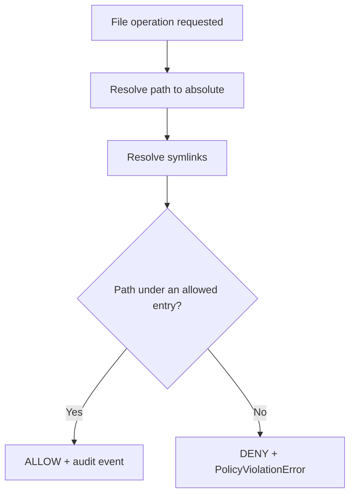

# Filesystem Policy

The filesystem policy controls which directories Missy can read from and write to. By default, **no filesystem access is permitted**.

## Configuration

```yaml
filesystem:
  allowed_read_paths:
    - "/home/user/workspace"
    - "/home/user/documents"
    - "/var/log/syslog"

  allowed_write_paths:
    - "/home/user/workspace/output"
```

## How Path Matching Works

When Missy attempts a file operation, the `FilesystemPolicyEngine` checks whether the target path falls under any entry in the relevant allow list:

1. The requested path is **resolved to an absolute path** using `Path.resolve(strict=False)`.
2. All symlink components that exist on disk are resolved.
3. The resolved path is checked against each entry in `allowed_read_paths` or `allowed_write_paths` using `Path.is_relative_to()`.
4. If the path equals an allowed directory or is nested inside it, access is granted.
5. Otherwise, a `PolicyViolationError` is raised.



## Symlink Handling

Symlinks are always resolved **before** the path is compared against allow lists. This prevents symlink traversal attacks:

```
# If /home/user/workspace/link -> /etc/shadow
# and allowed_read_paths includes "/home/user/workspace"
#
# Requesting: /home/user/workspace/link
# Resolved:   /etc/shadow
# Result:     DENIED (not under /home/user/workspace after resolution)
```

!!! warning "Symlinks can escape allowed directories"
    A symlink inside an allowed directory that points outside it will be **denied**. This is intentional. If you need to follow symlinks to external locations, add the symlink target to the allow list.

Resolution uses `strict=False`, so paths to files that do not yet exist (e.g., a file about to be created) are still resolved without raising an error. The non-existent portion of the path is appended as-is to the last resolvable parent.

## Read vs. Write Permissions

Read and write permissions are independent. A path can be readable but not writable:

```yaml
filesystem:
  allowed_read_paths:
    - "/home/user/workspace"        # can read everything here
    - "/var/log"                    # can read logs

  allowed_write_paths:
    - "/home/user/workspace/output" # can only write to output/
```

In this example:

- `/home/user/workspace/src/main.py` -- readable, not writable
- `/home/user/workspace/output/result.txt` -- readable and writable
- `/var/log/syslog` -- readable, not writable
- `/etc/passwd` -- neither readable nor writable

!!! tip "Write paths are not implicitly readable"
    If you need both read and write access to a directory, list it in **both** `allowed_read_paths` and `allowed_write_paths`.

## Path Resolution Details

| Input Path | Resolution |
|---|---|
| Relative path (`./foo`) | Resolved against CWD |
| Home directory (`~/docs`) | Expanded to absolute path |
| Path with `..` (`/home/user/../other`) | Normalized to `/home/other` |
| Existing symlink | Target resolved |
| Non-existent file | Parent resolved, filename appended |
| Trailing slash (`/tmp/`) | Equivalent to `/tmp` |

## Audit Trail

Every filesystem check emits a `filesystem_read` or `filesystem_write` audit event, regardless of whether the operation was allowed or denied. The event includes the resolved path and the matching rule (if any).

```bash
missy audit recent --category filesystem
```

## Example: Workspace-Only Access

A typical configuration grants read/write access to the workspace and read-only access to a broader set of directories:

```yaml
filesystem:
  allowed_read_paths:
    - "/home/user/workspace"
    - "/home/user/.config"
    - "/etc"

  allowed_write_paths:
    - "/home/user/workspace"
```

## Example: Locked-Down Production

For a production deployment where Missy should only read from a specific input directory and write to a specific output directory:

```yaml
filesystem:
  allowed_read_paths:
    - "/opt/missy/input"

  allowed_write_paths:
    - "/opt/missy/output"
```
