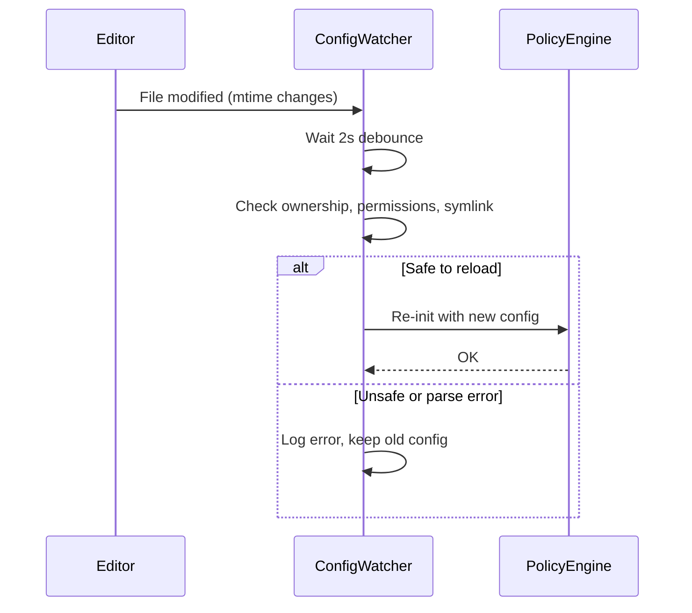

# Configuration Overview

Missy's behavior is controlled by a single YAML configuration file. Every capability -- network access, shell execution, filesystem permissions, plugins -- is **disabled by default** and must be explicitly enabled.

## Config File Location

```
~/.missy/config.yaml
```

This file is created automatically by `missy init` or `missy setup`. You can also create it manually.

!!! tip "Quick start"
    Run `missy setup` to launch the interactive setup wizard, which walks you through provider configuration and writes a valid config file.

## Secure Defaults

When no configuration file exists, or when a section is omitted, Missy applies its **secure-by-default** posture:

| Section | Default |
|---|---|
| `network.default_deny` | `true` -- all outbound requests blocked |
| `filesystem.allowed_read_paths` | `[]` -- no filesystem reads permitted |
| `filesystem.allowed_write_paths` | `[]` -- no filesystem writes permitted |
| `shell.enabled` | `false` -- all shell execution blocked |
| `plugins.enabled` | `false` -- no plugins loaded |
| `providers` | `{}` -- no providers configured |

!!! warning "Nothing works until you configure it"
    A fresh `config.yaml` with only a provider defined will deny all network access, filesystem operations, and shell commands. You must explicitly allowlist each capability your workflows require.

## Config Version

The `config_version` field tracks the schema version of your configuration file:

```yaml
config_version: 2
```

When Missy loads a config with an older (or missing) version number, it may apply automatic migrations to update deprecated field names or restructure sections. A `config_version: 0` (or absent) indicates a pre-migration config.

## Hot Reload

Missy watches `~/.missy/config.yaml` for changes at runtime using a background polling thread (`ConfigWatcher`). When the file is modified:

1. **Debounce** -- Missy waits 2 seconds after the last modification before reloading, so rapid saves (e.g., from an editor that writes a temp file then renames) are coalesced into a single reload.
2. **Safety checks** -- Before loading the changed file, Missy verifies:
    - The file is **not a symlink** (prevents symlink substitution attacks).
    - The file is **owned by the current user** (prevents privilege escalation).
    - The file is **not group- or world-writable** (prevents unauthorized edits).
3. **Atomic swap** -- If the new config parses successfully, the policy engine and provider registry are re-initialized atomically. If parsing fails, the previous config remains active and an error is logged.



!!! note "Hot reload scope"
    Hot reload updates the **policy engine** (network, filesystem, shell rules) and the **provider registry**. It does not restart active sessions or channels. Restart Missy to pick up changes to Discord, voice, or scheduler configuration.

## File Locations Summary

All Missy state files live under `~/.missy/` by default:

| Purpose | Default Path |
|---|---|
| Configuration | `~/.missy/config.yaml` |
| Audit log | `~/.missy/audit.jsonl` |
| Memory database | `~/.missy/memory.db` |
| Scheduler jobs | `~/.missy/jobs.json` |
| MCP server config | `~/.missy/mcp.json` |
| Device registry | `~/.missy/devices.json` |
| Vault key | `~/.missy/secrets/vault.key` |
| Vault data | `~/.missy/secrets/vault.enc` |
| Prompt patches | `~/.missy/patches.json` |
| Workspace | `~/workspace` |

## Next Steps

- [Complete config reference](reference.md) -- every field documented
- [Network policy](network.md) -- controlling outbound access
- [Filesystem policy](filesystem.md) -- read/write path rules
- [Shell policy](shell.md) -- command whitelisting
- [Provider configuration](providers.md) -- API keys, models, tiers
- [Network presets](presets.md) -- named shorthand for common services
