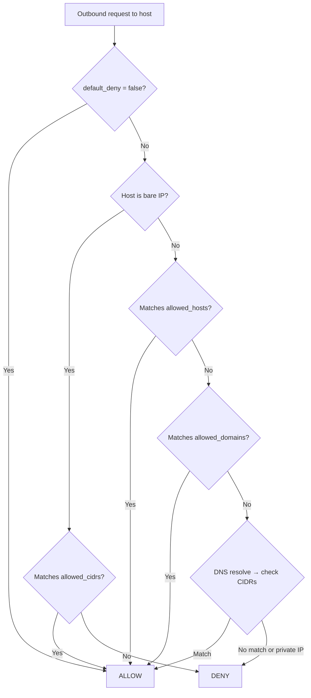

# Network Policy

The network policy controls all outbound HTTP requests. Every request passes through the `PolicyHTTPClient` gateway, which consults the `NetworkPolicyEngine` before dispatching.

## Default Deny

```yaml
network:
  default_deny: true
```

When `default_deny` is `true` (the default), **every outbound request is blocked** unless the destination matches at least one allow rule. Set to `false` only in trusted environments where unrestricted network access is acceptable.

!!! warning "default_deny: false disables all network security"
    Setting `default_deny: false` allows Missy to reach any host on the internet. This bypasses all domain, host, and CIDR checks. Use with extreme caution.

## Allow Rule Evaluation Order

When `default_deny` is `true`, the engine evaluates rules in this order and short-circuits on the first match:



1. If the host is a bare IP address, check `allowed_cidrs` only.
2. Check exact match in `allowed_hosts` (global + per-category).
3. Check suffix match in `allowed_domains`.
4. DNS-resolve the hostname and re-check resolved IPs against `allowed_cidrs`.
5. Deny.

## allowed_cidrs

CIDR notation blocks. Useful for allowing local subnets or entire IP ranges.

```yaml
network:
  allowed_cidrs:
    - "127.0.0.0/8"       # loopback
    - "10.0.0.0/8"        # private class A
    - "192.168.1.0/24"    # specific home subnet
```

CIDRs are parsed once at config load time. Invalid CIDR strings are logged as warnings and ignored.

## allowed_domains

Fully-qualified domain names. The engine supports exact match and suffix matching:

```yaml
network:
  allowed_domains:
    - "api.anthropic.com"          # exact match only
    - "anthropic.com"              # exact match for "anthropic.com"
    - "*.github.com"               # wildcard: matches "api.github.com", "raw.github.com", etc.
```

!!! note "Suffix matching semantics"
    - `"github.com"` matches **only** `github.com` exactly.
    - `"*.github.com"` matches `github.com` itself **and** any subdomain like `api.github.com`.

## allowed_hosts

Explicit `host` or `host:port` strings. The port suffix is stripped during comparison, so `"api.anthropic.com:443"` matches the hostname `api.anthropic.com`.

```yaml
network:
  allowed_hosts:
    - "api.anthropic.com"
    - "localhost:11434"            # Ollama
```

## Per-Category Hosts

Three per-category host lists provide fine-grained control. They are **merged** (unioned) with `allowed_hosts` when the request's category matches:

```yaml
network:
  # Hosts only reachable by provider API calls
  provider_allowed_hosts:
    - "api.anthropic.com"

  # Hosts only reachable by tool execution (e.g., web_fetch)
  tool_allowed_hosts:
    - "api.github.com"
    - "httpbin.org"

  # Hosts only reachable by the Discord channel
  discord_allowed_hosts:
    - "discord.com"
    - "gateway.discord.gg"
```

The category is set automatically by the subsystem making the request:

| Category | Set by |
|---|---|
| `provider` | Provider HTTP calls (Anthropic, OpenAI, etc.) |
| `tool` | Tool execution (web_fetch, etc.) |
| `discord` | Discord channel WebSocket/REST |

## Presets

Named presets expand to predefined host/domain/CIDR entries for common services. They are the recommended way to configure network access:

```yaml
network:
  presets:
    - anthropic
    - github
    - ollama
```

Preset entries are **merged** with any explicit `allowed_hosts`, `allowed_domains`, and `allowed_cidrs` you define. See the [Presets page](presets.md) for the full list of built-in presets.

## DNS Rebinding Protection

When a hostname passes domain/host checks but resolves to a **private or reserved IP address** (loopback, link-local, RFC 1918), Missy blocks the request unless that private range is explicitly in `allowed_cidrs`. This prevents DNS rebinding attacks where an attacker points a public domain at internal infrastructure.

!!! tip "Allowing local services"
    If you run services on `localhost` (like Ollama on port 11434), add `127.0.0.0/8` to `allowed_cidrs` **and** the hostname to `allowed_hosts`:

    ```yaml
    network:
      allowed_cidrs:
        - "127.0.0.0/8"
      allowed_hosts:
        - "localhost:11434"
    ```

    Or simply use the `ollama` preset, which configures both.

## Audit Trail

Every network check -- allowed or denied -- emits a `network_check` audit event with the host, result, and matching rule. View recent events with:

```bash
missy audit recent --category network
```

## Example: Minimal Anthropic-Only Config

```yaml
network:
  default_deny: true
  presets:
    - anthropic
```

This allows only `api.anthropic.com` and `anthropic.com` domains. All other outbound traffic is blocked.

## Example: Multi-Provider with Local Services

```yaml
network:
  default_deny: true
  presets:
    - anthropic
    - openai
    - ollama
    - github
  tool_allowed_hosts:
    - "api.weather.com"
    - "httpbin.org"
  allowed_cidrs:
    - "192.168.1.0/24"          # home network devices
```
