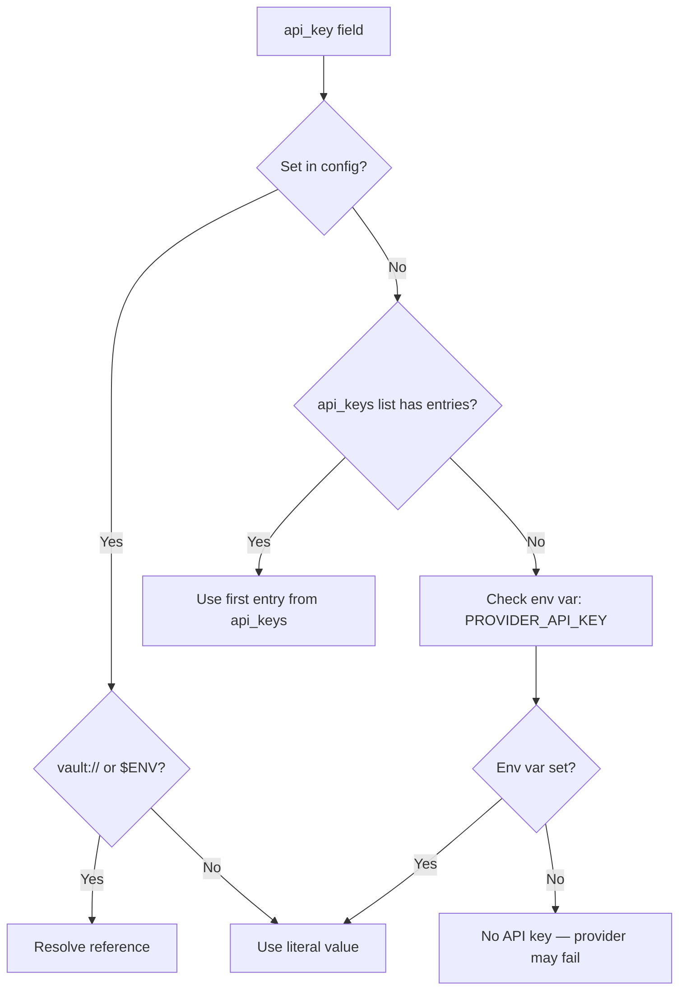

# Provider Configuration

Providers are the AI model backends that Missy uses for inference. Each provider is configured as a named entry under the `providers` section.

## Basic Configuration

```yaml
providers:
  anthropic:
    name: anthropic
    model: "claude-sonnet-4-6"
    timeout: 30
    enabled: true
```

The only required field is `model`. All other fields have sensible defaults.

## Provider Fields

| Field | Type | Default | Description |
|---|---|---|---|
| `name` | `str` | key name | Logical name (defaults to the YAML key) |
| `model` | `str` | *required* | Model identifier for inference |
| `api_key` | `str\|null` | `null` | API key (falls back to env var) |
| `api_keys` | `list[str]` | `[]` | Multiple keys for rotation |
| `base_url` | `str\|null` | `null` | API endpoint override |
| `timeout` | `int` | `30` | Request timeout in seconds |
| `enabled` | `bool` | `true` | Whether this provider is available |
| `fast_model` | `str` | `""` | Model for fast/simple tasks |
| `premium_model` | `str` | `""` | Model for complex/premium tasks |

## API Key Resolution

Missy resolves API keys using a priority chain:



1. `api_key` in the config file (literal, `vault://`, or `$ENV` reference).
2. First entry from `api_keys` list (if `api_key` is not set).
3. Environment variable `{PROVIDER_NAME}_API_KEY` (uppercased).

## Vault References

Store API keys in Missy's encrypted vault instead of plain text in the config file:

```yaml
providers:
  anthropic:
    api_key: "vault://ANTHROPIC_API_KEY"
```

Set the vault value:

```bash
missy vault set ANTHROPIC_API_KEY "sk-ant-..."
```

Both `api_key` and individual entries in `api_keys` support `vault://` references. Environment variable references with `$` prefix are also resolved:

```yaml
providers:
  openai:
    api_key: "$OPENAI_API_KEY"    # resolves from environment
```

## API Key Rotation

The `api_keys` field accepts a list of keys. The provider implementation rotates through them when rate limits are hit:

```yaml
providers:
  anthropic:
    model: "claude-sonnet-4-6"
    api_keys:
      - "vault://ANTHROPIC_KEY_1"
      - "vault://ANTHROPIC_KEY_2"
      - "vault://ANTHROPIC_KEY_3"
```

!!! note "api_key vs api_keys"
    If both `api_key` and `api_keys` are set, `api_key` takes precedence as the primary key. The `api_keys` list is available for rotation. If only `api_keys` is set, the first entry is used as the primary key.

## Model Tiers

Each provider can define three model tiers for different workload types:

```yaml
providers:
  anthropic:
    model: "claude-sonnet-4-6"         # default tier
    fast_model: "claude-haiku-4-5"       # fast/cheap tier
    premium_model: "claude-opus-4-6"     # premium/complex tier
```

| Tier | Field | Use Case |
|---|---|---|
| Default | `model` | Standard agent operations |
| Fast | `fast_model` | Simple queries, classification, routing |
| Premium | `premium_model` | Complex reasoning, code generation, analysis |

The agent runtime and model router select the appropriate tier based on task complexity.

## Base URL Override

For self-hosted models or API-compatible proxies, override the endpoint:

=== "Ollama (local)"
    ```yaml
    providers:
      ollama:
        name: ollama
        model: "llama3.2"
        base_url: "http://localhost:11434"
        timeout: 120
    ```

=== "OpenAI-compatible proxy"
    ```yaml
    providers:
      custom:
        name: openai
        model: "gpt-4o"
        base_url: "https://my-proxy.internal.corp/v1"
        api_key: "vault://PROXY_API_KEY"
    ```

=== "Azure OpenAI"
    ```yaml
    providers:
      azure:
        name: openai
        model: "gpt-4o"
        base_url: "https://my-deployment.openai.azure.com"
        api_key: "vault://AZURE_OPENAI_KEY"
        timeout: 60
    ```

## Timeout Configuration

The `timeout` field sets the HTTP request timeout in seconds. Adjust based on the provider and model:

| Provider | Recommended Timeout | Reason |
|---|---|---|
| Anthropic | 30-60s | Cloud API, fast responses |
| OpenAI | 30-60s | Cloud API, fast responses |
| Ollama (local) | 120-300s | Local inference, varies by hardware |

## Disabling a Provider

Set `enabled: false` to disable a provider without removing its configuration:

```yaml
providers:
  openai:
    model: "gpt-4o"
    api_key: "vault://OPENAI_API_KEY"
    enabled: false                       # configured but not active
```

Disabled providers are skipped by the `ProviderRegistry` during resolution and fallback.

## Provider Fallback

The `ProviderRegistry` resolves providers in this order:

1. The provider specified by `--provider` flag or `AgentConfig.provider`.
2. If that provider is unavailable (disabled, no API key, etc.), fall back to the **first available** provider in the registry.

!!! tip "Always configure at least one provider"
    If no provider is available, Missy raises a `ProviderError`. The `missy doctor` command checks provider availability.

## Network Requirements

Each provider needs network access to its API endpoint. Use [network presets](presets.md) for easy configuration:

```yaml
network:
  default_deny: true
  presets:
    - anthropic     # allows api.anthropic.com
    - openai        # allows api.openai.com
    - ollama        # allows localhost:11434
```

## Multiple Provider Example

```yaml
providers:
  anthropic:
    name: anthropic
    model: "claude-sonnet-4-6"
    fast_model: "claude-haiku-4-5"
    premium_model: "claude-opus-4-6"
    api_key: "vault://ANTHROPIC_API_KEY"
    timeout: 30

  openai:
    name: openai
    model: "gpt-4o"
    api_key: "vault://OPENAI_API_KEY"
    timeout: 30

  ollama:
    name: ollama
    model: "llama3.2"
    base_url: "http://localhost:11434"
    timeout: 120

network:
  default_deny: true
  presets:
    - anthropic
    - openai
    - ollama
```
