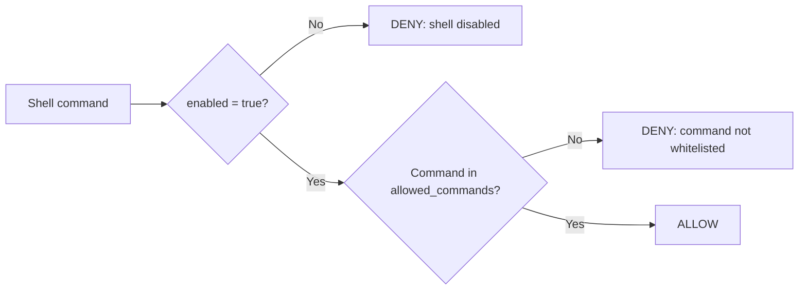

# Shell Policy

The shell policy controls whether Missy can execute shell commands and, if so, which commands are permitted. Shell execution is **disabled by default**.

## Configuration

```yaml
shell:
  enabled: false
  allowed_commands:
    - git
    - ls
    - cat
    - grep
    - python3
```

## Two-Gate Security Model

Shell access requires **both** gates to be open:



| `enabled` | `allowed_commands` | Result |
|---|---|---|
| `false` | `[]` | All commands denied |
| `false` | `["git", "ls"]` | All commands denied (enabled is false) |
| `true` | `[]` | **All commands allowed** (unrestricted) |
| `true` | `["git", "ls"]` | Only `git` and `ls` allowed |

!!! warning "Empty allowed_commands with enabled=true means unrestricted shell"
    When `enabled: true` and `allowed_commands` is empty, Missy can execute **any** shell command. This is by design for power users who want full shell access, but it effectively removes shell security. Always populate `allowed_commands` in production.

## Command Matching

The engine extracts the program name from the command string using POSIX shell tokenization (`shlex.split`) and matches it against `allowed_commands` by **basename**:

```yaml
shell:
  enabled: true
  allowed_commands:
    - git
```

| Command | Extracted Program | Match | Result |
|---|---|---|---|
| `git status` | `git` | `git` | ALLOW |
| `git log --oneline` | `git` | `git` | ALLOW |
| `/usr/bin/git status` | `/usr/bin/git` (basename: `git`) | `git` | ALLOW |
| `rm -rf /` | `rm` | -- | DENY |

!!! note "Basename comparison"
    Both the command and the allow-list entry are compared by their basename. `/usr/bin/git` matches the entry `git`, and vice versa. This prevents bypass via absolute paths.

## Compound Commands

Missy parses compound commands that use shell chain operators (`&&`, `||`, `;`, `|`, `&`). **Every program** in the compound chain must be in `allowed_commands`:

```bash
# With allowed_commands: ["git", "grep"]
git log | grep "fix"     # ALLOW (both git and grep are allowed)
git log | rm -rf /       # DENY (rm is not allowed)
```

## Subshell and Brace Group Rejection

Commands containing subshell markers or brace groups are **always denied**, regardless of `allowed_commands`:

| Pattern | Example | Reason |
|---|---|---|
| `$(...)` | `echo $(cat /etc/passwd)` | Command substitution |
| `` `...` `` | `` echo `whoami` `` | Backtick substitution |
| `<(...)` | `diff <(cmd1) <(cmd2)` | Process substitution |
| `{ ...; }` | `{ rm -rf /; }` | Brace group |

This prevents attackers from hiding arbitrary commands inside constructs that simple tokenization cannot reliably parse.

## Launcher Command Warnings

When a command in `allowed_commands` is a known "launcher" -- a program that can execute arbitrary subcommands -- Missy logs a warning:

Recognized launchers: `env`, `xargs`, `find`, `nice`, `nohup`, `sudo`, `su`, `bash`, `sh`, `python`, `python3`, `perl`, `ruby`, `node`, `eval`, `exec`.

!!! tip "Avoid whitelisting launchers"
    Adding `bash`, `sudo`, or `python3` to `allowed_commands` effectively gives Missy unrestricted shell access, since these programs can execute any other command. Prefer whitelisting specific end-user commands instead.

## Audit Trail

Every shell check emits a `shell_check` audit event with the full command string, the result (`allow` or `deny`), and the matching rule.

```bash
missy audit recent --category shell
```

## Example: Developer Workstation

```yaml
shell:
  enabled: true
  allowed_commands:
    - git
    - ls
    - cat
    - head
    - tail
    - grep
    - find
    - wc
    - diff
    - curl
    - jq
    - python3
    - pip
    - ruff
    - pytest
```

## Example: Read-Only Monitoring

```yaml
shell:
  enabled: true
  allowed_commands:
    - ls
    - cat
    - df
    - free
    - uptime
    - ps
    - top
    - systemctl
```

## Example: Shell Disabled (Default)

```yaml
shell:
  enabled: false
  allowed_commands: []
```

No shell commands are permitted. Missy can still use built-in tools (file_read, calculator, etc.) that do not invoke the shell.
