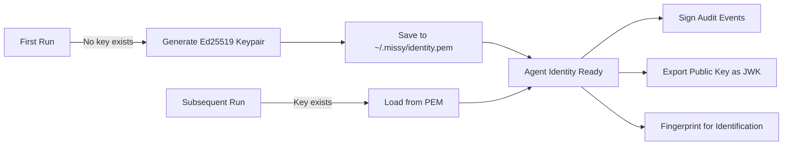

---
tags:
  - security
  - identity
  - cryptography
---

# Agent Identity

Missy assigns each agent instance a unique **Ed25519 cryptographic identity**. This keypair is used to sign audit events, verify message integrity, and provide non-repudiation for agent actions.

!!! info "Key storage"
    The private key is stored at `~/.missy/identity.pem` with `0600` permissions. It is generated automatically on first run if it does not exist.

## How It Works



Each identity provides:

- **Signing** -- Ed25519 signatures over arbitrary messages (audit events, tool results)
- **Verification** -- Confirm that a signature was produced by this agent instance
- **Fingerprinting** -- SHA-256 hash of the public key for unique identification
- **JWK export** -- Public key in JSON Web Key format for external verification

## Keypair Generation

On first startup, Missy generates a fresh Ed25519 keypair and writes the private key to `~/.missy/identity.pem` in PKCS8 PEM format:

```python
from missy.security.identity import AgentIdentity

# Generate a new identity
identity = AgentIdentity.generate()
identity.save("~/.missy/identity.pem")

# Load an existing identity
identity = AgentIdentity.from_key_file("~/.missy/identity.pem")
```

The private key file is created with restrictive permissions (`0o600`) -- only the owner can read or write it.

## Signing and Verification

Every audit event can be signed with the agent's private key, creating a tamper-evident log:

```python
# Sign a message
message = b'{"event": "tool_call", "tool": "shell_exec"}'
signature = identity.sign(message)

# Verify the signature
is_valid = identity.verify(message, signature)
```

Ed25519 signatures are 64 bytes and provide 128-bit security. Verification is fast enough to run on every audit event without measurable overhead.

## Public Key Fingerprint

The fingerprint is a SHA-256 hash of the raw public key bytes, encoded as hex:

```python
fingerprint = identity.public_key_fingerprint()
# e.g. "a3b2c1d4e5f6..."
```

Use the fingerprint to identify which agent instance produced a given audit trail, especially in multi-agent deployments.

## JWK Export

The public key can be exported as a JSON Web Key for use with external verification systems:

```python
jwk = identity.to_jwk()
# {
#     "kty": "OKP",
#     "crv": "Ed25519",
#     "x": "<base64url-encoded public key>"
# }
```

This JWK can be shared with monitoring systems, audit aggregators, or other services that need to verify signatures without access to the private key.

## How Audit Events Are Signed

When the agent identity is loaded, the `AuditLogger` includes a signature field in each event:

1. The event payload is serialized to canonical JSON (sorted keys, no extra whitespace).
2. The agent signs the JSON bytes with its Ed25519 private key.
3. The base64-encoded signature is added to the `_signature` field.
4. The agent fingerprint is added to the `_agent_id` field.

This allows offline verification of the entire audit trail using only the agent's public key.

## Security Considerations

!!! danger "Protect the private key"
    The `identity.pem` file grants the ability to forge audit signatures. Ensure it is:

    - Readable only by the Missy process owner (`chmod 600`)
    - Excluded from backups that are shared or stored insecurely
    - Never committed to version control

!!! tip "Key rotation"
    To rotate the identity, delete `~/.missy/identity.pem` and restart Missy. A new keypair will be generated. Note that this changes the agent fingerprint, so external systems that verify signatures must be updated.
