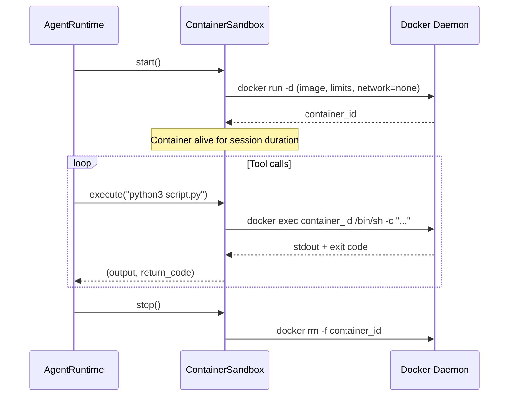

---
tags:
  - security
  - container
  - sandbox
---

# Container Sandbox

The container-per-session sandbox provides **Docker-based isolation** for tool execution. When enabled, each agent session spawns a dedicated Docker container. All shell commands and file operations run inside it, preventing untrusted code from affecting the host system.

!!! tip "When to use"
    Use the container sandbox when running untrusted code, executing user-supplied scripts, or working with unfamiliar MCP tools. For trusted, policy-gated operations, the policy engine alone may be sufficient.

## How It Works



Key properties:

- **One container per session** -- the container persists across multiple `execute()` calls, maintaining state between tool invocations.
- **Network disabled** -- `network_mode: "none"` by default. The container has no network access.
- **Resource limits** -- memory and CPU are capped to prevent resource exhaustion.
- **Capability drop** -- `--cap-drop=ALL` and `--security-opt=no-new-privileges` harden the container.
- **Read-only workspace** -- the host workspace directory is mounted at `/workspace` as read-only.

## Configuration

Add a `container` section to `~/.missy/config.yaml`:

```yaml
container:
  enabled: true
  image: "python:3.12-slim"      # Docker image to use
  memory_limit: "256m"           # Memory cap (Docker --memory)
  cpu_quota: 0.5                 # CPU fraction (Docker --cpus)
  network_mode: "none"           # "none" = no network access
```

| Field | Type | Default | Description |
|---|---|---|---|
| `enabled` | `bool` | `false` | Master switch for container sandboxing |
| `image` | `str` | `"python:3.12-slim"` | Docker image for session containers |
| `memory_limit` | `str` | `"256m"` | Docker memory limit |
| `cpu_quota` | `float` | `0.5` | CPU quota as fraction of one core |
| `network_mode` | `str` | `"none"` | Docker network mode |

## Usage

### Context Manager (Recommended)

```python
from missy.security.container import ContainerSandbox

with ContainerSandbox(image="python:3.12-slim") as sb:
    output, rc = sb.execute("python3 -c 'print(40 + 2)'")
    print(output)  # "42\n"
    print(rc)       # 0
```

The container is automatically created on entry and destroyed on exit.

### File Transfer

Copy files in and out of the container:

```python
with ContainerSandbox() as sb:
    # Copy a script into the container
    sb.copy_in("/home/user/script.py", "/tmp/script.py")

    # Run it
    output, rc = sb.execute("python3 /tmp/script.py")

    # Copy results back
    sb.copy_out("/tmp/results.json", "/home/user/results.json")
```

### Checking Docker Availability

```python
if ContainerSandbox.is_available():
    # Docker is installed and responsive
    ...
else:
    # Fall back to policy-engine-only enforcement
    ...
```

## CLI: `missy sandbox status`

Check the current sandbox configuration and Docker availability:

```bash
missy sandbox status
```

This reports whether Docker is installed, the configured image, resource limits, and whether container sandboxing is enabled in the config.

## Security Properties

| Property | Enforcement |
|---|---|
| No network access | `--network=none` (default) |
| Memory limit | `--memory 256m` (configurable) |
| CPU limit | `--cpus 0.5` (configurable) |
| No privilege escalation | `--security-opt=no-new-privileges` |
| All capabilities dropped | `--cap-drop=ALL` |
| Workspace read-only | `-v ~/workspace:/workspace:ro` |
| Automatic cleanup | Container removed on session end or crash |

## Container Sandbox vs. Policy Engine

Both mechanisms restrict what the agent can do. They serve different purposes:

| Aspect | Policy Engine | Container Sandbox |
|---|---|---|
| **Scope** | Network, filesystem, shell rules | Full OS-level isolation |
| **Granularity** | Per-host, per-path, per-command | Entire execution environment |
| **Overhead** | None (in-process checks) | Docker container lifecycle |
| **Network control** | Domain/CIDR allowlists | Complete network disable |
| **Use case** | Trusted operations with boundaries | Untrusted or experimental code |

!!! tip "Defense in depth"
    The container sandbox and policy engine are complementary. When both are enabled, the policy engine gates which tools can run, and the container sandbox isolates their execution. A command must pass the policy check **and** run inside the container.

## Graceful Degradation

When Docker is not installed or the daemon is not running:

- `start()` returns `None` (no container created)
- `execute()` returns `("Container not started", -1)`
- `stop()` is a no-op
- No exceptions are raised

This allows Missy to run on systems without Docker, falling back to policy-engine-only enforcement.
