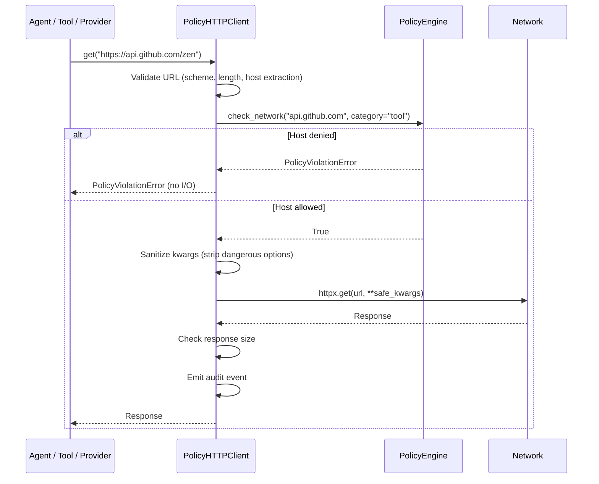

# Gateway: PolicyHTTPClient

`PolicyHTTPClient` is the **single enforcement point** for all outbound HTTP in Missy. Every HTTP request -- provider API calls, tool fetches, webhook deliveries, MCP server communication -- passes through this client. No code in the codebase bypasses it.

!!! security "Architectural guarantee"
    The gateway is not advisory. It wraps `httpx` and enforces the active `PolicyEngine` network policy **before any network I/O occurs**. If the destination host is not permitted, a `PolicyViolationError` is raised and no bytes leave the machine.

## Request Flow



## URL Validation

Before any policy check, the URL itself is validated:

| Check | Threshold | Error |
|---|---|---|
| URL length | 8,192 characters | `ValueError` |
| Scheme | `http` or `https` only | `ValueError` |
| Host extraction | Must be non-empty | `ValueError` |

!!! danger "No exotic schemes"
    Only `http://` and `https://` are permitted. Schemes like `file://`, `ftp://`, `gopher://`, `data:`, and `dict://` are rejected, preventing local file access and protocol smuggling attacks.

## Redirect Blocking

```python
# Both sync and async clients are created with:
httpx.Client(follow_redirects=False)
httpx.AsyncClient(follow_redirects=False)
```

Redirects are **disabled entirely**. A server cannot redirect a policy-approved request to an unapproved destination. If you need to follow redirects, the calling code must explicitly make a new request to the redirect target, which will undergo its own policy check.

!!! warning "Why redirects are blocked"
    An allowed API server at `api.example.com` could return a 302 redirect to `169.254.169.254` (cloud metadata). With redirect following enabled, this would bypass the policy engine. Missy blocks this by design.

## Response Size Limits

Every response is checked against a configurable size limit to prevent memory exhaustion from malicious or misconfigured servers.

| Check | Default | Description |
|---|---|---|
| `Content-Length` header | 50 MB | Fast-path check before body buffering |
| Actual body length | 50 MB | Fallback for chunked/streaming responses |

```python
# Override per-client instance:
client = PolicyHTTPClient(max_response_bytes=10 * 1024 * 1024)  # 10 MB
```

## Kwargs Sanitization

The client filters all keyword arguments passed to `httpx` request methods. Only safe kwargs are forwarded:

=== "Allowed"

    ```python
    # These kwargs pass through to httpx:
    "headers", "params", "data", "json", "content",
    "cookies", "timeout", "files", "extensions"
    ```

=== "Stripped"

    ```python
    # These kwargs are silently removed:
    "verify"      # Would disable TLS verification
    "base_url"    # Would redirect traffic
    "transport"   # Would bypass the policy layer
    "auth"        # Would inject credentials
    "cert"        # Could specify client certificates
    "proxy"       # Would route through attacker proxy
    ```

!!! danger "No TLS bypass"
    Even if calling code passes `verify=False`, the gateway strips it. TLS certificate verification is always enforced. There is no way to disable it through the gateway.

## Connection Pool Limits

The client enforces connection pool limits to prevent resource exhaustion:

```python
httpx.Limits(
    max_connections=20,
    max_keepalive_connections=10,
    keepalive_expiry=30,  # seconds
)
```

These limits apply to both sync and async clients and prevent a runaway agent from opening hundreds of connections.

## Audit Events

Every successful HTTP request emits a `network_request` audit event:

```json
{
  "event_type": "network_request",
  "category": "network",
  "result": "allow",
  "detail": {
    "method": "GET",
    "url": "https://api.github.com/zen",
    "status_code": 200
  }
}
```

Denied requests emit events through the `PolicyEngine` (see [Policy Engine: Audit Events](policy-engine.md#audit-events)).

## Usage

### Factory Function

The recommended way to create clients:

```python
from missy.gateway.client import create_client

client = create_client(
    session_id="s1",
    task_id="t1",
    timeout=30,
    category="tool",  # Enables tool_allowed_hosts checking
)
response = client.get("https://api.github.com/zen")
```

### Context Manager

Both sync and async context managers are supported:

=== "Synchronous"

    ```python
    with create_client(session_id="s1") as client:
        response = client.get("https://api.example.com/data")
        response = client.post("https://api.example.com/submit", json=payload)
    ```

=== "Asynchronous"

    ```python
    async with create_client(session_id="s1") as client:
        response = await client.aget("https://api.example.com/data")
        response = await client.apost("https://api.example.com/submit", json=payload)
    ```

### Available Methods

| Sync | Async | HTTP Method |
|---|---|---|
| `get()` | `aget()` | GET |
| `post()` | `apost()` | POST |
| `put()` | `aput()` | PUT |
| `patch()` | `apatch()` | PATCH |
| `delete()` | `adelete()` | DELETE |
| `head()` | `ahead()` | HEAD |

### Category Parameter

The `category` parameter determines which per-category host lists are checked in addition to the global lists:

```python
# Checks allowed_hosts + provider_allowed_hosts
provider_client = create_client(category="provider")

# Checks allowed_hosts + tool_allowed_hosts
tool_client = create_client(category="tool")

# Checks allowed_hosts + discord_allowed_hosts
discord_client = create_client(category="discord")
```

## Security Properties Summary

| Property | Enforcement |
|---|---|
| Policy check before I/O | `_check_url()` called before every request |
| Scheme restriction | Only `http://` and `https://` |
| URL length limit | 8,192 characters |
| Redirect blocking | `follow_redirects=False` |
| Response size limit | 50 MB default |
| Kwargs sanitization | Allowlist of safe kwargs only |
| TLS enforcement | `verify=False` always stripped |
| Connection pooling | 20 max connections, 10 keepalive |
| Audit trail | Every request logged |
