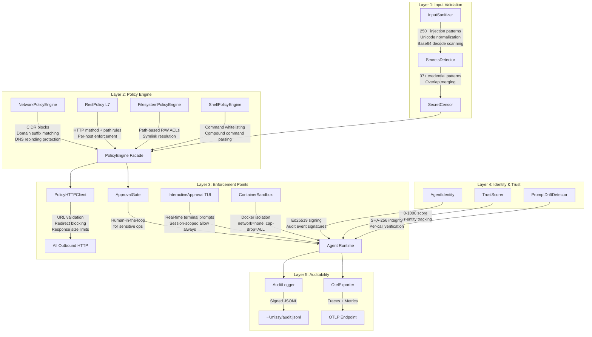

# Security Model

Missy enforces a **default-deny security posture**. Every capability -- network access, filesystem operations, shell execution, plugin loading -- is disabled at startup and must be explicitly enabled in `~/.missy/config.yaml`. There are no implicit permissions.

!!! danger "Security is not optional"
    Missy is designed to run as a local agent with access to your system. The security model exists to prevent the AI from being weaponized against you through prompt injection, compromised MCP servers, or malicious tool outputs.

## Defense in Depth

Missy layers multiple independent security mechanisms. A failure in any single layer does not compromise the system.



## Security Layers

### Layer 1: Input Validation

Every user input passes through the [InputSanitizer](input-sanitization.md) before reaching the agent. It detects prompt injection attempts across 250+ patterns, including multi-language attacks, delimiter injection, and base64-encoded payloads. The [SecretsDetector](secrets-detection.md) scans all text for 37+ credential patterns, and the SecretCensor redacts any findings before they reach logs or provider APIs.

### Layer 2: Policy Engine

The [three-layer policy engine](policy-engine.md) controls what the agent can do:

| Engine | Controls | Default |
|---|---|---|
| `NetworkPolicyEngine` | Outbound connections | All denied |
| `FilesystemPolicyEngine` | File read/write | All denied |
| `ShellPolicyEngine` | Command execution | Disabled |

Every policy check emits an audit event regardless of outcome, providing a complete record of what was attempted and what was allowed or denied.

### Layer 3: Runtime Enforcement

The [PolicyHTTPClient](gateway.md) is the single enforcement point for all outbound HTTP. No code in Missy bypasses it. Redirects are blocked. Response sizes are capped. Dangerous kwargs like `verify=False` are stripped. The [L7 REST policy](gateway.md#l7-rest-policy-enforcement) adds per-host HTTP method and path controls on top of host-level network policy.

The `ApprovalGate` requires explicit human confirmation for sensitive operations. The [Interactive Approval TUI](gateway.md#interactive-approval-tui) surfaces policy-denied requests in the terminal with real-time `y/n/a` prompts and session-scoped "allow always" memory.

The [Container Sandbox](container-sandbox.md) provides Docker-based OS-level isolation. When enabled, tool execution runs inside a dedicated container with no network access, dropped capabilities, and resource limits.

### Layer 4: Identity & Trust

[Agent Identity](agent-identity.md) assigns each Missy instance an Ed25519 cryptographic keypair. Audit events are signed, providing non-repudiation and tamper detection.

[Trust Scoring](trust-scoring.md) tracks provider, MCP server, and tool reliability on a 0--1000 scale. Entities that fail or violate policies are penalized; untrusted entities trigger warnings or require approval.

[Prompt Drift Detection](prompt-drift.md) registers system prompt hashes at session start and verifies them before every provider call, catching runtime prompt tampering.

### Layer 5: Encrypted Secrets

The [Vault](vault.md) stores API keys and credentials using ChaCha20-Poly1305 authenticated encryption. Config files reference secrets via `vault://KEY_NAME` URIs, keeping plaintext credentials out of YAML files entirely.

### Layer 6: Full Auditability

Every security-relevant event is logged to `~/.missy/audit.jsonl` as structured JSON. Optional OpenTelemetry export provides distributed tracing and metrics for production deployments.

## Default Configuration

A freshly initialized Missy instance has this security posture:

```yaml
network:
  default_deny: true        # All outbound blocked
  allowed_cidrs: []
  allowed_domains: []
  allowed_hosts: []

filesystem:
  allowed_write_paths: []   # No write access
  allowed_read_paths: []    # No read access

shell:
  enabled: false            # Shell completely disabled
  allowed_commands: []

plugins:
  enabled: false            # No plugins loaded
  allowed_plugins: []
```

!!! warning "Principle of least privilege"
    Enable only what you need. Every allowed domain, path, and command expands the attack surface. The setup wizard (`missy setup`) configures the minimum permissions required for your chosen providers.

## Threat Model

See the [Threat Model](threat-model.md) for a detailed analysis of what Missy protects against and its known limitations.

## Section Contents

| Page | Description |
|---|---|
| [Policy Engine](policy-engine.md) | Network, filesystem, and shell policy enforcement |
| [Gateway](gateway.md) | PolicyHTTPClient: outbound HTTP enforcement, L7 REST policy, interactive approval |
| [Input Sanitization](input-sanitization.md) | Prompt injection detection and prevention |
| [Secrets Detection](secrets-detection.md) | Credential pattern scanning and redaction |
| [Prompt Drift Detection](prompt-drift.md) | SHA-256 integrity checking for system prompts |
| [Agent Identity](agent-identity.md) | Ed25519 cryptographic identity for signed audit trails |
| [Trust Scoring](trust-scoring.md) | 0--1000 reliability scoring for providers and tools |
| [Container Sandbox](container-sandbox.md) | Docker-based per-session isolation for tool execution |
| [Vault](vault.md) | Encrypted secrets storage with ChaCha20-Poly1305 |
| [Threat Model](threat-model.md) | Threats addressed and known limitations |
