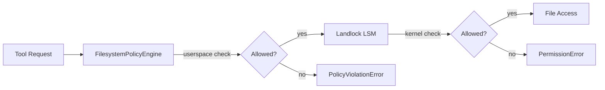

---
tags:
  - security
---

# Landlock LSM

Landlock is a Linux security module (LSM) that provides kernel-level filesystem access control. Missy's `LandlockPolicy` module uses Landlock via ctypes syscalls to enforce filesystem restrictions at the kernel level, complementing the userspace `FilesystemPolicyEngine`.

## How It Works

On supported Linux kernels (5.13+), Landlock restricts filesystem access for the current process. Once applied, restrictions cannot be relaxed — only tightened.

## Two-Layer Defense

| Layer | Engine | Enforcement |
|-------|--------|-------------|
| Userspace | `FilesystemPolicyEngine` | Path prefix matching with audit events |
| Kernel | `LandlockPolicy` | Kernel-level syscall enforcement, cannot be bypassed from userspace |

Even if a bug in the Python process bypasses the userspace policy engine, Landlock prevents unauthorized filesystem access at the kernel level.

## Configuration

Landlock uses the same paths configured in `filesystem.allowed_read_paths` and `filesystem.allowed_write_paths`. No additional configuration is needed — it activates automatically on supported kernels.

## Requirements

- Linux kernel 5.13+ with Landlock enabled
- No additional Python dependencies (uses ctypes)

## Limitations

- Not available on macOS or Windows
- Once applied to a process, restrictions cannot be removed
- Some filesystem operations (e.g., device files) may require additional Landlock access rights
