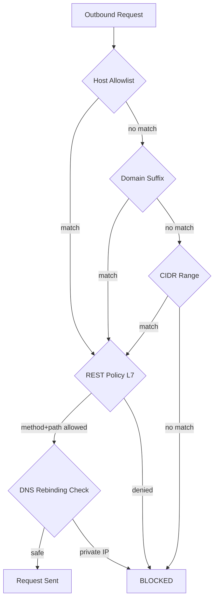

---
tags:
  - security
---

# Network Policy

Network policy controls all outbound HTTP traffic. When `default_deny` is `true` (the default), every request is blocked unless the destination matches an allowlist entry or a preset.

## Enforcement Layers



## Presets

Use named presets instead of manually listing hosts:

```yaml
network:
  default_deny: true
  presets:
    - anthropic    # api.anthropic.com + anthropic.com
    - github       # api.github.com + github.com
    - openai       # api.openai.com
```

Run `missy presets list` to see all available presets with their expanded hosts, domains, and CIDRs.

## REST Policy (L7)

After a host passes network-level checks, REST policy applies HTTP method + path rules:

```yaml
network:
  rest_policies:
    - host: "api.github.com"
      method: "GET"
      path: "/repos/**"
      action: "allow"
    - host: "api.github.com"
      method: "DELETE"
      path: "/**"
      action: "deny"
```

## Per-Category Hosts

Narrow access to specific subsystems without opening the global allowlist:

| Config Key | Used By |
|-----------|---------|
| `provider_allowed_hosts` | Provider API calls only |
| `tool_allowed_hosts` | Tool HTTP requests only |
| `discord_allowed_hosts` | Discord API traffic only |

All are unioned with the global `allowed_hosts` and `allowed_domains` during evaluation.

## DNS Rebinding Protection

All resolved IPs are checked — if any address is private/reserved without explicit CIDR allowance, the entire request is denied. This prevents DNS rebinding attacks where a public domain resolves to a private IP.

## See Also

- [Gateway Enforcement](gateway.md) — the `PolicyHTTPClient` that enforces these rules
- [Policy Engine](policy-engine.md) — the multi-layer facade
- [Configuration Reference](../configuration/network.md) — full YAML reference
