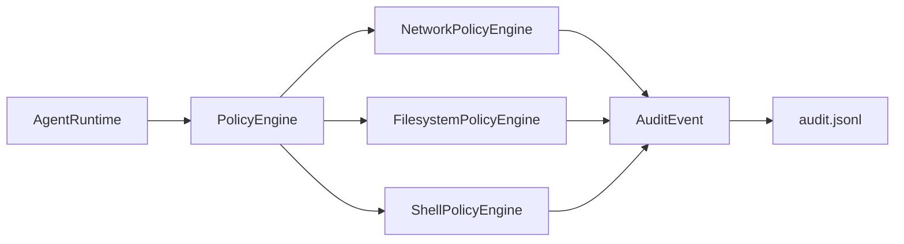

# Policy Engine

The policy engine is Missy's central authorization layer. It composes three domain-specific engines behind a single `PolicyEngine` facade, each enforcing a different class of access control.

!!! security "Every check is audited"
    Every policy evaluation -- allow or deny -- emits a structured `AuditEvent` to the event bus. This provides a complete, tamper-evident record of all access attempts.

## Architecture



The `PolicyEngine` is initialized once from `MissyConfig` and installed as a thread-safe process-level singleton:

```python
from missy.policy.engine import init_policy_engine, get_policy_engine

init_policy_engine(config)
engine = get_policy_engine()
engine.check_network("api.github.com", category="provider")
```

---

## NetworkPolicyEngine

Controls all outbound network access. Operates in **default-deny** mode: every connection is blocked unless explicitly allowed.

### Evaluation Order

The engine evaluates requests in this order, short-circuiting on the first match:

1. **Default-allow check** -- If `default_deny: false`, allow everything (not recommended).
2. **Bare IP check** -- If the host is an IP address, check against `allowed_cidrs` only.
3. **Exact host match** -- Check `allowed_hosts` and per-category host lists.
4. **Domain suffix match** -- Check `allowed_domains` with wildcard support.
5. **DNS resolution + CIDR re-check** -- Resolve the hostname, then check resolved IPs against `allowed_cidrs`.
6. **Deny** -- Raise `PolicyViolationError`.

### Configuration

```yaml
network:
  default_deny: true

  # CIDR blocks (IPv4 and IPv6)
  allowed_cidrs:
    - "10.0.0.0/8"
    - "fd00::/8"

  # Domain names (exact or wildcard suffix)
  allowed_domains:
    - "api.anthropic.com"       # Exact match
    - "*.github.com"            # Matches api.github.com, github.com, etc.

  # Explicit host:port pairs
  allowed_hosts:
    - "api.anthropic.com:443"

  # Per-category overrides (merged with global lists)
  provider_allowed_hosts:
    - "api.anthropic.com:443"
    - "api.openai.com:443"
  tool_allowed_hosts:
    - "api.github.com:443"
  discord_allowed_hosts:
    - "discord.com:443"
    - "gateway.discord.gg:443"
```

### Domain Matching

Domain patterns support two forms:

| Pattern | Matches | Does Not Match |
|---|---|---|
| `github.com` | `github.com` | `api.github.com` |
| `*.github.com` | `github.com`, `api.github.com`, `raw.github.com` | `evil-github.com` |

!!! warning "Wildcard scope"
    `*.github.com` matches `github.com` itself and any subdomain. It does **not** match domains that merely end with the string (e.g., `not-github.com` is not matched).

### Per-Category Host Lists

Network requests carry a `category` tag identifying the subsystem making the request:

| Category | Host List | Typical Use |
|---|---|---|
| `provider` | `provider_allowed_hosts` | AI provider API calls |
| `tool` | `tool_allowed_hosts` | Tool HTTP requests |
| `discord` | `discord_allowed_hosts` | Discord API and Gateway |

Per-category lists are checked **in addition to** the global `allowed_hosts` and `allowed_domains`. A host allowed in the global list is accessible to all categories.

### DNS Rebinding Protection

!!! danger "DNS rebinding attacks"
    An attacker can point `evil.example.com` at `169.254.169.254` (cloud metadata) or `10.0.0.1` (internal infrastructure). Without DNS rebinding protection, a domain-allowlisted hostname could reach private networks.

When a hostname passes domain/host checks and proceeds to DNS resolution, the engine applies strict rebinding protection:

1. **Resolve all DNS records** for the hostname.
2. **Check every resolved IP** -- if any IP is private, loopback, or link-local, verify it is explicitly covered by `allowed_cidrs`.
3. **If any resolved IP is private and not allowed**, deny the entire request. This prevents mixed-record attacks where a hostname resolves to both public and private IPs.

```
evil.example.com → 93.184.216.34, 169.254.169.254
                                    ↑ private, not in allowed_cidrs
                                    → DENIED (entire request blocked)
```

### CIDR Matching

CIDR blocks are parsed once at engine construction time for performance. Both IPv4 and IPv6 are supported:

```yaml
allowed_cidrs:
  - "10.0.0.0/8"           # Private IPv4
  - "172.16.0.0/12"        # Private IPv4
  - "192.168.0.0/16"       # Private IPv4
  - "fd00::/8"             # Private IPv6
  - "169.254.169.254/32"   # AWS metadata (explicit opt-in only)
```

!!! danger "Cloud metadata endpoints"
    Never add `169.254.169.254/32` to `allowed_cidrs` unless you explicitly need cloud metadata access and understand the SSRF implications.

---

## FilesystemPolicyEngine

Controls read and write access to the local filesystem. By default, no paths are accessible.

### Symlink Resolution

!!! security "Symlink traversal prevention"
    All paths are resolved via `Path.resolve()` before comparison. A symlink inside an allowed directory that points outside it will be **denied**. This prevents an attacker from creating `~/workspace/escape -> /etc/shadow` and reading protected files through an allowed path.

### Configuration

```yaml
filesystem:
  allowed_read_paths:
    - "/home/user/workspace"
    - "/home/user/documents"
  allowed_write_paths:
    - "/home/user/workspace/output"
```

### Path Matching

A path is allowed if it is **equal to or nested inside** any entry in the relevant list. The comparison uses resolved absolute paths:

| Request | `allowed_write_paths: ["/home/user/workspace"]` | Result |
|---|---|---|
| `/home/user/workspace/file.txt` | Nested inside allowed path | **Allow** |
| `/home/user/workspace` | Exact match | **Allow** |
| `/home/user/other/file.txt` | Not under any allowed path | **Deny** |
| `/home/user/workspace/../../etc/passwd` | Resolves to `/etc/passwd` | **Deny** |

### Separate Read/Write Controls

Read and write permissions are independent. Granting write access to a directory does **not** imply read access, and vice versa. Configure both explicitly:

```yaml
filesystem:
  allowed_read_paths:
    - "/home/user/workspace"      # Can read everything
  allowed_write_paths:
    - "/home/user/workspace/output"  # Can only write to output/
```

---

## ShellPolicyEngine

Controls shell command execution. The shell is **disabled by default** -- the `enabled` flag must be set to `true` before any command is evaluated against the whitelist.

### Evaluation Order

1. **Global disable check** -- If `enabled: false`, deny all commands immediately.
2. **Command parsing** -- Extract all program names from potentially compound commands.
3. **Subshell rejection** -- Commands containing `$(...)`, backticks, `<(...)`, or brace groups are rejected outright.
4. **Whitelist check** -- Every program in the command must match an `allowed_commands` entry.

### Configuration

```yaml
shell:
  enabled: true
  allowed_commands:
    - "git"
    - "ls"
    - "cat"
    - "grep"
    - "docker"
```

!!! warning "Empty whitelist = unrestricted"
    When `enabled: true` and `allowed_commands` is an empty list, **all commands are permitted**. Always specify an explicit whitelist.

### Compound Command Handling

The engine parses compound commands and validates **every** program in the chain:

```bash
# Both 'git' and 'grep' must be in allowed_commands
git log --oneline | grep "fix"    # ✓ if both allowed

# Subshell commands are always rejected
echo $(cat /etc/passwd)            # ✗ rejected (subshell marker)

# Brace groups are always rejected
{ rm -rf /; }                      # ✗ rejected (brace group)
```

Chain operators that trigger compound parsing: `&&`, `||`, `;`, `|`, `&`, newline.

### Launcher Command Warnings

The engine warns when whitelisted commands can execute arbitrary subcommands:

!!! warning "Dangerous whitelisted commands"
    These commands can execute arbitrary child processes, effectively bypassing the whitelist: `env`, `xargs`, `find`, `sudo`, `bash`, `sh`, `python`, `python3`, `perl`, `ruby`, `node`, `eval`, `exec`, `nice`, `nohup`, `strace`, `time`, `watch`.

    If you whitelist `bash`, an attacker can run `bash -c "rm -rf /"`. Consider whether you truly need these commands.

### Basename Matching

Commands are matched by **basename**, so both bare names and fully-qualified paths work:

| `allowed_commands: ["git"]` | Command | Result |
|---|---|---|
| | `git status` | **Allow** |
| | `/usr/bin/git status` | **Allow** (basename is `git`) |
| | `gitk` | **Deny** (basename `gitk` != `git`) |

---

## Audit Events

Every policy check emits an `AuditEvent` with these fields:

| Field | Description |
|---|---|
| `event_type` | `network_check`, `filesystem_read`, `filesystem_write`, `shell_check` |
| `category` | `network`, `filesystem`, `shell` |
| `result` | `allow` or `deny` |
| `policy_rule` | The matching rule (e.g., `domain:*.github.com`) or `null` for denials |
| `detail` | Context-specific data (host, path, command) |
| `session_id` | Session that triggered the check |
| `task_id` | Task that triggered the check |

Query audit events with the CLI:

```bash
missy audit security --limit 50
missy audit recent --category network --limit 20
```
