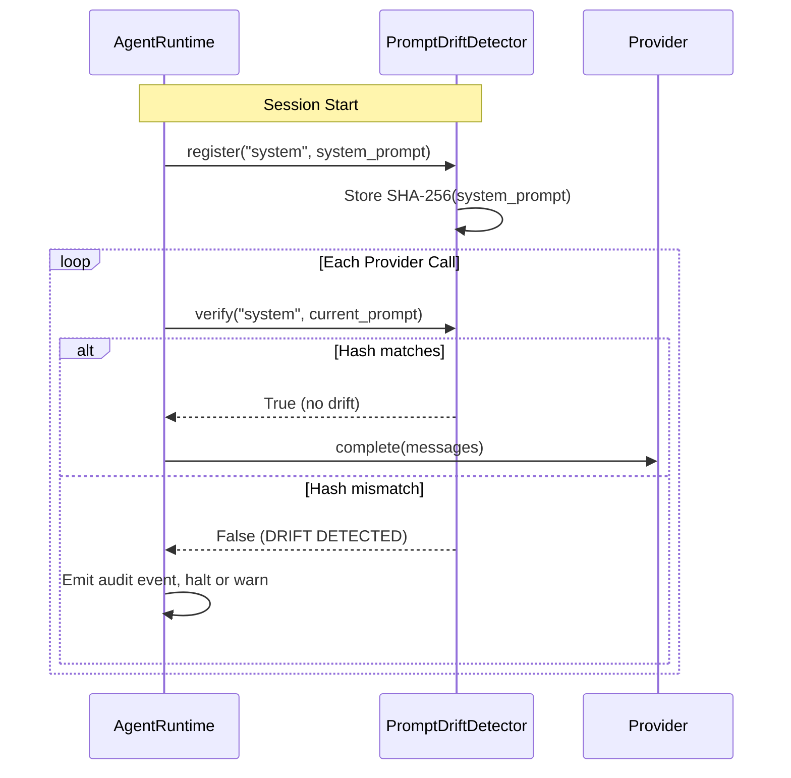

---
tags:
  - security
  - prompt-injection
---

# Prompt Drift Detection

The `PromptDriftDetector` guards against **runtime modification of system prompts**. It registers each prompt's SHA-256 hash at startup and verifies it before every provider call. If the hash changes, drift is detected and an audit event is emitted.

## What It Protects Against

Prompt drift detection catches scenarios where the system prompt is modified after initialization:

- **Prompt injection via tool output** -- a malicious tool result rewrites or appends to the system prompt
- **MCP server manipulation** -- a compromised MCP server injects instructions into the prompt
- **Memory injection** -- crafted conversation history that alters the system prompt during context assembly

!!! danger "Defense layer"
    Drift detection does not prevent modification -- it detects it. When drift is found, the runtime can halt execution, alert the operator, or roll back to the registered prompt. It works alongside the `InputSanitizer` which catches injection attempts earlier in the pipeline.

## How It Works



### Registration

At session start, the system prompt is registered with an identifier:

```python
from missy.security.drift import PromptDriftDetector

detector = PromptDriftDetector()
detector.register("system", system_prompt)
detector.register("tool_definitions", tool_schema_json)
```

You can register multiple prompts -- each gets its own identifier and hash.

### Verification

Before each provider call, the current prompt content is verified against the stored hash:

```python
if not detector.verify("system", current_system_prompt):
    # Drift detected! The prompt has changed since registration.
    audit_logger.log("prompt_drift", {"prompt_id": "system"})
```

If the identifier was never registered, `verify()` returns `True` (nothing to check).

### Bulk Verification

Check all registered prompts at once:

```python
report = detector.verify_all({
    "system": current_system_prompt,
    "tool_definitions": current_tool_json,
})

for entry in report:
    if entry["drifted"]:
        print(f"DRIFT: {entry['prompt_id']}")
        print(f"  Expected: {entry['expected_hash']}")
        print(f"  Actual:   {entry['actual_hash']}")
```

## Audit Events

When drift is detected, the runtime emits a `prompt_drift` audit event:

```json
{
  "event_type": "prompt_drift",
  "category": "security",
  "detail": {
    "prompt_id": "system",
    "expected_hash": "a3b2c1d4...",
    "actual_hash": "f7e8d9c0..."
  }
}
```

View drift events with:

```bash
missy audit security --limit 20
```

## Drift Report

The `get_drift_report()` method returns the stored state of all registered prompts:

```python
report = detector.get_drift_report()
# [
#     {"prompt_id": "system", "expected_hash": "a3b2c1d4..."},
#     {"prompt_id": "tool_definitions", "expected_hash": "e5f6a7b8..."},
# ]
```

## Design Notes

- **SHA-256 hashing** -- the hash is computed over the UTF-8 encoding of the prompt text. SHA-256 provides collision resistance sufficient for integrity checking.
- **No persistence** -- hashes are held in memory for the session duration. Each new session re-registers its prompts.
- **Zero dependencies** -- uses only the Python standard library `hashlib`.
