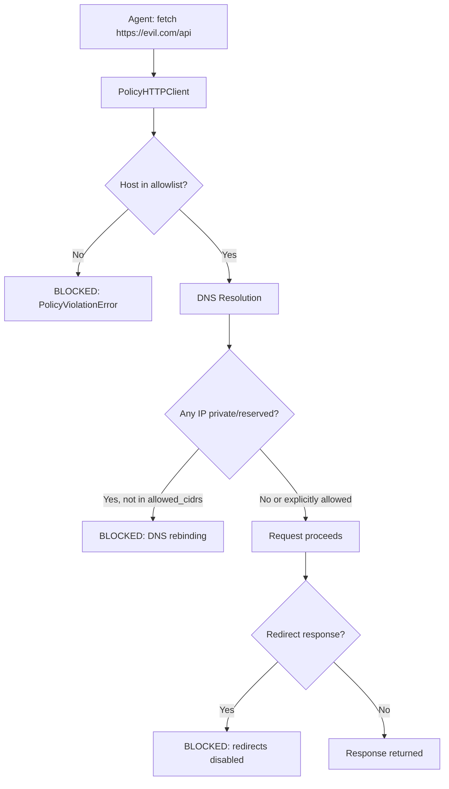
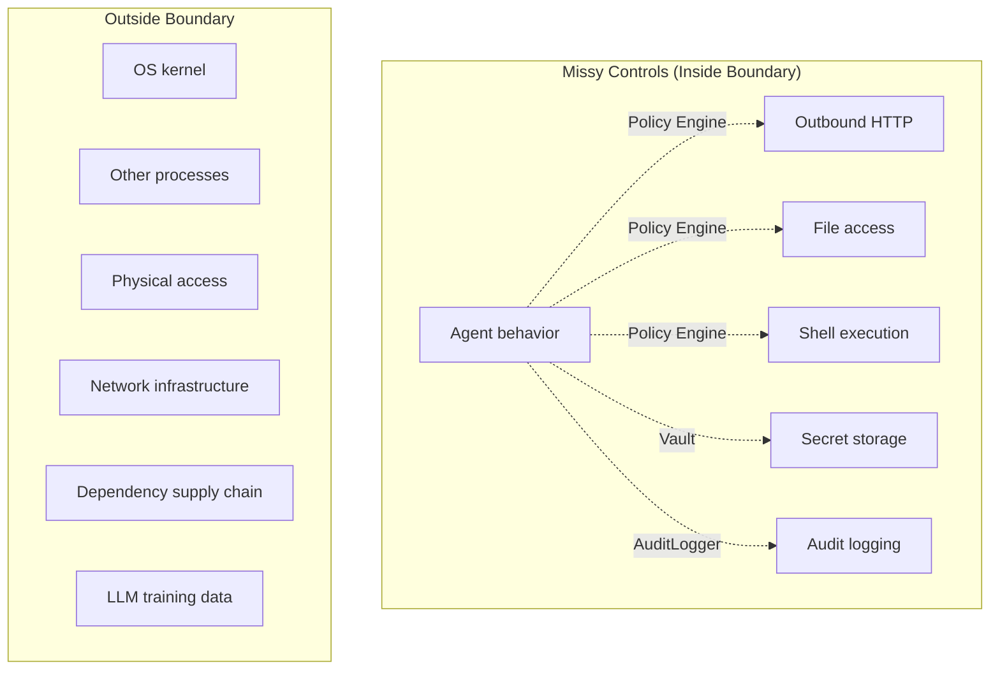

# Threat Model

This document describes the threats Missy's security architecture is designed to address, the mitigations in place, and the known limitations of the current design.

## Scope

Missy is a self-hosted local AI agent running on a Linux machine under a single user account. The threat model assumes:

- **Trusted operator**: The person who installs and configures Missy is trusted.
- **Untrusted inputs**: User prompts, tool outputs, MCP server responses, file contents, and webhook payloads are all treated as potentially adversarial.
- **Trusted code**: The Missy codebase itself is assumed uncompromised. Supply chain attacks against Missy's dependencies are out of scope (mitigate with standard practices: pinned dependencies, hash verification).

---

## Threats Addressed

### T1: Prompt Injection

**Attack**: An adversary embeds instructions in user input, tool output, or retrieved documents that cause the agent to perform unintended actions.

**Mitigations**:

| Layer | Mechanism |
|---|---|
| [InputSanitizer](input-sanitization.md) | 250+ injection patterns with Unicode normalization, base64 decode, URL/HTML decode scanning |
| Policy Engine | Even if injection succeeds, the agent cannot access hosts, paths, or commands not explicitly allowed |
| ApprovalGate | Sensitive operations require human confirmation |
| Audit trail | All actions are logged for post-incident review |

!!! danger "Prompt injection is an unsolved problem"
    No detection system catches all prompt injection attacks. Missy's sanitizer is a strong heuristic layer, but it can be bypassed by sufficiently novel techniques. The policy engine and approval gate exist precisely because injection detection alone is insufficient.

### T2: Secret Exfiltration

**Attack**: The agent inadvertently includes credentials in a response, log entry, or outbound API call.

**Mitigations**:

| Layer | Mechanism |
|---|---|
| [SecretsDetector](secrets-detection.md) | 37+ credential patterns scanned at multiple pipeline stages |
| SecretCensor | Automatic redaction with overlap merging |
| [Vault](vault.md) | Encrypted at-rest storage; config uses `vault://` references, not plaintext |
| Network policy | Even if a secret reaches the agent, exfiltrating it requires an allowed outbound destination |

### T3: Server-Side Request Forgery (SSRF)

**Attack**: The agent is tricked into making HTTP requests to internal services, cloud metadata endpoints (`169.254.169.254`), or other unintended destinations.

**Mitigations**:

| Layer | Mechanism |
|---|---|
| [PolicyHTTPClient](gateway.md) | Single enforcement point for all outbound HTTP |
| Network policy | Default-deny; only explicitly allowed hosts/CIDRs are reachable |
| [DNS rebinding protection](policy-engine.md#dns-rebinding-protection) | Hostnames resolving to private/reserved IPs are blocked unless the IP range is explicitly allowed |
| Redirect blocking | `follow_redirects=False` prevents redirect-based SSRF |
| Scheme restriction | Only `http://` and `https://` are permitted |
| URL length limit | 8,192 characters prevents URL-bomb attacks |

### T4: Command Injection

**Attack**: The agent is tricked into executing arbitrary shell commands, either through direct injection or by chaining allowed commands with shell metacharacters.

**Mitigations**:

| Layer | Mechanism |
|---|---|
| Shell disabled by default | `shell.enabled: false` blocks all execution |
| [Command whitelisting](policy-engine.md#shellpolicyengine) | Only explicitly listed programs are permitted |
| Compound command parsing | `&&`, `\|\|`, `;`, `\|` chains are split; every program must be whitelisted |
| Subshell rejection | `$(...)`, backticks, `<(...)`, and brace groups are rejected outright |
| Launcher warnings | Commands like `bash`, `python`, `sudo` trigger warnings when whitelisted |

### T5: MCP Supply Chain Attack

**Attack**: A compromised or malicious MCP server returns tool definitions or results containing injection payloads, exfiltration attempts, or commands designed to abuse the agent's capabilities.

**Mitigations**:

| Layer | Mechanism |
|---|---|
| Tool namespacing | MCP tools are namespaced as `server__tool`, making their origin visible |
| Input sanitization | MCP tool outputs pass through the sanitizer like any other input |
| Policy enforcement | MCP tool actions are subject to the same network/filesystem/shell policies |
| Health monitoring | `McpManager.health_check()` detects and restarts dead servers |
| Audit trail | All MCP tool invocations are logged |

!!! warning "MCP trust boundary"
    MCP servers run as separate processes with their own capabilities. Missy enforces policy on what the agent does with MCP tool results, but cannot control what the MCP server itself does on the system. Only run MCP servers you trust.

### T6: Filesystem Traversal

**Attack**: The agent is tricked into reading or writing files outside allowed directories, potentially accessing `/etc/shadow`, SSH keys, or other sensitive files.

**Mitigations**:

| Layer | Mechanism |
|---|---|
| [Path-based ACLs](policy-engine.md#filesystempolicyengine) | Separate read and write allowlists |
| Symlink resolution | All paths resolved via `Path.resolve()` before comparison |
| No default access | Empty allowlists by default |

### T7: Resource Exhaustion

**Attack**: A malicious input, tool, or server attempts to exhaust memory, disk, connections, or API budget.

**Mitigations**:

| Resource | Mechanism |
|---|---|
| Input size | 10,000 character truncation limit |
| Response size | 50 MB default limit on HTTP responses |
| Connections | httpx pool limits: 20 max connections, 10 keepalive |
| API budget | `max_spend_usd` per-session cap |
| Circuit breaker | Exponential backoff (threshold=5, base=60s, max=300s) |
| Context window | Token budget (default 30k) with automatic pruning |

### T8: Credential Stuffing via Config

**Attack**: Plaintext API keys in `config.yaml` are leaked through backups, version control, or file sharing.

**Mitigations**:

| Layer | Mechanism |
|---|---|
| [Vault](vault.md) | ChaCha20-Poly1305 encrypted storage |
| `vault://` references | Config files contain references, not secrets |
| `.gitignore` hardening | Default `.gitignore` excludes `~/.missy/secrets/`, config files, and certificates |
| File permissions | Key file created with `0600`, directory with `0700` |

---

## Threats NOT Addressed

The following threats are outside Missy's security scope:

### Physical Access

If an attacker has physical access to the machine or root access to the OS, Missy's security controls can be bypassed by reading process memory, modifying the binary, or accessing the vault key file directly.

### Kernel and OS Exploits

Missy runs as a userspace process. Kernel vulnerabilities, container escapes, or OS-level privilege escalation are not mitigated by Missy.

### Compromised Dependencies

If a Python dependency (httpx, cryptography, pyyaml, etc.) is compromised at the package level, malicious code could bypass Missy's controls. Mitigate with:

- Pinned dependency versions in `pyproject.toml`
- Hash verification via `pip install --require-hashes`
- Regular dependency audits

### Side-Channel Attacks

Timing attacks against the policy engine, cache-based side channels, and electromagnetic emanations are not addressed.

### Model-Level Attacks

Missy cannot prevent the underlying LLM from:

- Generating harmful content within its capability window
- Being influenced by training data poisoning
- Exhibiting emergent behaviors not anticipated by the sanitizer

The policy engine limits what the agent can **do** with generated content, but not what it **generates**.

### Network-Level Attacks

Man-in-the-middle attacks on HTTPS connections, BGP hijacking, and DNS spoofing at the resolver level are outside scope. Missy relies on the OS TLS stack and DNS resolver.

!!! warning "TLS is enforced but not verified beyond the OS"
    The gateway enforces TLS (cannot be disabled via kwargs), but certificate pinning is not implemented. The system relies on the OS CA store for certificate validation.

### Denial of Service Against Missy

A local user or process can deny service to Missy by killing the process, filling the disk, or exhausting system resources. Missy does not defend against attacks from other processes on the same machine.

---

## Security Boundaries Summary

## Reporting Security Issues

If you discover a security vulnerability in Missy, please report it responsibly. Do not open a public GitHub issue. Contact the maintainers directly via the information in the repository's security policy.
