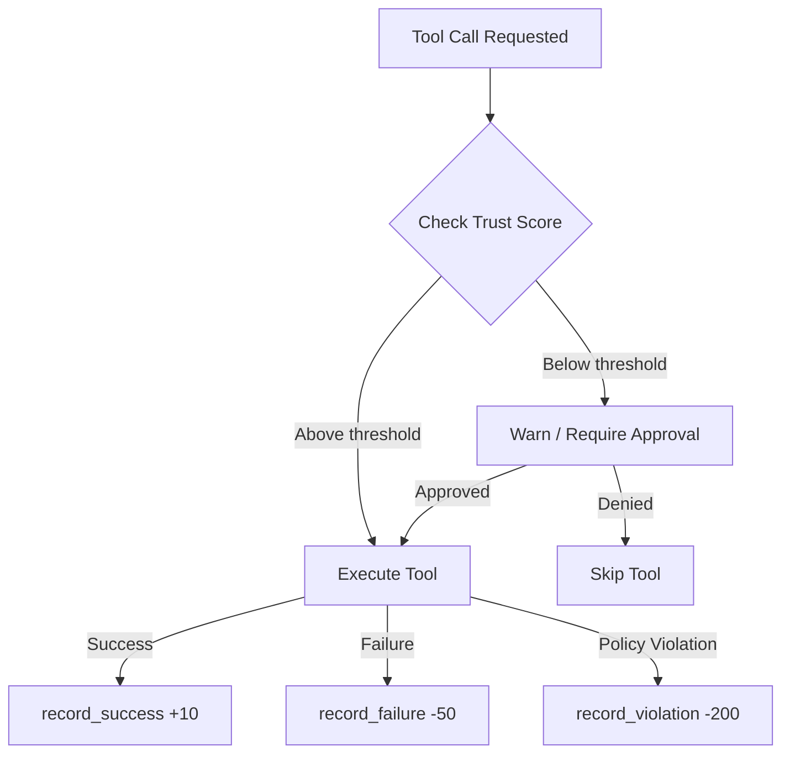

---
tags:
  - security
  - trust
---

# Trust Scoring

Missy tracks the reliability of providers, MCP servers, and tools using a **0--1000 trust score**. The score adjusts automatically based on observed behavior: successful operations increase trust, while failures and policy violations decrease it.

## Score Scale

| Range | Meaning |
|---|---|
| 800--1000 | Highly trusted -- consistent success, no violations |
| 500--799 | Neutral -- default starting point, building track record |
| 200--499 | Degraded -- multiple failures, caution advised |
| 0--199 | Untrusted -- repeated violations or sustained failures |

New entities start at **500** (neutral). The score is clamped to the `[0, 1000]` range.

## Score Adjustments

Three event types modify trust scores, each with a configurable weight:

| Event | Default Weight | Direction | Example |
|---|---|---|---|
| `record_success` | +10 | :material-arrow-up: Increase | Successful API call, tool returned valid result |
| `record_failure` | -50 | :material-arrow-down: Decrease | Timeout, error response, malformed output |
| `record_violation` | -200 | :material-arrow-down: Decrease | Policy violation, unauthorized access attempt |

!!! example "Score trajectory"
    A new MCP server starts at 500. After 10 successful calls (+100), its score is 600. One policy violation (-200) drops it to 400. Five more successes (+50) bring it back to 450.

## Trust Threshold

The `is_trusted()` method checks whether an entity's score exceeds a threshold (default: **200**):

```python
from missy.security.trust import TrustScorer

scorer = TrustScorer()

# After some operations...
if not scorer.is_trusted("mcp_server__risky_tool"):
    # Warn or block
    logger.warning("Low trust score for risky_tool")
```

When an entity drops below the trust threshold, the agent runtime can:

- Log a warning in the audit trail
- Require human approval before using the entity
- Skip the entity in favor of a more trusted alternative

## Integration with the Tool Loop

The `TrustScorer` is consulted during the agent's tool execution loop:



1. Before executing a tool or calling a provider, the runtime checks `is_trusted(entity_id)`.
2. If the score is below the threshold, the operation may be blocked or escalated to the `ApprovalGate`.
3. After execution, the appropriate `record_*` method is called to update the score.

## Tracked Entities

Trust scores are tracked for any entity identifier. Common patterns:

| Entity Type | ID Format | Example |
|---|---|---|
| Provider | `provider:<name>` | `provider:anthropic` |
| MCP server | `mcp:<server>` | `mcp:github` |
| MCP tool | `mcp:<server>__<tool>` | `mcp:github__create_issue` |
| Built-in tool | `tool:<name>` | `tool:shell_exec` |

## Viewing Scores

All current scores can be retrieved programmatically:

```python
scorer.get_scores()
# {"provider:anthropic": 620, "mcp:github": 380, ...}
```

## Resetting Scores

To reset an entity back to the default score of 500:

```python
scorer.reset("mcp:github")
```

!!! warning "In-memory only"
    Trust scores are currently held in memory and reset when Missy restarts. Persistent trust scoring across sessions is planned for a future release.
