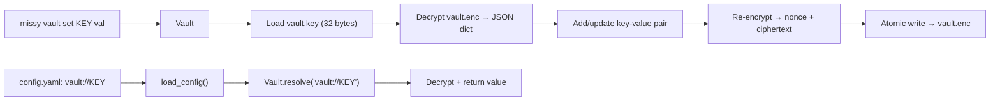

# Encrypted Vault

Missy's Vault provides ChaCha20-Poly1305 authenticated encryption for API keys, tokens, and other credentials. Secrets are stored encrypted on disk and referenced in config files via `vault://` URIs, keeping plaintext credentials out of YAML entirely.

## How It Works



### Encryption Details

| Property | Value |
|---|---|
| Algorithm | ChaCha20-Poly1305 (AEAD) |
| Key size | 256 bits (32 bytes) |
| Nonce size | 96 bits (12 bytes, random per encryption) |
| Authentication | Poly1305 MAC (built into AEAD) |
| Key derivation | Random bytes via `secrets.token_bytes(32)` |
| Storage format | `nonce (12 bytes) || ciphertext` |

!!! security "Authenticated encryption"
    ChaCha20-Poly1305 is an AEAD cipher. It provides both confidentiality (encryption) and integrity (authentication). Tampering with the ciphertext or nonce causes decryption to fail, preventing silent data corruption.

## File Locations

| File | Path | Permissions | Purpose |
|---|---|---|---|
| Key file | `~/.missy/secrets/vault.key` | `0600` | 32-byte encryption key |
| Encrypted data | `~/.missy/secrets/vault.enc` | `0600` | Encrypted JSON key-value store |
| Vault directory | `~/.missy/secrets/` | `0700` | Container directory |

## Setup

### Enable the Vault

```yaml
# ~/.missy/config.yaml
vault:
  enabled: true
  vault_dir: "~/.missy/secrets"   # Default location
```

### Requirements

The vault requires the `cryptography` Python package:

```bash
pip install cryptography
```

This is included in the base Missy installation. If you see a `VaultError` about a missing package, reinstall:

```bash
pip install -e ".[dev]"
```

## CLI Commands

### Store a Secret

```bash
missy vault set ANTHROPIC_API_KEY sk-ant-api03-your-key-here
missy vault set OPENAI_API_KEY sk-proj-your-key-here
missy vault set DISCORD_TOKEN your-bot-token
```

### Retrieve a Secret

```bash
missy vault get ANTHROPIC_API_KEY
# Output: sk-ant-api03-your-key-here
```

### List All Keys

```bash
missy vault list
# Output:
# ANTHROPIC_API_KEY
# OPENAI_API_KEY
# DISCORD_TOKEN
```

!!! security "Keys only, not values"
    `vault list` shows key names only. Values are never displayed unless explicitly retrieved with `vault get`.

### Delete a Secret

```bash
missy vault delete OPENAI_API_KEY
```

## Config File References

Use `vault://KEY_NAME` in any config field that accepts a secret:

```yaml
providers:
  anthropic:
    name: anthropic
    model: "claude-sonnet-4-6"
    api_key: "vault://ANTHROPIC_API_KEY"

  openai:
    name: openai
    model: "gpt-4o"
    api_key: "vault://OPENAI_API_KEY"
    api_keys:
      - "vault://OPENAI_KEY_1"
      - "vault://OPENAI_KEY_2"
```

During config loading, `vault://` references are resolved transparently. The provider receives the decrypted secret, never the reference string.

### Environment Variable References

The vault resolver also supports `$ENV_VAR` syntax as a fallback:

```yaml
providers:
  anthropic:
    api_key: "$ANTHROPIC_API_KEY"   # Read from environment
```

### Resolution Priority

| Reference | Resolution |
|---|---|
| `vault://KEY_NAME` | Decrypt from vault |
| `$ENV_VAR` | Read from environment |
| Any other string | Used as-is (literal value) |

## Key File Security

!!! danger "Protect the key file"
    The key file (`vault.key`) is the master key. Anyone with access to both `vault.key` and `vault.enc` can decrypt all stored secrets. Protect it accordingly.

### Automatic Protections

The vault implements several protections for the key file:

1. **Atomic exclusive creation** -- The key file is created with `O_CREAT | O_EXCL`, preventing TOCTOU race conditions. If the file already exists, it is read instead of overwritten.

2. **Strict permissions** -- The key file is created with `0600` (owner read/write only). The vault directory is created with `0700`.

3. **Symlink rejection** -- If the key file is a symlink, the vault refuses to read it. This prevents an attacker from replacing the key file with a symlink to a controlled location.

4. **Hard link detection** -- If the key file has multiple hard links (`st_nlink > 1`), the vault refuses to read it. This prevents an attacker from creating a hard link to monitor key file access.

5. **Length validation** -- The key must be exactly 32 bytes. Truncated or padded files are rejected.

### Atomic Writes

The encrypted vault file is written atomically:

1. Create a temporary file in the same directory with correct permissions (`0600`).
2. Write the encrypted data and `fsync`.
3. Rename the temp file to `vault.enc` (atomic on POSIX).

This prevents data loss if the process crashes mid-write.

### Backup Recommendations

```bash
# Back up the vault (both files required for restoration)
cp ~/.missy/secrets/vault.key /secure/backup/vault.key
cp ~/.missy/secrets/vault.enc /secure/backup/vault.enc
chmod 600 /secure/backup/vault.key /secure/backup/vault.enc
```

!!! warning "Key and data are inseparable"
    The vault data cannot be decrypted without the exact key file used to encrypt it. If you lose `vault.key`, the contents of `vault.enc` are unrecoverable. Back up both files together.

## Programmatic Usage

```python
from missy.security.vault import Vault

vault = Vault()  # Uses default ~/.missy/secrets

# Store
vault.set("MY_SECRET", "secret-value")

# Retrieve
value = vault.get("MY_SECRET")  # Returns None if not found

# Delete
vault.delete("MY_SECRET")  # Returns True if existed

# List keys
keys = vault.list_keys()  # ["ANTHROPIC_API_KEY", ...]

# Resolve references
secret = vault.resolve("vault://MY_SECRET")      # From vault
secret = vault.resolve("$MY_ENV_VAR")             # From environment
secret = vault.resolve("literal-value")           # Passthrough
```

## Security Comparison

| Method | On-Disk Security | In-Memory | Config Visibility | Backup Safety |
|---|---|---|---|---|
| Plaintext in YAML | None | Plaintext | Visible in file | Leaked in backups |
| Environment variable | OS-dependent | Plaintext | Not in config | Varies |
| **Vault** | **ChaCha20-Poly1305** | **Plaintext (runtime only)** | **`vault://` ref only** | **Encrypted** |

!!! warning "Runtime exposure"
    At runtime, decrypted secrets exist in process memory. The vault protects at-rest storage only. A memory dump of the running process could expose secrets. This is inherent to any secrets management system that must provide secrets to application code.
